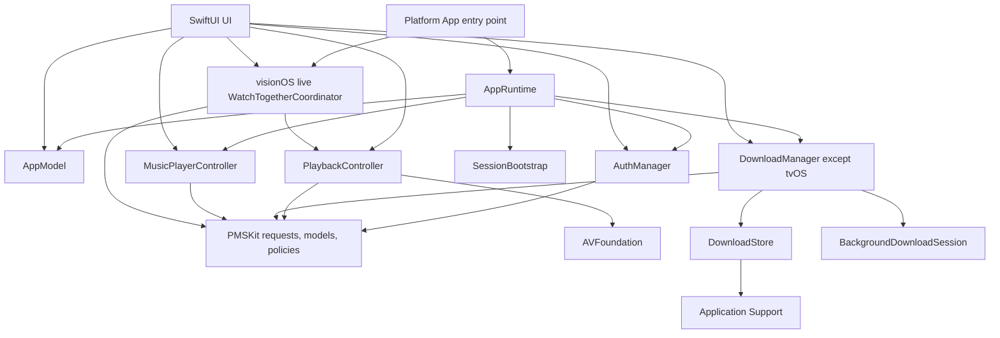

# Architecture overview

Labstream is a SwiftUI media client for Plex, Jellyfin, and Emby. The app code in
`Labstream/` owns UI and most live orchestration; the local Swift package in `PMSKit/`
owns reusable request builders, wire models, and policies. Most PMSKit behavior is pure
and can be tested without an app process, simulator, Keychain, filesystem, or media
server; a small set of reusable infrastructure is intentionally effectful.

## Native targets and release trains

The repository contains four native application targets. Vision Pro and mobile are the
supported product paths; the native Mac target is a local-build development preview. All four
attach the file-system-synchronized `Labstream/Shared/` root plus exactly one root under
`Labstream/Platforms/`. Vision Pro, mobile, and Mac additionally attach the non-overlapping
`Labstream/Capabilities/Downloads/` root; tvOS cannot compile or construct that capability.

| Target / scheme | Entry point | Platform | Current marketing version |
| --- | --- | --- | --- |
| `Labstream` | `Labstream/Platforms/visionOS/App/Labstream.swift` | visionOS | 1.5.0 |
| `LabstreamMobile` | `Labstream/Platforms/Mobile/App/LabstreamMobile.swift` | iOS and iPadOS | 1.4.0 |
| `LabstreamMac` | `Labstream/Platforms/macOS/App/LabstreamMac.swift` | native macOS, not Catalyst | 1.0.0 |
| `LabstreamTV` | `Labstream/Platforms/tvOS/App/LabstreamTV.swift` | tvOS | 1.0.0 |

The marketing versions are intentionally independent release trains. The Xcode
project is the source of truth for current version and deployment settings.

Shared files still use conditional compilation for genuinely inline framework and presentation
differences. Capability and build variants also use `#if canImport(...)`,
`#if targetEnvironment(simulator)`, and `#if DEBUG`; these are compile-time conditions, not
runtime feature flags. Whole-platform entrypoints/adapters instead rely on exclusive target
membership and contain no redundant whole-file platform guard. The densest shared-platform branches are in
`Labstream/Shared/Player/CustomPlayerChrome.swift`,
`Labstream/Shared/Player/CustomPlayerView.swift`, `Labstream/Shared/UI/RootView.swift`, and the
shared login/detail UI. Whole-platform adapters remain in small files where possible.

## App-lifetime composition

Every target guards the optional result of `AppRuntime.make()` in its `App` initializer
and has a `SecureStorageUnavailableView` fallback. The current factory returns a service
graph even when the durable client identifier cannot be read by using a process-local
identifier for that launch; credentials themselves still fail closed. `AppRuntime`
constructs the common long-lived services and the one launch bootstrap:

- `AppModel`: active backend and the three live server/session lanes.
- `AuthManager`: authentication, restore, backend switching, and Keychain writes.
- `DownloadManager`: the cross-backend offline queue and transfer orchestration, absent on tvOS.
- `MusicPlayerController`: the app-lifetime audio queue and player.
- `SessionBootstrap`: one-time restore and browse-gate state shared across scene recreation.

Only the visionOS entry point additionally owns the real `CustomCinemaSessionStore` and
`WatchTogetherCoordinator`; it injects the same live instances into the main window and Custom
Cinema. Non-vision products construct neither capability. Keeping the live visionOS objects above the main window matters
because entering Cinema can dismiss the window while the authenticated session, active player,
and SharePlay coordination must survive until it reopens.

`ContentView` receives the exact `AppRuntime` and is the launch gate. It registers system-entry routing, restores saved
sessions once, presents restore/login/browse UI, and starts download reconciliation.
`RootView` receives the same runtime as the authenticated navigation shell and injects the app
model, supported download manager, and music player into the view environment. Its visionOS-only SharePlay consumers read
the coordinator inherited from the visionOS scene environment.

## Session and backend model

`AppModel` keeps separate Plex, Jellyfin, and Emby session state. Switching the active
backend does not overwrite another backend's credentials. At launch,
`AuthManager.restoreSession()` runs under one generation-scoped authorization attempt,
restores the selected user-facing lane, and then hydrates saved inactive lanes so an
offline job can continue against its own backend while a different backend is active.
Login, Quick Connect/Connect, restore, and server selection cannot publish stale results
from an older authorization attempt. System-entry fallback restore uses
`restoreSessionIfNoAuthorizationInProgress()` rather than taking authority from a login the
user is completing.

Token-free identities serve two different purposes:

- a stable server/user key scopes persisted preferences such as library visibility;
- a revisioned browse-session key invalidates navigation, search, paging, and music
  queues after a backend, server, user, or authentication-session change.

Online navigation is session-scoped. The Offline library is deliberately
cross-backend: its records carry their backend identity and remain available when the
active browse backend changes.

## App/PMSKit boundary

The dominant boundary keeps app-lifecycle effects in the app target:

- SwiftUI observation, navigation, presentation, and target lifecycle;
- Keychain and UserDefaults access;
- live `URLSession` execution and background-session delegates;
- app-owned file mutation, offline-index persistence, and filesystem orchestration;
- `AVPlayer`, audio sessions, Picture in Picture, Now Playing, RealityKit, and live
  GroupActivities/AVPlayerPlaybackCoordinator attachment;
- MetricKit, Spotlight, App Intents, and share/export UI.

PMSKit primarily owns behavior that can be expressed as input-to-output decisions:

- Plex, Jellyfin, and Emby request construction and response decoding;
- shared media and offline models;
- playback, download, retry, paging, routing, redaction, and SharePlay identity/readiness
  policies;
- state-machine decisions that can be exercised by `swift test`.

There are deliberate package-side exceptions. Examples include the reusable, effectful
loopback HLS proxy and upstream connection machinery in
`PMSKit/Sources/PMSKit/MediaSession/`, and the shared protected-file writes in
`PMSKit/Sources/PMSKit/Security/CredentialArtifactStorage.swift`.
These types keep framework effects behind narrow, injectable/testable APIs; they do not
move SwiftUI, AVPlayer ownership, background-session delegation, or app persistence into
the package.

The boundary is not a mandate to erase backend differences. Plex has native hub,
optimizer, and music behavior; Jellyfin and Emby share MediaBrowser-shaped providers
where their APIs genuinely align, while their authentication, playback, and download
details remain explicit.

## Browse, search, and music

- Pure Plex browse requests are built by `PlexBrowseRequest` in PMSKit (through the small
  app facade in `Labstream/Shared/Backend/PlexBrowseAPI.swift`). `PlexBrowseService` pins one
  immutable backend session, executes through the shared `PlexClient`, decodes responses,
  and is the app-facing browse boundary.
- Jellyfin and Emby retain concrete facades under `Labstream/Shared/Backend/Jellyfin/` and
  `Labstream/Shared/Backend/Emby/`, backed by `MediaBrowserBrowseCore` only for their genuinely
  shared browse execution/decode/map behavior.
- Backend-neutral paging models live in `Labstream/Shared/Backend/Paging/`. The grouped,
  deduplicated search-result model lives in
  `PMSKit/Sources/PMSKit/Search/SearchResults.swift`, while `Labstream/Shared/UI/SearchView.swift`
  executes the active backend search, renders the sections, and routes music versus standard
  results.
- `MusicProvider` is the backend-neutral music boundary. Plex supplies richer native
  artist metadata; Jellyfin and Emby share `MediaBrowserMusicProvider`.
- `MusicPlayerController` survives navigation. Its queue is tied to the browse-session
  identity so stale media IDs are never resolved against a different server.

## Video playback and theater surfaces

Three input lanes converge on one `PlaybackController` and its shared item observation,
transport state, diagnostics, seek UI, and chrome, while source negotiation, reopen,
progress, and server cleanup remain lane-specific:

1. Plex streaming resolved by the controller's Plex path;
2. an already-negotiated Jellyfin or Emby remote stream with reopen/progress/cleanup
   callbacks;
3. a local downloaded file.

`PlaybackController` owns the `AVPlayer`; `CustomPlayerView` and the Cinema attachment own
their `AVPlayerLayer` presenters, with `CustomPlayerChrome` as the only shipping video chrome.
There is no selectable native `AVPlayerViewController` path. iOS/iPadOS and macOS platform
coordinators use the process-wide music/video system-media lease, while visionOS video uses a
controller-scoped `MPNowPlayingSession` and routes its commands directly back to the controller.
See [Playback architecture](PLAYBACK-ARCHITECTURE.md) for lifecycle and cleanup invariants.

The visionOS **Custom Cinema** immersive space is the user-visible app-owned Cinema
path and reuses the same controller and chrome.

## Downloads and offline ownership

The download pipeline has four layers:

1. backend-specific `DownloadManager` extensions select a source and perform any Plex
   optimize, Jellyfin transcode/remux, or Emby Convert preparation;
2. `DownloadManager` owns queue policy, retries, storage limits, diagnostics, the
   observable Offline snapshot, and attempt-scoped work/cleanup coordination;
3. `BackgroundDownloadSession` owns background URLSession work and durable static
   byte-range recovery, with every adoptable task stamped by its exact download attempt;
4. `DownloadStore` owns the locked relative-path JSON index and transactional artifact
   state in Application Support. `DownloadArtifactLifecycleCoordinator` orders filesystem
   work with index persistence, while `DownloadCleanupIntentJournal` independently keeps
   credential-free server cleanup durable across deletion and process death.

Device builds use a background URLSession that can relaunch the app. Simulator builds
normally substitute a foreground session because the visionOS simulator background
daemon is unreliable. Both visionOS and non-visionOS currently use the closed-segment
static range train; the conditional in `StaticRangeTransferRegime` is a future escape
hatch, not a current platform difference.

## System integration and diagnostics

`SystemEntryRouter` bridges App Intents, Spotlight, Cinema exit, and SharePlay launches that
have already been resolved on the participant's device back into SwiftUI navigation.
Identifier-based system entries are backend/server scoped and refetch authoritative metadata
before navigation; SharePlay routing carries the participant-locally resolved item. Music
is intentionally excluded from the current system-video surface. Spotlight indexing is
best-effort and index-as-you-browse rather than a full-library crawl. The cross-device SharePlay
privacy and authenticated local-resolution boundary is canonical in
[System integration](SYSTEM-INTEGRATION.md#shareplay-watch-together).

Structured app diagnostics are local, bounded, redacted, and opt-in. MetricKit is a
separate passive crash/hang channel: it keeps at most five redacted summaries, uploads
nothing, and includes them only in a user-generated feedback report. Debug performance
signposts compile to no-op implementations in Release.

## Documentation rule

Published docs describe current behavior. Active implementation plans and acceptance journals live
in `docs/plans/`; unresolved investigations in `docs/research/`; immutable audit and profiling
observations in `docs/evidence/`; and completed or superseded context in `docs/archive/`. None of
those internal lanes belongs in the public navigation.
