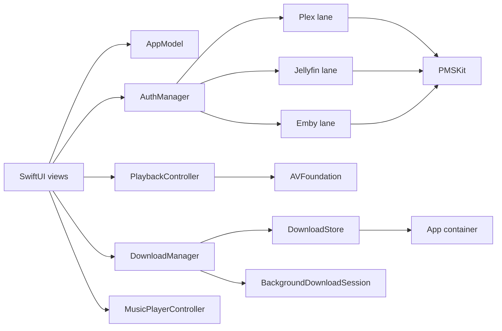
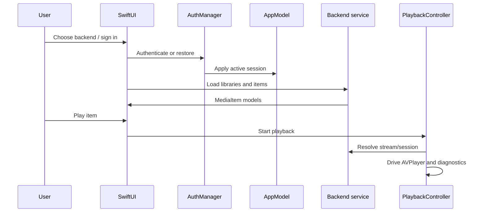

# Architecture overview

Labstream is a SwiftUI visionOS app with backend-specific service lanes and a pure Swift package, `PMSKit`, for request builders, response models, and policy decisions.

## Design goals

- Keep server-specific behavior explicit instead of hiding real API differences behind a broad protocol.
- Keep pure decisions in `PMSKit` so they can be unit-tested without a simulator, server, or Keychain.
- Keep side effects in the app target: SwiftUI state, Keychain, URLSession, files, AVFoundation, and system integration.
- Preserve user privacy by default: diagnostics are local, bounded, redacted, and user-exported only.

## Ownership map

| Area | Owner | Responsibility |
| --- | --- | --- |
| App lifecycle | `Labstream/App` | Object creation, restore flow, window routing. |
| Session state | `AppModel` | Active backend, selected server/session, browse readiness. |
| Authentication | `AuthManager` | Sign-in, restore, sign-out, Keychain persistence. |
| Browsing | Backend services | Plex/Jellyfin/Emby browse APIs mapped to shared app models. |
| Playback | `PlaybackController` | AVPlayer, startup, restart/reopen, progress, cleanup, diagnostics snapshots. |
| Downloads | `DownloadManager` plus helpers | Route choice, transfers, resume/reconcile, offline-library state. |
| Music | `MusicPlayerController` and providers | Music browse, queue, and audio playback. |
| System surfaces | `SystemEntryRouter` and integration files | App Intents, Spotlight, user activities. |
| Pure policies | `PMSKit` | Request builders, DTOs, redaction, download/playback policies, tests. |

## Main runtime flow

## Documentation rule

Published docs should describe current behavior. Investigation notes, migration plans, historical issue details, and one-off validation logs belong in `docs/research/` or `docs/archive/`, not the public navigation.
