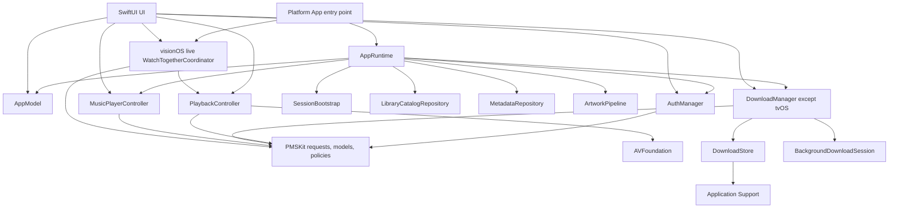

# Architecture overview

Labstream is a SwiftUI media client for Plex, Jellyfin, and Emby. The app code in
`Labstream/` owns UI and most live orchestration; the local Swift package in `PMSKit/`
owns reusable request builders, wire models, and policies. Most PMSKit behavior is pure
and can be tested without an app process, simulator, Keychain, filesystem, or media
server; a small set of reusable infrastructure is intentionally effectful.

## Native targets and release trains

The repository contains four native application targets. Vision Pro and mobile are the
supported product paths; the native Mac target is a local-build development preview, and the
streaming-only tvOS target is in development. All four
attach the file-system-synchronized `Labstream/Shared/` root plus exactly one root under
`Labstream/Platforms/`. Vision Pro, mobile, and Mac additionally attach the non-overlapping
`Labstream/Capabilities/Downloads/` root; tvOS cannot compile or construct that capability.

| Target / scheme | Entry point | Platform | Current marketing version |
| --- | --- | --- | --- |
| `Labstream` | `Labstream/Platforms/visionOS/App/Labstream.swift` | visionOS | 1.6.1 |
| `LabstreamMobile` | `Labstream/Platforms/Mobile/App/LabstreamMobile.swift` | iOS and iPadOS | 1.6.1 |
| `LabstreamMac` | `Labstream/Platforms/macOS/App/LabstreamMac.swift` | native macOS, not Catalyst | 1.6.1 |
| `LabstreamTV` | `Labstream/Platforms/tvOS/App/LabstreamTV.swift` | tvOS | 1.6.1 |

The marketing versions remain independently configurable. They were synchronized for the 1.6.1
codebase milestone; that synchronization does not change the Mac or tvOS distribution status.
The Xcode project is the source of truth for current version and deployment settings.

Shared files still use conditional compilation for genuinely inline framework and presentation
differences. Capability and build variants also use `#if canImport(...)`,
`#if targetEnvironment(simulator)`, and `#if DEBUG`; these are compile-time conditions, not
runtime feature flags. Whole-platform entrypoints/adapters instead rely on exclusive target
membership and contain no redundant whole-file platform guard. Authenticated navigation no longer
embeds four shells in one conditional view: `RootView` owns common composition,
`RootNavigationCoordinator` owns shared transitions, and each exclusive
`Labstream/Platforms/*/UI/*RootShell.swift` file owns native presentation. The densest remaining
shared-platform branches are in the shared player and login/detail UI.

## App-lifetime composition

Every target guards the optional result of `AppRuntime.make()` in its `App` initializer
and has a `SecureStorageUnavailableView` fallback. The current factory returns a service
graph even when the durable client identifier cannot be read by using a process-local
identifier for that launch; credentials themselves still fail closed. `AppRuntime`
constructs the common long-lived services and the one launch bootstrap:

- `AppModel`: active backend and the three live server/session lanes.
- `AuthManager`: authentication, restore, backend switching, and Keychain writes. It privately
  owns `EmbyConnectAuthFlow` (secret-bearing pending Connect state and Emby server
  exchange/commit) and `AuthorizationPollingCoordinator` (exact-attempt ownership of the one
  live Plex PIN, Jellyfin Quick Connect, or Emby Connect polling task). Global attempt
  admission remains on `AuthAttemptAuthority`.
- `DownloadManager`: the cross-backend offline queue and transfer orchestration, absent on tvOS.
- `MusicPlayerController`: the app-lifetime audio queue and player.
- `SessionBootstrap`: one-time restore and browse-gate state shared across scene recreation.
- `LibraryCatalogRepository`: exact-authority section/view enumeration shared across browse,
  search, music, system-entry, and SharePlay consumers.
- `MetadataRepository`: exact-authority item hydration with separate display and action-authority
  policies.
- `ArtworkPipeline`: actor-owned authenticated/local artwork scheduling, joining, and bounded
  memory caches shared by presentation and system-media consumers.
- `ArtworkShimmerClock`: one app-lifetime, reference-counted placeholder ticker.

Only the visionOS entry point additionally owns the real `CustomCinemaSessionStore` and
`WatchTogetherCoordinator`; it injects the same live instances into the main window and Custom
Cinema. Non-vision products construct neither capability. Keeping the live visionOS objects above the main window matters
because entering Cinema can dismiss the window while the authenticated session, active player,
and SharePlay coordination must survive until it reopens.

`ContentView` receives the exact `AppRuntime` and is the launch gate. It registers system-entry routing, restores saved
sessions once, presents restore/login/browse UI, and starts download reconciliation.
`RootView` receives the same runtime as the authenticated navigation shell and injects the app
model, supported download manager, and music player into the view environment. Its visionOS-only SharePlay consumers read
the coordinator inherited from the visionOS scene environment.

## Session and backend model

`AppModel` keeps separate Plex, Jellyfin, and Emby session state. Switching the active
backend does not overwrite another backend's credentials. At launch,
`AuthManager.restoreSession()` runs under one global generation-scoped authorization authority and
restores only the selected user-facing lane. After that completes, launch derives the distinct
inactive backends that own durable active download rows and demand-hydrates only those lanes before
download reconcile. Paused, failed, and completed rows stay cold until their explicit action edge;
tvOS has neither downloads nor inactive-download hydration.
Login, Quick Connect/Connect, restore, and server selection cannot publish stale results
from an older authorization attempt. System-entry fallback restore uses
`restoreSessionIfNoAuthorizationInProgress()` rather than taking authority from a login the
user is completing. `AuthorizationPollingCoordinator` separately owns polling-task lifetime and
rejects stale exact-owner finish/cancel requests, while `AuthAttemptAuthority` remains the only
authority that admits state or credential publication.

Token-free identities serve two different purposes:

- a stable server/user key scopes persisted preferences such as library visibility;
- a revisioned browse-session key invalidates navigation, search, paging, and music
  queues after a backend, server, user, or authentication-session change.

Online navigation is session-scoped. The Offline library is deliberately
cross-backend: its records carry their backend identity and remain available when the
active browse backend changes.

## App/PMSKit boundary

The dominant boundary keeps app-lifecycle effects in the app target:

- SwiftUI observation, navigation, presentation, and target lifecycle;
- Keychain and UserDefaults access;
- live `URLSession` execution and background-session delegates;
- app-owned file mutation, offline-index persistence, and filesystem orchestration;
- `AVPlayer`, audio sessions, Picture in Picture, Now Playing, RealityKit, and live
  GroupActivities/AVPlayerPlaybackCoordinator attachment;
- MetricKit, Spotlight, App Intents, and share/export UI.

PMSKit primarily owns behavior that can be expressed as input-to-output decisions:

- Plex, Jellyfin, and Emby request construction and response decoding;
- shared media and offline models;
- playback, download, retry, paging, routing, redaction, and SharePlay identity/readiness
  policies;
- state-machine decisions that can be exercised by `swift test`.

There are deliberate package-side exceptions. They include the MediaBrowser
`URLSession` request executor, the reusable loopback HLS proxy and upstream connection
machinery in `PMSKit/Sources/PMSKit/MediaSession/`, the locked diagnostic ring buffer, and
the shared protected-file writes in
`PMSKit/Sources/PMSKit/Security/CredentialArtifactStorage.swift`.
These types keep framework effects behind narrow, injectable/testable APIs; they do not
move SwiftUI, AVPlayer ownership, background-session delegation, or app persistence into
the package. The app still owns background-session delegates and most live URLSession
work; “all live URLSession execution lives in the app” is not true.

The boundary is not a mandate to erase backend differences. Plex has native hub,
optimizer, and music behavior; Jellyfin and Emby share MediaBrowser-shaped providers
where their APIs genuinely align, while their authentication, playback, and download
details remain explicit.

## Browse, search, and music

- Pure Plex hubs, search, and metadata requests are built by `PlexBrowseRequest` in PMSKit.
  Video-library section pages, filters, and sorts use `PlexLibraryBrowseRequest`. The small
  app facade in `Labstream/Shared/Backend/PlexBrowseAPI.swift` covers both. `PlexBrowseService` pins one
  immutable backend session and client identity, retains transport isolation through the shared
  `PlexClient`, and moves response decoding and normalization off the main actor before returning
  completed values to its MainActor callers.
- Jellyfin and Emby retain concrete facades under `Labstream/Shared/Backend/Jellyfin/` and
  `Labstream/Shared/Backend/Emby/`, backed by `MediaBrowserBrowseCore` only for their genuinely
  shared browse behavior. The MainActor facades snapshot an immutable authenticated context and
  transport; the Sendable core executes requests, decodes JSON, and maps DTOs off the main actor,
  returning only completed values to UI owners.
- Backend-neutral paging models live in `Labstream/Shared/Backend/Paging/`. The grouped,
  deduplicated search-result model lives in
  `PMSKit/Sources/PMSKit/Search/SearchResults.swift`, while `Labstream/Shared/UI/SearchView.swift`
  executes the active backend search, renders the sections, and routes music versus standard
  results. MediaBrowser search and video/music A-Z probes reuse one ordered bounded fan-out
  primitive with a four-request ceiling; search remains fail-fast while letter-probe failures
  continue to degrade individually.
- Sparse library pages use one model-owned flight per page: exact-page callers join, each waiter
  can cancel independently, last-waiter/reset cancellation retires the work, and stale completions
  cannot publish. Movie-version collapse keeps stable first-seen groups and updates only the dense
  projection positions touched by each arriving page. Long playlists use a separate positional
  paging model so duplicate tracks and native server order survive page boundaries; page zero can
  render early, but Play and queue actions wait for the complete list.
- `LibraryCatalogLoader` is the behavior-neutral native section/view enumeration seam.
  `LibraryCatalogRepository`, owned once by `AppRuntime`, caches and joins reads only for an exact
  backend plus opaque authenticated authority. It evicts failed loads, serializes force refresh,
  and rejects stale queued/completed work. Libraries, Home, Search, Music, the Mac sidebar,
  visibility editing, system entries, and Watch Together consume this shared enumeration; their
  visibility, ordering, destination, query, and presentation policies remain outside it.
- Plex Home remains its native server-composed `/hubs` response. Jellyfin/Emby Home executes one
  duplicate-safe canonical rail plan under a four-request ceiling, publishes successful rails as
  each request completes, preserves empty/successful results across partial failure, and performs
  one failed-key-only retry. Exact authority, generation, and attempt fences reject late results;
  only a complete non-degraded snapshot becomes the pinned loaded identity.
- `MusicProvider` is the backend-neutral music boundary. Plex supplies richer native
  artist metadata; Jellyfin and Emby share `MediaBrowserMusicProvider`.
- `MusicPlayerController` survives navigation. Its queue is tied to the browse-session
  identity so stale media IDs are never resolved against a different server.

`AppModel` also vends an exact `AuthenticatedBrowseSessionContext` for catalog and metadata
repositories. It carries an opaque process-local authority generation alongside the immutable
backend session and client identity; server, user, credential, or client-identity replacement
mints a new authority without placing credentials or raw server identity in cache keys.

`MetadataRepository` keys item reads by backend, opaque authority, and item identifier. Display
reads reuse a value for ten seconds, then may paint it stale for up to sixty seconds while one
repository-owned refresh runs. Authoritative reads ignore completed cache values, although they
may join the exact current native read. Provenance and repository admission prevent reused, stale,
expired, locally watched-patched, or superseded values from authorizing Play, Download, or watched
mutation; an exact fresh native Detail value can therefore support immediate Play without a second
read. A successful watched mutation patches only the exact presentation entry and never upgrades
its authority.

`AppRuntime` also owns one `ArtworkPipeline`. `MediaArtwork` keeps authenticated requests private
behind token-free descriptors keyed by backend, opaque authority, purpose, source digest, and
requested pixels; local descriptors replace auth authority with an opaque persisted owner plus
monotonic poster generation. The actor core joins exact requests, gives each waiter independent
cancellation, schedules at most four active loads per canonical origin with priority, downsamples
and eagerly decodes through ImageIO off the main actor, and bounds compressed, decoded, and
definitive-4xx negative caches by cost. Its ephemeral remote transport disables URL cache, cookies,
and credential storage. `PosterImage`, music/video system Now Playing (including visionOS scoped
metadata), `AVPlayerItem` external metadata, offline rows, and offline player artwork all use this
pipeline; native framework bridges receive only completed `DecodedImage` or original encoded bytes.
Asynchronous success and terminal-failure publication is fenced by the exact descriptor, pipeline
instance, and owning playback/view generation rather than cancellation alone. Settings clears
positive and negative memory state on that same app-lifetime pipeline and advances its epoch so
pre-clear work cannot repopulate those caches. Persisted offline
`posterGeneration` changes on publish, replacement, and clear so a same-path, same-byte-count
replacement cannot reuse stale pixels. One reference-counted app-lifetime shimmer clock serves all
visible placeholders in the main UI and visionOS Custom Cinema ImmersiveSpace, while Reduce Motion
starts no animation work.

AVKit-hosted chapter stills remain request-backed because their independent hosting environment
does not inject the pipeline or an exact pixel contract. BIF and sprite-sheet providers, Emby
generated per-position frames, Emby online/offline chapter fallback, and the player nearest-frame
cache remain provider-scoped time-indexed exceptions rather than `ArtworkPipeline` consumers.
Authenticated requests use the nonpersistent side-asset transport, and their leaf caches are
memory-only and bounded by both byte cost and entry count. Sprite sheets and final scrub previews
cross a detached, eager ImageIO decode boundary before provider or MainActor cache publication; one
BIF backing payload is retained, safe offline files are mapped, and normal seek lookup copies only
the selected frame; the source-compatible `frames` accessor materializes all payloads only when
explicitly read. Largest-real-BIF and tile-sheet peak-RSS measurement was a planned Wave 5 gate that the operator
explicitly elected to forgo; no measurement gate remains outstanding (see
docs/archive/plans/2026-07-21-simplification-performance.md).
Their `DecodedImage` conversion is not shared-pipeline migration. Downloaded poster/chapter/BIF/subtitle
payloads are validated before promotion: `DownloadSideAssetService.validate` decodes and structurally
checks each payload kind ahead of the atomic staging write.

## Video playback and theater surfaces

Three input lanes converge on one `PlaybackController` and its shared item observation,
transport state, diagnostics, seek UI, and chrome, while source negotiation, reopen,
progress, and server cleanup remain lane-specific:

1. Plex streaming resolved by the controller's Plex path;
2. an already-negotiated Jellyfin or Emby remote stream with reopen/progress/cleanup
   callbacks;
3. a local downloaded file.

`PlaybackController` owns the `AVPlayer`; `CustomPlayerView` and the Cinema attachment own
their `AVPlayerLayer` presenters, with `CustomPlayerChrome` as the only shipping video chrome.
There is no selectable native `AVPlayerViewController` path. iOS/iPadOS and macOS platform
coordinators use the process-wide music/video system-media lease, while visionOS video uses a
controller-scoped `MPNowPlayingSession` and routes its commands directly back to the controller.
See [Playback architecture](PLAYBACK-ARCHITECTURE.md) for lifecycle and cleanup invariants.

The visionOS **Custom Cinema** immersive space is the user-visible app-owned Cinema
path and reuses the same controller and chrome.

## Downloads and offline ownership

The download pipeline has five layers:

1. backend-specific `DownloadManager` extensions select a source and perform any Plex
   optimize, Jellyfin transcode/remux, or Emby Convert preparation;
2. `DownloadManager` owns queue policy, retries, storage limits, diagnostics, the
   observable Offline snapshot, and attempt-scoped work/cleanup coordination;
3. `DownloadKeepaliveCoordinator` privately owns exact-attempt Jellyfin/Emby control-plane
   keepalive tasks and credential-generation quarantine;
4. `BackgroundDownloadSession` owns background URLSession work and durable static
   byte-range recovery, with every adoptable task stamped by its exact download attempt;
5. `DownloadStore` owns the locked relative-path JSON index and transactional artifact
   state in Application Support. `DownloadArtifactLifecycleCoordinator` orders filesystem
   work with index persistence, while `DownloadCleanupIntentJournal` independently keeps
   credential-free server cleanup durable across deletion and process death.

Device builds use a background URLSession that can relaunch the app. Simulator builds
normally substitute a foreground session because the visionOS simulator background
daemon is unreliable. Every downloads-capable platform uses the same static-range planner: known totals use
the bounded closed-segment train, while unknown totals retain one open-ended request from
the attempt-owned durable checkpoint.

Download startup installs every session callback and registers the dormant session with the
background-completion registry before transport activation can submit work. For a healthy current
store only, initial transport submission crosses one bounded MainActor turn; that task retains the
manager until submission, and an explicit retry before the turn cancels the deferred edge and owns
the sole immediate submission rather than overtaking it. Unsupported, unreadable, or malformed
recovery does not enter that deferred edge: unsupported schemas retain their explicit reset path,
while unreadable indexes and malformed current ownership remain fail-closed. This is critical-path
scheduling of the existing app-owned transport, not removal of transport work or any persistence,
recovery, or background-completion durability.

## System integration and diagnostics

`SystemEntryRouter` bridges App Intents, Spotlight, Cinema exit, and SharePlay launches that
have already been resolved on the participant's device back into SwiftUI navigation.
Identifier-based system entries are backend/server scoped and refetch authoritative metadata
before navigation; SharePlay routing carries the participant-locally resolved item. Music
is intentionally excluded from the current system-video surface. Spotlight indexing is
best-effort and index-as-you-browse rather than a full-library crawl. The cross-device SharePlay
privacy and authenticated local-resolution boundary is canonical in
[System integration](SYSTEM-INTEGRATION.md#shareplay-watch-together).

Structured app diagnostics are local, bounded, redacted, and opt-in. MetricKit is a
separate passive crash/hang channel: it keeps at most five redacted summaries, uploads
nothing, and includes them only in a user-generated feedback report. Debug performance
signposts compile to no-op implementations in Release. `RuntimeLifecycleCoordinator` consumes the
existing aggregate-scene 500 ms handoff grace and emits typed active/inactive recovery reasons;
best-effort diagnostic flushing happens only on genuine aggregate inactivity.

## Documentation rule

Published docs describe current behavior. Active implementation plans and acceptance journals live
in `docs/plans/`; unresolved investigations in `docs/research/`; immutable audit and profiling
observations in `docs/evidence/`; and completed or superseded context in `docs/archive/`. None of
those internal lanes belongs in the public navigation.
