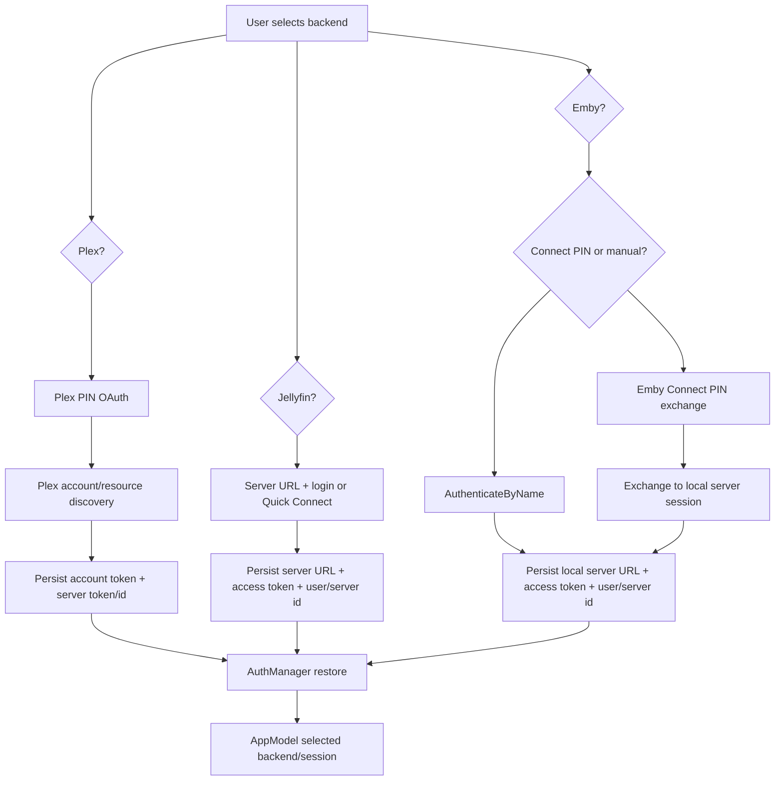

# Backends

Labstream supports Plex, Jellyfin, and Emby as selectable backends. Plex remains the default path for existing installs, but Jellyfin and Emby have real sign-in, browse, playback, music, progress, and watched-state lanes. Emby playback and Emby Connect wire shapes have been live-validated; headset breadth still varies by feature. The original Emby planning map is historical context only: [`archive/research/17-emby-backend-support.md`](https://github.com/jlipworth/Labstream/blob/main/docs/archive/research/17-emby-backend-support.md).

Downloads/offline behavior is intentionally out of scope for this backend overview.

## Comparison

| Area | Plex | Jellyfin | Emby |
| --- | --- | --- | --- |
| Sign-in | Plex PIN OAuth via in-app web auth | Server URL + username/password or Jellyfin Quick Connect | Emby Connect PIN (`emby.media/pin.html`) is the primary path; manual server URL + username/password (`POST /Users/AuthenticateByName`) remains the fallback. Emby does **not** have Jellyfin Quick Connect |
| Auth header | `X-Plex-Token` family | `Authorization: MediaBrowser …` | `Authorization: Emby UserId="…", Client, Device, DeviceId, Version, Token="…"` (scheme is `Emby `, not `MediaBrowser `) **plus** `X-Emby-Token: <token>` on authenticated calls |
| Secrets | Plex account token, selected server token/resource, selected server id | Jellyfin access token, user ID, server URL, server ID | Emby local server access token, user ID, server URL (base path preserved), server ID; stable device id from `ClientIdentity`. Emby Connect tokens/access keys stay in memory only during PIN sign-in and are not persisted |
| Browse | `PlexClient` actor + PMSKit request builders | `JellyfinBrowseService` + PMSKit request builders | `EmbyBrowseService` + PMSKit request builders |
| Shared model | PMS metadata mapped to `MediaItem` | `MediaBrowserBaseItemDto<JellyfinFlavor>` mapped to `MediaItem` | `MediaBrowserBaseItemDto<EmbyFlavor>` mapped to `MediaItem` |
| Music | Plex `MusicProvider` over `MusicRequest`/`PlaylistRequest` with Plex-only artist enrichments | Shared `MediaBrowserMusicProvider` over `JellyfinBrowseService` | Shared `MediaBrowserMusicProvider` over `EmbyBrowseService` |
| Playback | Universal transcode/direct-stream HLS, `Generic` profile | `POST /Items/{Id}/PlaybackInfo`, resolved stream URL, headers/proxy as needed | `POST /Items/{Id}/PlaybackInfo?UserId=…`; `resolveStream` prefers server-generated `TranscodingUrl`, then `DirectStreamUrl`, then synthesized `stream.{container}`; relative URLs join onto the preserved server base path |
| Stream auth | `X-Plex-Token` in URL | Header / proxy as needed | Server-generated HLS URL carries the token as `api_key=` in the query, so AVPlayer child playlists/segments inherit auth — no per-child `Authorization` injected. Direct-stream falls back to `X-Emby-Token` header when `AddApiKeyToDirectStreamUrl` is false |
| Progress | PMS timeline/scrobble endpoints | Jellyfin session/progress path where available | `POST /Sessions/Playing`, `/Sessions/Playing/Progress`, `/Sessions/Playing/Stopped`, `/Sessions/Playing/Ping` |
| Cleanup | Explicit transcode stop endpoint | Stop active encoding/session where available | `DELETE /Videos/ActiveEncodings?DeviceId=&PlaySessionId=`, called when the resolved source uses server-side encoding (`usesServerEncoding`) — **separate from `Stopped`** |

## Abstraction rule

Do not introduce a broad backend protocol across Plex, Jellyfin, and Emby. Plex differs fundamentally in auth, library shape, stream resolution, timeline/progress, and PMS-specific feature support.

Jellyfin and Emby do share a forked MediaBrowser API, and the current code now contains targeted shared pieces where the overlap is proven:

- `PMSKit/MediaBrowser/MediaBrowserNetworking.swift` for URL joining, auth-header quoting, library-field constants, and request/query dialect helpers.
- `PMSKit/MediaBrowser/MediaBrowserItemModels.swift` for generic item DTOs with a backend flavor (`JellyfinFlavor` / `EmbyFlavor`) so synthetic image/media schemes remain explicit.
- `PMSKit/MediaBrowser/MediaBrowserPlaybackCarriers.swift`, `MediaBrowserPlaybackPolicy.swift`, and `MediaBrowserPlaybackProgressPolicy.swift` for small backend-neutral playback/progress carriers and pure policies.
- App-layer seams such as `MediaBrowserMusicProvider` and `MediaBrowserMusicBrowsing` for duplicated Jellyfin/Emby music browse flows.

The rule is therefore: share small, pure, parameterized MediaBrowser-family helpers; keep backend-specific request construction and behavior explicit where the wire shape differs.

## Current asymmetry

Plex uses a shared `PlexClient` actor because most app surfaces talk to one selected PMS server with common headers and token behavior.

Jellyfin and Emby each keep their own browse/auth/playback services and public PMSKit builders, but those services use common MediaBrowser helpers for repeated low-level mechanics. The split stays intentional for divergences such as auth scheme, Emby `X-Emby-Token`, Emby `UserId` query/body behavior, `AutoOpenLiveStream:false`, HLS `api_key` auth, and base-path preservation.

## Emby promotion rule

Only behavior that is implemented and live-validated against a real Emby server should be described as Emby-proven. Emby Connect PIN request/exchange shape is implemented and live-verified, including server identity checks before exchanging a Connect access key, but in-headset UX validation should still be called out separately when relevant.

LAN discovery remains unimplemented. Keep [`archive/research/17-emby-backend-support.md`](https://github.com/jlipworth/Labstream/blob/main/docs/archive/research/17-emby-backend-support.md) as historical planning context, not current capability truth.
