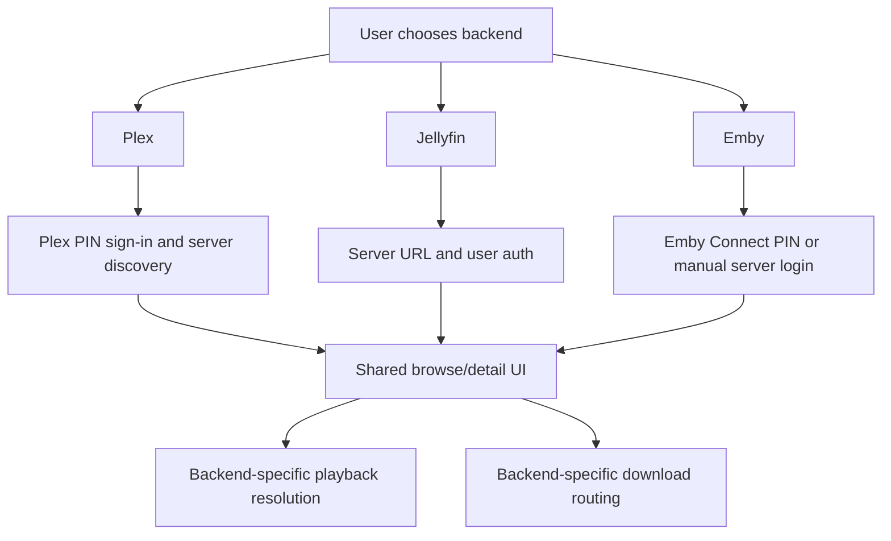

# Backends

Labstream supports Plex, Jellyfin, and Emby. Each backend has its own auth, browse,
playback, progress, and download details. The app shares canonical presentation models and
small policy seams where behavior is genuinely identical, while keeping wire behavior explicit.

## Backend comparison

| Area | Plex | Jellyfin | Emby |
| --- | --- | --- | --- |
| Sign-in | Plex PIN/OAuth and server discovery. | Server URL plus username/password or Quick Connect. | Emby Connect PIN or manual server URL plus username/password. |
| Auth material | Plex account token and selected-server token/resource. | Server URL, access token, user ID, server ID. | Server URL, access token, user ID, server ID. |
| Credential sync | Account token syncs across the user's devices via iCloud Keychain (shared sign-in). | Device-local; per-device sign-in. | Device-local; per-device sign-in. |
| Browse | Plex library APIs. | MediaBrowser item APIs. | MediaBrowser-family item APIs with Emby-specific differences. |
| Playback | Universal-transcode HLS decisions and direct/copy/transcode routes. | PlaybackInfo, resolved stream URLs, session progress, and active-encoding cleanup. | PlaybackInfo, resolved stream URLs, session progress, and separate active-encoding cleanup. |
| Downloads | Direct originals, existing server versions, and server-rendered compatible copies. | Static original/range transfers or server-selected stream outputs. | Direct static, prepared static, compatible remux, or convert-then-static lanes. |
| Music | Plex music provider. | MediaBrowser music provider. | MediaBrowser music provider. |

Only the Plex account token syncs across devices; Jellyfin/Emby tokens are deliberately device-local
because those servers bind the token to the device id used at sign-in. See `docs/DEVELOPMENT.md`
§Credentials and iCloud Keychain sync for the full rationale.

## Canonical models and MediaBrowser sharing

The app-facing library model is historically Plex-shaped. `MediaItem`, `Media`, `Part`,
`Stream`, `Chapter`, and related types live in
`PMSKit/Sources/PMSKit/Models/Library.swift`; this does not
mean Jellyfin and Emby use Plex on the wire. Their shared `MediaBrowserBaseItemDto` graph
decodes the forked MediaBrowser API and maps into those canonical types with
`toMediaItem()`. A phantom backend flavor changes only the synthetic reference scheme
(`jellyfin://` or `emby://`), and public backend DTO names are type aliases over the shared
generic implementation.

The MediaBrowser layer currently shares:

- the common Jellyfin/Emby item, media-source, stream, chapter, person, and user-data DTOs;
- URL normalization, base-path preservation, and same-origin checks before credentials are
  attached to a backend-provided absolute URL;
- authorization-header quoting, browse field lists, and the small path/query-name dialect;
- request execution, poster/chapter reference handling, library visibility/grid policy,
  playback quality math, progress-event mapping, and neutral playback-result carriers.

It is not a complete backend service. `JellyfinLibrary`/`EmbyLibrary` and
`JellyfinPlayback`/`EmbyPlayback` still construct native requests and return native result
types. Their path spelling, query casing, auth headers, PlaybackInfo bodies, stream URL
rules, server capabilities, and download guarantees remain distinct. In particular:

- Jellyfin uses the `MediaBrowser` authorization scheme and offers Quick Connect and
  trick-play tile playlists.
- Emby uses the `Emby` authorization scheme, also sends `X-Emby-Token`, requires its own
  user-id/PlaybackInfo conventions, supports Emby Connect, and has persistent Convert jobs.
- A user-entered MediaBrowser base path such as `/emby` is part of server identity and must
  survive normalization and relative-stream URL resolution.

Plex remains a separate request family. Its request descriptors, canonical response DTOs,
timeline, music, optimizer, and universal-transcode APIs are spread across the root PMSKit
folders rather than a `Plex/` directory.

## Package boundary

PMSKit is primarily the testable model/request/policy layer. The app owns SwiftUI,
AVFoundation, Keychain calls, background `URLSession` delegates, durable download-store
mutation, and file orchestration. Do not describe PMSKit as completely side-effect free,
however: it also contains the MediaBrowser request executor, the Apple-only loopback
`MediaSessionProxy` actor, the locked diagnostic ring buffer, and hardened credential-artifact
file writes. These are narrow infrastructure exceptions, not backend coordinators.

## Abstraction rule

Do not introduce a broad “one backend protocol” unless the behavior is truly identical. Plex, Jellyfin, and Emby differ in auth, request shape, stream resolution, progress reporting, cleanup, and download preparation.

What should be shared:

- canonical presentation models and pure policy helpers;
- small MediaBrowser-family helpers where Jellyfin and Emby genuinely overlap;
- UI concepts such as grids, detail screens, settings, and queues.

What should stay backend-specific:

- auth flows and token handling;
- stream URL construction and headers;
- server cleanup;
- download routing and server-prep behavior.
