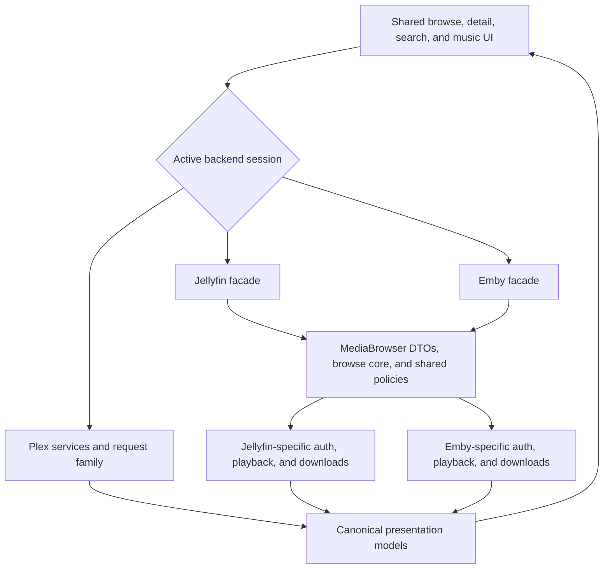

# Backends

Labstream supports Plex, Jellyfin, and Emby. Each backend has its own auth, browse,
playback, progress, and download details. The app shares canonical presentation models and
small policy seams where behavior is genuinely identical, while keeping wire behavior explicit.

## Backend comparison

| Area | Plex | Jellyfin | Emby |
| --- | --- | --- | --- |
| Sign-in | Plex PIN/OAuth and server discovery. | Server URL plus username/password or Quick Connect. | Emby Connect PIN or manual server URL plus username/password. |
| Auth material | Plex account token and selected-server token/resource. | Server URL, access token, user ID, server ID. | Server URL, access token, user ID, server ID. |
| Credential sync | Account token may sync across canonical Keychain-backed installs via iCloud Keychain (shared sign-in). | Device-local; per-device sign-in. | Device-local; per-device sign-in. |
| Browse | Plex library APIs. | MediaBrowser item APIs. | MediaBrowser-family item APIs with Emby-specific differences. |
| Playback | Universal-transcode HLS decisions and direct/copy/transcode routes. | PlaybackInfo, resolved stream URLs, session progress, and active-encoding cleanup. | PlaybackInfo, resolved stream URLs, session progress, and separate active-encoding cleanup. |
| Downloads | Direct originals, existing server versions, and server-rendered compatible copies. | Static original/range transfers or server-selected stream outputs. | Direct static, prepared static, compatible remux, or convert-then-static lanes. |
| Music | Plex music provider. | MediaBrowser music provider. | MediaBrowser music provider. |

Only the Plex account token may sync across canonical Keychain-backed installs; Jellyfin/Emby tokens are deliberately device-local
because those servers bind the token to the device id used at sign-in. See `docs/DEVELOPMENT.md`
§Credentials and iCloud Keychain sync for the full rationale. Per-worktree Mac development
identities use isolated credential storage instead of this canonical sync path.

## Canonical models and MediaBrowser sharing

The app-facing library model is historically Plex-shaped. `MediaItem`, `Media`, `Part`,
`Stream`, `Chapter`, and related types live in
`PMSKit/Sources/PMSKit/Models/Library.swift`; this does not
mean Jellyfin and Emby use Plex on the wire. Their shared `MediaBrowserBaseItemDto` graph
decodes the forked MediaBrowser API and maps into those canonical types with
`toMediaItem()`. A phantom backend flavor changes only the synthetic reference scheme
(`jellyfin://` or `emby://`), and public backend DTO names are type aliases over the shared
generic implementation.

The MediaBrowser layer currently shares:

- the common Jellyfin/Emby item, media-source, stream, chapter, person, and user-data DTOs;
- URL normalization, base-path preservation, and same-origin checks before credentials are
  attached to a backend-provided absolute URL;
- authorization-header quoting, browse field lists, and the small path/query-name dialect;
- request execution, poster/chapter reference handling, library visibility/grid policy,
  playback quality math, progress-event mapping, and neutral playback-result carriers.

In the app target, `MediaBrowserBrowseCore` is the browse-only execution/decode/map core
behind the thin `JellyfinBrowseService` and `EmbyBrowseService` facades. Those MainActor facades
capture immutable credentials, client identity, and transport configuration; the Sendable core
then performs request execution, JSON decoding, and DTO mapping off the main actor. It does not
own PlaybackInfo, device profiles, active-encoding cleanup, authentication, or downloads.
Per-library MediaBrowser search and video/music alphabet probes use the app's shared ordered
bounded fan-out with at most four active requests. Search remains all-or-error; individual failed
alphabet probes remain omitted/zero-degraded rather than sinking the listing.
`LibraryCatalogLoader` maps one native Plex section or Jellyfin/Emby view enumeration into ordered
descriptors. The app-lifetime `LibraryCatalogRepository` caches and coalesces only within the exact
backend plus opaque authenticated authority; failures are retryable, force refresh is serialized,
and stale authority work cannot publish or start after replacement. Libraries, Home, Search, Music,
the Mac sidebar, visibility editing, system-entry matching, and Watch Together share that native
enumeration, but their query, visibility, ordering, Home-rail, and destination policies remain
outside the repository.

Jellyfin/Emby Home is not a single combined backend endpoint. One canonical plan schedules resume,
next-up, and per-library latest requests under a four-request ceiling, publishes available rails
progressively in stable plan order, and performs one failed-key-only retry without refetching
successful or empty-success rails. Plex Home remains the native server-composed `/hubs` path.

All three backends page playlist entries through their native range parameters. The app's
positional playlist model appends rows without sorting or identifier de-duplication, so a repeated
track and server order survive page boundaries. Reported totals, clamped server pages, retry,
cancellation, and authority replacement decide when the list is complete; queue actions remain
disabled until then.

Jellyfin/Emby field selection uses intent-bearing metadata profiles for grid, search, Home,
playlist, generic item hydration, related media, and Music. They are currently byte-identical
aliases of the established grid/full field contracts; separate routing exists so later measured
trimming cannot silently change an unrelated surface.

It is not a complete backend service. `JellyfinLibrary`/`EmbyLibrary` and
`JellyfinPlayback`/`EmbyPlayback` still construct backend-native requests, then publish the shared
`MediaBrowserPlaybackOpenResult` carrier. Their path spelling, query casing, auth headers,
PlaybackInfo bodies, stream URL rules, server capabilities, and download guarantees remain
distinct. In particular:

- Jellyfin uses the `MediaBrowser` authorization scheme and offers Quick Connect and
  trick-play tile playlists.
- Emby uses the `Emby` authorization scheme, also sends `X-Emby-Token`, requires its own
  user-id/PlaybackInfo conventions, supports Emby Connect, and has persistent Convert jobs.
- A user-entered MediaBrowser base path such as `/emby` is part of server identity and must
  survive normalization and relative-stream URL resolution.

Plex remains a separate request family. Hubs, search, and metadata builders live in
`PlexBrowseRequest`; video-library section pages, filters, and sorts live in
`PlexLibraryBrowseRequest`. The app's `PlexBrowseService` pins an immutable Plex session and owns
browse execution. Its transport callback retains the existing MainActor isolation, while a
Sendable executor performs JSON decoding and response normalization off the main actor with
cancellation fences. Other Plex request descriptors, canonical response DTOs,
timeline, optimizer, and universal-transcode APIs remain spread across the root PMSKit
folders rather than a `Plex/` directory.

For MediaBrowser Home artwork (Jellyfin and Emby), synthetic season/series Primary sources are
treated as portrait posters; Thumb and Backdrop fallbacks retain 16:9 request and presentation
geometry. Automated policy, request, mapping, and hosted checks cover this shared policy.

## Package boundary

PMSKit is primarily the testable model/request/policy layer. The app owns SwiftUI,
AVFoundation, Keychain calls, background `URLSession` delegates, durable download-store
mutation, and file orchestration. Do not describe PMSKit as completely side-effect free,
however: it also contains the MediaBrowser request executor, the Apple-only loopback
`MediaSessionProxy` actor, the locked diagnostic ring buffer, and hardened credential-artifact
file writes. These are narrow infrastructure exceptions, not backend coordinators.

## Abstraction rule

Do not introduce a broad “one backend protocol” unless the behavior is truly identical. Plex, Jellyfin, and Emby differ in auth, request shape, stream resolution, progress reporting, cleanup, and download preparation.

What should be shared:

- canonical presentation models and pure policy helpers;
- small MediaBrowser-family helpers where Jellyfin and Emby genuinely overlap;
- UI concepts such as grids, detail screens, settings, and queues.

What should stay backend-specific:

- auth flows and token handling;
- stream URL construction and headers;
- server cleanup;
- download routing and server-prep behavior.
