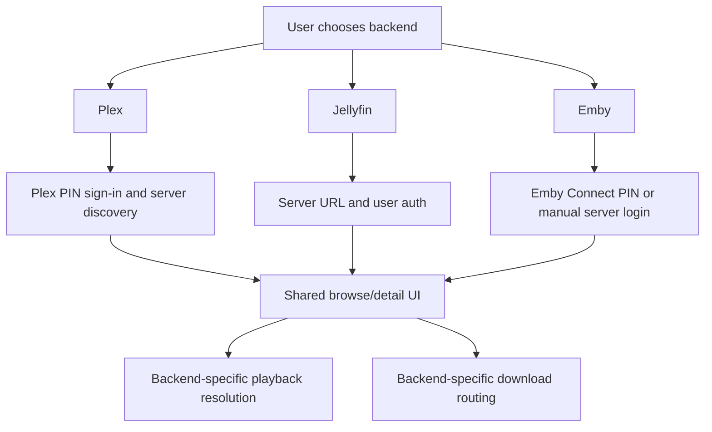

# Backends

Labstream supports Plex, Jellyfin, and Emby. Each backend has its own auth, browse, playback, progress, and download details; the app shares UI concepts where that is helpful but keeps wire behavior explicit.

## Backend comparison

| Area | Plex | Jellyfin | Emby |
| --- | --- | --- | --- |
| Sign-in | Plex PIN/OAuth and server discovery. | Server URL plus username/password or Quick Connect. | Emby Connect PIN or manual server URL plus username/password. |
| Auth material | Plex account token and selected-server token/resource. | Server URL, access token, user ID, server ID. | Server URL, access token, user ID, server ID. |
| Browse | Plex library APIs. | MediaBrowser item APIs. | MediaBrowser-family item APIs with Emby-specific differences. |
| Playback | Universal transcode/direct-stream HLS and direct/copy decisions. | PlaybackInfo and resolved stream URLs. | PlaybackInfo, resolved stream URLs, progress, and active-encoding cleanup. |
| Downloads | Direct originals, existing server versions, and server-rendered compatible copies. | Static original/range transfers or server-selected stream outputs. | Direct static, prepared static, compatible remux, or convert-then-static lanes. |
| Music | Plex music provider. | MediaBrowser music provider. | MediaBrowser music provider. |

## Abstraction rule

Do not introduce a broad “one backend protocol” unless the behavior is truly identical. Plex, Jellyfin, and Emby differ in auth, request shape, stream resolution, progress reporting, cleanup, and download preparation.

What should be shared:

- pure models and policy helpers;
- small MediaBrowser-family helpers where Jellyfin and Emby genuinely overlap;
- UI concepts such as grids, detail screens, settings, and queues.

What should stay backend-specific:

- auth flows and token handling;
- stream URL construction and headers;
- server cleanup;
- download routing and server-prep behavior.
