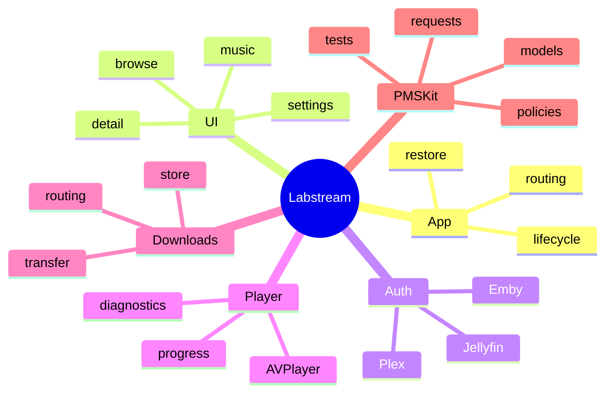

# Code map

Use this as the “where do I change X?” guide.

## App shell and lifecycle

- `Labstream/App/` creates app-lifetime objects and handles launch/bootstrap state. `Labstream.swift` is the visionOS entry point; `LabstreamMobile.swift` is the iOS/iPadOS entry point.
- `Labstream/UI/ContentView.swift` switches between restore, login, and browse states.
- `Labstream/UI/RootView.swift` contains the shared section routing plus the iPad sidebar and iPhone tab shell.
- `Labstream/SystemIntegration/` routes Spotlight, App Intents, and user activities into the main window.

## Auth, sessions, and identity

- `Labstream/Auth/` owns Plex, Jellyfin, and Emby sign-in/restore flows.
- `Labstream/Auth/KeychainStore.swift` stores secrets. Do not move tokens into UserDefaults, diagnostics, logs, or Codable profile indexes.
- `PMSKit/Sources/PMSKit/SessionIdentity.swift` contains token-free identity helpers.

## Browse and UI

- `Labstream/Backend/Plex/`, `Labstream/Backend/Jellyfin/`, and `Labstream/Backend/Emby/` adapt backend-specific APIs into app models.
- `Labstream/UI/` contains Settings, login, browse grids, detail screens, offline library, and download-option UI.
- `Labstream/Music/` contains music providers and queue/player state.

## Playback

- `Labstream/Player/PlaybackController.swift` owns the active playback session.
- `Labstream/Player/PlaybackDiagnostics.swift` feeds Stats for Nerds and exported diagnostics.
- PMSKit owns request builders and pure playback policy helpers; the app owns AVFoundation and network side effects.

## Downloads and offline

- `Labstream/Downloads/DownloadManager.swift` coordinates queue state and user-visible snapshots.
- Backend-specific download extensions keep Plex/Jellyfin/Emby behavior explicit.
- `DownloadStore` persists the offline index.
- `BackgroundDownloadSession` owns URLSession transfers and byte-range recovery.
- `PMSKit/Sources/PMSKit/Downloads/` contains pure route/status/retry/display policies.

## Diagnostics and privacy

- `Labstream/Diagnostics/` owns the app-side diagnostics facade and file sink.
- `PMSKit/Sources/PMSKit/Diagnostics/` owns redaction, typed diagnostic fields, report rendering, and MetricKit summary models.
- Use typed `DiagnosticFieldValue`s; do not add raw URLs, tokens, hosts, usernames, paths, filenames, or media titles.

## Tests and scripts

- `PMSKit/Tests/PMSKitTests/` covers pure policies, request builders, decoders, and redaction.
- `scripts/` contains simulator, deployment, docs, hygiene, and optional live-probe helpers. `scripts/worktree-sim.sh` can provision the default visionOS worktree simulator or an opt-in iPad simulator.
- `.woodpecker/` contains portable CI definitions.
