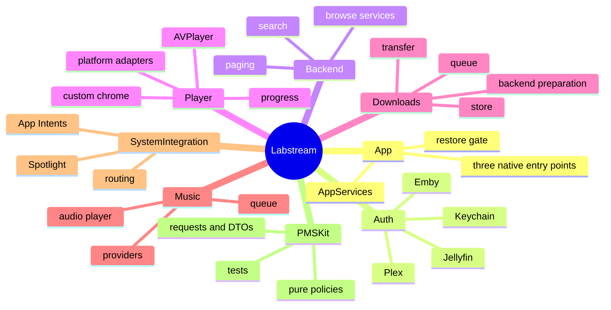

# Code map

Use this as the current “where do I change X?” guide. App lifecycle, UI, and most live
orchestration live in `Labstream/`; reusable requests, models, and policies live in
`PMSKit/`. PMSKit is mostly pure, with narrow effectful infrastructure such as its
loopback media-session proxy and protected credential-artifact writer.

## App shell and lifecycle

- `Labstream/App/AppServices.swift` is the shared composition root for app-lifetime
  `AppModel`, `AuthManager`, `DownloadManager`, and `MusicPlayerController` instances.
- `Labstream/App/Labstream.swift` is the visionOS entry point and declares the main
  window plus Custom Cinema and hidden Reality Theater immersive spaces.
- `Labstream/App/LabstreamMobile.swift` is the universal iPhone/iPad entry point.
- `Labstream/App/LabstreamMac.swift` is the native macOS entry point and declares the
  Mac Settings scene and menu commands.
- `Labstream/App/ContentView.swift` registers system routing, runs the one-time restore,
  and switches between restore, login, and browse states.
- `Labstream/App/AppDelegate.swift` bridges iOS/visionOS background URLSession relaunch
  events; `MacAppDelegate.swift` owns the small native Mac lifecycle adapter.
- `Labstream/App/PlatformClientIdentity.swift` maps the target to its Plex client/device
  identity.

The targets share one source tree. Use Swift conditional compilation—`#if os(...)`,
`#if canImport(...)`, `#if targetEnvironment(simulator)`, and `#if DEBUG`—for code that
cannot compile or should not ship on every platform. Do not create duplicate backend or
policy implementations merely to vary presentation.

## Session state, authentication, and secrets

- `Labstream/App/AppModel.swift` owns live, separate Plex/Jellyfin/Emby server and
  credential lanes, the active backend, token-free session identities, and the shared
  `PlexClient`.
- `Labstream/Auth/AuthManager.swift` owns sign-in, restore, server selection, backend
  switching, and sign-out. It covers Plex PIN auth, Jellyfin credentials/Quick Connect,
  and Emby credentials/Connect PIN.
- `Labstream/Auth/KeychainStore.swift` stores secrets and the stable client identifier.
  Do not put tokens in UserDefaults, diagnostics, URLs that do not require them, or
  Codable profile indexes.
- `Labstream/Auth/WebAuthSession.swift` is the cross-platform web-auth presentation
  adapter.
- `PMSKit/Sources/PMSKit/SessionIdentity.swift` and
  `PMSKit/Sources/PMSKit/MediaBackendSwitch.swift` contain the corresponding pure
  identity and switch decisions.

Downloads call `AppModel.backendSession(for:)` so each row uses its own backend lane,
not necessarily the backend currently visible in the UI.

## Browse, paging, search, and artwork

- `PMSKit/Sources/PMSKit/Models/PlexBrowseRequest.swift` contains pure Plex browse request
  builders; `Labstream/Backend/PlexBrowseAPI.swift` is their source-compatible app facade.
  `Labstream/Backend/PlexBrowseService.swift` pins one immutable Plex session and owns
  execution, decoding, and normalized browse results.
- `Labstream/Backend/Jellyfin/JellyfinBrowseService.swift` and
  `Labstream/Backend/Emby/EmbyBrowseService.swift` are the live MediaBrowser browse
  facades. Their shared browse-only execution/decode/map core is
  `Labstream/Backend/MediaBrowserBrowseCore.swift`; playback and downloads stay outside it.
- `Labstream/Backend/Paging/` owns backend-neutral paging sources/models and the
  Plex/Jellyfin/Emby grid and rail adapters. `RailPagingModel`, `RailPagingSource`, and
  `RailViewAllDestination` power paged Home “View All” destinations.
- `PMSKit/Sources/PMSKit/Search/SearchResults.swift` owns the pure grouped,
  deduplicated, library-aware search presentation model; `Labstream/UI/SearchView.swift`
  renders its backend-neutral sections and routes standard versus music results.
- `Labstream/UI/HomeView.swift` uses Plex native hubs or
  `Labstream/UI/MediaBrowserHomeProvider.swift` for shared Jellyfin/Emby Home rails.
- `Labstream/UI/LibraryGridView.swift` owns library roots and the shared sparse grid;
  `LibraryAlphabetRail.swift` owns the A–Z interaction.
- `Labstream/UI/ContainerBrowserView.swift` handles show/season child navigation and
  normalizes duplicate visible episode rows.
- `Labstream/UI/SearchView.swift` owns the shared search surface and music-result queue
  actions.
- `Labstream/UI/MediaArtwork.swift` builds backend-authenticated artwork requests;
  `PosterImage.swift` loads them.

Request/DTO implementations live under `PMSKit/Sources/PMSKit/Auth/`,
`PMSKit/Sources/PMSKit/Jellyfin/`, `PMSKit/Sources/PMSKit/Emby/`,
`PMSKit/Sources/PMSKit/MediaBrowser/`, and `PMSKit/Sources/PMSKit/Models/`, plus the
root Plex request files such as `PlexRequest.swift` and `PlexPhotoTranscode.swift`.

## Root navigation and shared UI

- `Labstream/UI/RootView.swift` is the authenticated shell. It contains the native Mac
  split view, visionOS tab shell, and adaptive iPhone tab bar/iPad sidebar presentation,
  and owns the paths used by system entries and Cinema return routing.
- `Labstream/UI/LoginView.swift`, `BackendSignInComponents.swift`,
  `LoginChromeComponents.swift`, and `PairingCodeView.swift` own shared backend login UI.
- `Labstream/UI/DetailView.swift` owns item-detail presentation state. Extracted backend
  effect seams are in `DetailMetadataLoader.swift`, `DetailWatchedUpdater.swift`, and
  `DetailPlaybackLauncher.swift`.
- `Labstream/UI/DownloadOptionsSheet.swift` owns download intent/version selection.
- `Labstream/UI/SettingsView.swift` owns backend/server status, preferences, storage,
  library visibility, diagnostics export, and About information.
- `Labstream/UI/DesignSystem.swift` contains shared visual constants and modifiers.

Online navigation paths are scoped to `AppModel.activeBrowseSessionKey` and reset when
that session changes. Offline navigation is intentionally not reset because saved items
are backend-scoped and cross-backend.

## Video playback

- `Labstream/Player/PlaybackController.swift` owns one active AVPlayer session. It
  handles Plex streams, negotiated Jellyfin/Emby streams, and local files through the
  same observer, transport, seek, subtitle/audio, chapter, retry, and cleanup lifecycle.
- `Labstream/Player/CustomPlayerView.swift` is the only shipping player presenter and
  hosts an AVPlayerLayer plus `CustomPlayerChrome`.
- `Labstream/Player/CustomPlayerChrome.swift` owns the shared transport/menu/scrubber UI
  and contains the largest concentration of platform conditional compilation.
- `Labstream/UI/DetailPlaybackLauncher.swift` negotiates Jellyfin/Emby playback and
  supplies remote reopen, progress, and encoding-cleanup callbacks to the controller.
- `Labstream/Player/TimelineReporter.swift` serializes/coalesces Plex timeline and
  Jellyfin/Emby playback-progress traffic.
- `Labstream/Player/PlaybackDiagnostics.swift`,
  `PlaybackController+Diagnostics.swift`, `PlaybackHDRProbe.swift`, and
  `StatsForNerdsView.swift` own runtime diagnostics surfaces.
- `Labstream/Player/TrickPlayThumbnailProviders.swift` owns remote and local Plex BIF,
  Jellyfin tile, and Emby chapter thumbnail providers.
- `Labstream/Player/AudioSessionCoordinator.swift` owns non-Mac audio-session policy.
- `Labstream/Player/MobilePlayerSystemCoordinator.swift` and
  `MobilePlayerOrientationCoordinator.swift` add iOS/iPadOS PiP, AirPlay, system media,
  and orientation behavior.
- `Labstream/Player/MacPlayerSystemCoordinator.swift` and
  `MacPlayerPresentation.swift` add native Mac system-media and presentation behavior.
- `Labstream/Player/VideoNowPlayingCore.swift` is shared by iOS/iPadOS and macOS;
  visionOS owns player chrome directly.
- `Labstream/Player/PlaybackLifecycleCallbackSink.swift` and
  `VideoPlaybackLifecyclePolicy.swift` reject queued observer/task callbacks from a
  superseded item generation; removing an observer alone is not treated as cancellation.
- `Labstream/Player/SystemMediaSessionCoordinator.swift` serializes process-wide Now
  Playing and remote-command ownership between music and video with identity-guarded leases.

Pure playback policies and request builders live primarily in
`PMSKit/Sources/PMSKit/Playback/`, `PMSKit/Sources/PMSKit/Transcode/`,
`PMSKit/Sources/PMSKit/MediaBrowser/`, and
`PMSKit/Sources/PMSKit/MediaSession/`. The MediaSession directory is the exception to
the usual pure-policy boundary: it owns the live, injectable loopback HLS proxy and
upstream connection rotation used by `PlaybackController`.

## Cinema and Reality Theater

- `Labstream/Player/CustomCinemaMode.swift` is the user-visible visionOS Custom Cinema
  implementation. It reuses the live `PlaybackController` and custom player chrome in an
  immersive space. The non-visionOS half supplies inert compatibility types for shared UI.
- `Labstream/Theater/RealityTheaterConfiguration.swift`,
  `RealityTheaterSessionStore.swift`, and `RealityTheaterPrototypeView.swift` implement a
  separate hidden RealityKit prototype. Its shipping and device-testing visibility gates
  are currently false; do not wire user-facing behavior to it without changing and
  validating that explicit gate.

## Downloads and offline

- `Labstream/Downloads/DownloadManager.swift` owns queue policy, observable records and
  snapshots, retry/resume, storage limits, server-prep polling, validation, and encoder
  cleanup.
- `DownloadManager+Plex.swift` and `DownloadManager+PlexOptimize.swift` own Plex source
  and optimizer behavior.
- `DownloadManager+Jellyfin.swift` owns Jellyfin original/transcode/remux behavior.
- `DownloadManager+Emby.swift` and `DownloadManager+EmbyConvert.swift` own Emby source,
  remux, and Convert behavior.
- `DownloadManager+SideCache.swift` caches posters, subtitles, chapters, Plex BIF, and
  Jellyfin trick-play assets.
- `DownloadTransferStartPlan.swift` is the common backend-to-transfer handoff contract.
- `Labstream/Downloads/BackgroundDownloadSession.swift` owns URLSession delegates,
  reattachment, progress, validation, completion gating, and durable static byte-range
  recovery.
- `Labstream/Downloads/BackgroundDownloadCompletionRegistry.swift` joins system relaunch
  callbacks to the live/recreated background session.
- `Labstream/Downloads/DownloadStore.swift` owns the locked relative-path index and files
  under Application Support.
- `DownloadArtifactLifecycleCoordinator.swift` registers attempt-scoped filesystem work
  before execution and releases it only after the matching persistence outcome;
  `DownloadArtifactFileCommitter.swift`, `DownloadPromotionFilesystem.swift`, and
  `DownloadStaticCheckpointFilesystem.swift` are the narrow file-effect seams.
- `RevisionedPersistenceWriter.swift` and `DownloadIndexFileCommitter.swift` serialize
  revisioned index writes. `BackgroundCompletionPersistenceBarrier.swift` flushes the
  exact boundary before releasing background-session completion handlers.
- `DownloadWorkRegistry.swift` tracks attempt-scoped side-cache and encoder work.
  `DownloadCleanupIntentJournal.swift` persists credential-free Jellyfin/Emby cleanup
  independently so deleting a row cannot discard required server cleanup.
- `Labstream/Downloads/OfflineLibraryView.swift` owns the cross-backend offline UI and
  local playback launch.
- `PMSKit/Sources/PMSKit/Downloads/` contains pure route, status, retry, display, storage,
  identity, and range-transfer policies and offline models.

Do not assume simulator and device transfers use identical URLSession configuration:
hardware uses the relaunch-capable background session, while simulator runs normally use
the documented foreground substitute.

## Music

- `Labstream/Music/MusicProvider.swift` defines the backend-neutral browse boundary.
- `PlexMusicProvider.swift` supplies Plex-native and richer artist data.
- `MediaBrowserMusicProvider.swift` is shared by Jellyfin and Emby.
- `MusicStreamResolver.swift` is the single backend-aware stream resolver.
- `MusicPlayerController.swift` owns the app-lifetime AVPlayer queue, shuffle/repeat,
  audio-session behavior, remote commands, and Now Playing metadata.
- `MusicPlaybackLifecycle.swift` generation-guards per-track observers and queued work;
  music acquires the shared `SystemMediaSessionCoordinator` lease rather than mutating
  global MediaPlayer state independently of video.
- `MusicLibraryView.swift`, `MediaBrowserMusicView.swift`, `MusicPagedGrid.swift`, and
  the album/artist/playlist detail views own presentation.
- `MiniPlayerBar.swift` and `NowPlayingView.swift` are the compact/full playback surfaces;
  `RootView.swift` owns their shared presentation state and app-owned visionOS backdrop
  so a surround tap and the explicit leading-edge close control use the same dismissal
  path without activating obscured content.
- `PMSKit/Sources/PMSKit/Music/` contains Plex music request builders and pure queue
  mutation behavior.

Plex music currently reports timeline/scrobble state. Jellyfin/Emby music playback works,
but MediaBrowser music progress reporting is not yet implemented.

## System integration

- `Labstream/SystemIntegration/SystemEntryRouter.swift` is the process-lifetime bridge
  from non-view entry points into RootView navigation. It weakly references the app-owned
  state and can wait for or initiate session restoration without preempting an in-progress
  user authorization attempt.
- `Labstream/SystemIntegration/LabstreamIntents.swift` defines Play, Open, and Continue
  Watching App Intents for all three backends.
- `Labstream/SystemIntegration/MediaItemEntity.swift` defines backend/server-scoped
  AppEntity search and suggestions. Display values are snapshots; metadata is refetched
  before navigation.
- `Labstream/SystemIntegration/SpotlightIndexer.swift` performs token-free,
  index-as-you-browse video indexing and shared-domain deletion.
- `PMSKit/Sources/PMSKit/SystemEntryRouting.swift` contains pure identifier and routing
  helpers.

The current system surface excludes music and does not crawl an entire library in the
background.

## Diagnostics and privacy

- `Labstream/Diagnostics/AppDiagnostics.swift` is the opt-in app-side facade.
- `DiagnosticFileLogSink.swift` owns the rotating local JSONL sink.
- `DiagnosticReportArtifact.swift` owns export/share wrappers.
- `BrowseDiagnostics.swift` creates privacy-safe browse facts.
- `MetricKitDiagnostics.swift` stores a bounded set of redacted crash/hang summaries for
  user-generated feedback; it does not upload them.
- `PerformanceInstrumentation.swift` is real signpost instrumentation in Debug and an
  API-compatible no-op in Release.
- `PMSKit/Sources/PMSKit/Diagnostics/` owns typed fields, redaction, the bounded event
  store, report rendering, and MetricKit summary models.

Use typed `DiagnosticFieldValue`s. Do not add raw tokens, URLs, hosts, usernames, local
paths, filenames, client identifiers, or media titles to diagnostics.

## Tests, builds, and scripts

- `PMSKit/Tests/PMSKitTests/` covers pure policies, request builders, decoders, state
  machines, and redaction. Run it with `cd PMSKit && swift test`.
- `Labstream.xcodeproj/project.pbxproj` is the source of truth for the three native target
  versions, platforms, and deployment settings.
- `scripts/worktree-sim.sh` provisions the visionOS worktree simulator or explicit
  iPhone/iPad simulators.
- `scripts/deploy-mobile-to-device.sh` deploys the signed mobile target to iPhone/iPad;
  `scripts/deploy-to-device.sh` deploys the signed visionOS target.
- `scripts/` also contains docs, hygiene, version stamping, and optional live-probe tools.
- `.woodpecker/` contains portable CI definitions.
