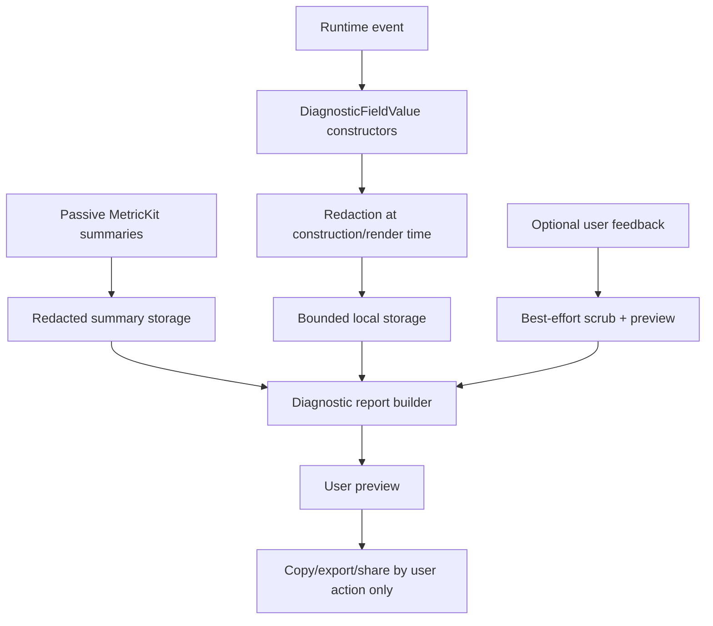

# Diagnostics and privacy

Labstream diagnostics are for user-initiated debugging, not analytics.

## Contract

- Diagnostic event logging is off by default.
- When enabled, events stay in a bounded local ring buffer.
- Reports are copied, exported, or shared only when the user taps a report action.
- No diagnostic report is uploaded by the app.
- Reports must omit or redact tokens, client identifiers, hostnames/IP addresses, full URLs, usernames, library paths, filenames, and media titles.
- Passive MetricKit crash/hang summaries are a separate local-only channel: visionOS may deliver them after a bad run, Labstream stores only a small bounded list of redacted summaries, and they surface only in a user-previewed/copied/exported report.
- Free-form feedback prose is best-effort scrubbed and previewed, but a bare media title or personal detail can look like ordinary text. UI and docs must tell the user to review/edit the preview before sharing.

## Typed fields

Use `DiagnosticFieldValue` constructors instead of raw strings:

- `.label` for safe categorical labels such as backend, state, route, codec/container labels, and quality labels.
- `.text` only for intentionally safe human-readable text.
- `.urlShape` for scheme/path-shape style reporting without full hosts/tokens.
- `.identifier` for stable-but-redacted identifiers.
- `.error`, `.bytes`, and bucket helpers for safe summaries.

The redaction layer runs at field construction/rendering time. Do not add raw URL/token/server/title strings to diagnostic fields.

## Report contents

The report may include:

- app product/version/build and OS/device class
- build identifier/timestamp when present
- backend name
- server product/version where safe
- connection scheme, not host
- selected quality settings
- Adaptive Bitrate state when present
- recent playback snapshot when present
- passive redacted MetricKit crash/hang summaries when present
- recent redacted event summaries when diagnostic event logging was enabled

It must not include the user’s Plex server name, Jellyfin/Emby server URL, raw hostname/IP, tokens, media titles, or filesystem paths.

## Profiling

Committed profiling baselines should be small, manually reviewed, and privacy-safe. Use backend/scenario names without titles or server names. See [`PROFILING.md`](PROFILING.md) and [`profiling/baselines/README.md`](https://github.com/jlipworth/Labstream/blob/main/docs/profiling/baselines/README.md).
