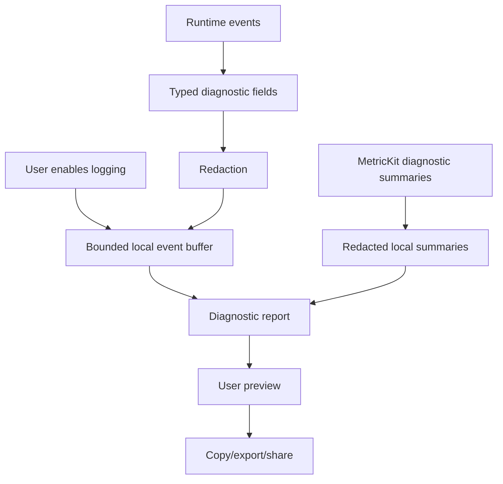

# Diagnostics and privacy

Labstream diagnostics are for user-initiated debugging, not analytics.

## Contract

- Diagnostic event logging is off by default.
- Events stay local in a bounded buffer.
- Reports are copied, exported, or shared only after a user action.
- The app does not upload diagnostic reports.
- Reports must omit or redact tokens, client identifiers, hostnames/IP addresses, full URLs, usernames, library paths, filenames, and media titles.
- Free-form user notes are best-effort scrubbed, but users should still review the preview before posting publicly.

## Typed fields

Use `DiagnosticFieldValue` constructors instead of raw strings:

- `.label` for safe categorical labels;
- `.text` only for intentionally safe text;
- `.urlShape` for scheme/path-shape reporting without hosts/tokens;
- `.identifier` for stable-but-redacted identifiers;
- `.error`, `.bytes`, and bucket helpers for safe summaries.

The redaction layer runs when fields are constructed and when reports are rendered. Do not add raw URLs, tokens, server names, usernames, paths, filenames, or media titles to diagnostic fields.

## Report contents

A report may include:

- app version/build and OS/device class;
- active backend;
- server product/version where safe;
- connection scheme, not host;
- selected quality settings;
- Adaptive Bitrate state;
- recent playback snapshot;
- passive redacted MetricKit crash/hang/CPU/disk-write diagnostic summaries;
- recent redacted event summaries.

The Mac development preview uses the same typed/redacted report pipeline and may add safe platform,
effective bundle-identity, sandbox-storage, download, and playback facts. Per-worktree bundle IDs
and container paths must not be emitted as raw identifiers or filesystem paths.

## Public issue reminder

GitHub issues are public. The app and docs ask users to review diagnostic reports, screenshots, videos, and logs before submitting because automated redaction cannot understand every personal detail in free-form prose or images.
