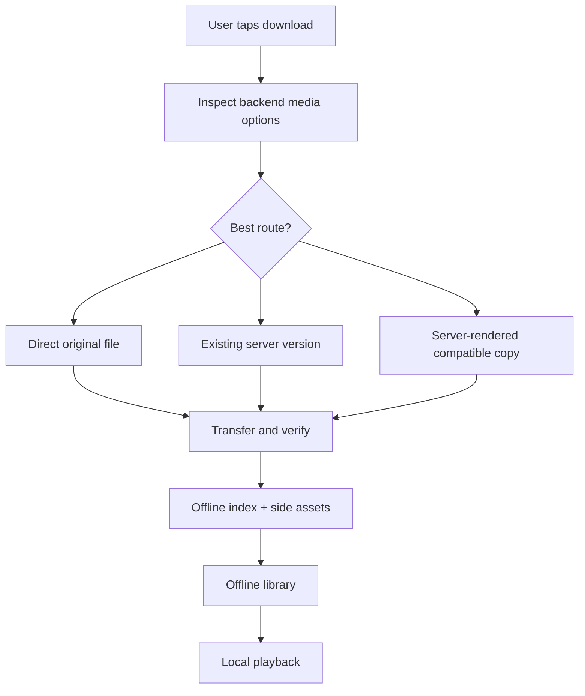
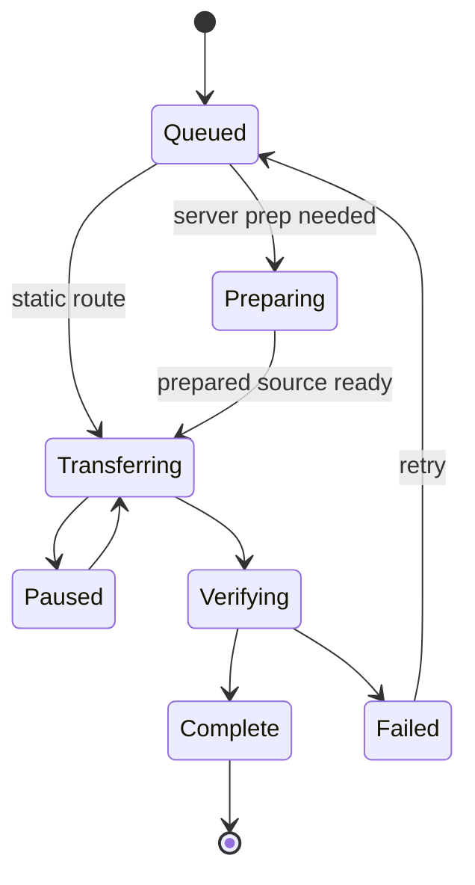

# Downloads and offline playback

Labstream downloads are designed to end in a local file the current device can play, plus enough metadata to show the item in the offline library and resume safely.

## Core rules

- A completed download must have a local playable file and a durable offline record.
- Direct original downloads are offered only when Labstream expects the file to play locally.
- Server-rendered or server-prepared routes are used when the original is not a safe local target.
- Transfers must reconcile cleanly on relaunch. Static/original and server-prepared
  static routes should resume from durable checkpoints when possible; live-forward
  remux/transcode streams may become retryable and restart from the beginning
  rather than claiming unsafe byte-offset resume.
- Offline records must not contain tokens, private server URLs, or unnecessary user-identifying details.

## Backend routes

| Backend | Download choices |
| --- | --- |
| Plex | Direct original when compatible, explicit existing versions when available, or server-rendered compatible copies. |
| Jellyfin | Static original/range transfer when safe, otherwise server-selected remux/transcode output where available. |
| Emby | Direct static, existing/prepared source reuse, compatible remux, or convert-then-static depending on server response. |

## Transfer lifecycle

## Background downloads and sleeping devices

Downloading while the app is backgrounded, suspended, or the device is locked/asleep is
fundamentally constrained by the platform, not by the server or the app:

- **Only system-owned transfers keep running.** True background `URLSessionDownloadTask`s owned
  by the system daemon (`nsurlsessiond`) may continue; app-side work (server-prep polling,
  keepalives, timers) is frozen while the app is suspended.
- **Background transfers are deprioritized.** The OS gives interactive networking and power
  management priority over background bulk transfers, so throughput can be several times slower
  than the same download with the app active.
- **Background app wake-ups are rate-limited.** Each time the system relaunches the app for a
  background-session event, it may delay the next opportunity to do app work. Any design that
  needs an app wake-up per chunk therefore stalls after a handful of chunks regardless of chunk
  size.
- **Transfers started while backgrounded are treated as discretionary** — the system schedules
  them at its own pace regardless of configuration.

Labstream's static byte-range lane is shaped around these limits:

- **Active app**: bounded 64 MB `Range` chunks, each appended to the durable partial — frequent
  real checkpoints, safe against force-quit.
- **Leaving the foreground** (scene inactive/background): the next segment is **one open-ended
  remainder request** (`bytes=offset-`) so the daemon can finish the whole file without waking
  the app per chunk. Its in-flight bytes are non-durable until completion, so:
  - **Pause** cancels by producing URLSession *resume data*, preserving the transferred bytes;
    Resume continues from them.
  - **Transient failures** (a brief network blip) re-resume from the resume data the system
    hands back, budget-bounded — a five-second blip does not restart a multi-GB transfer. The
    system daemon also rides out short connectivity losses on its own.
  - Every completed body is still validated against the durable partial's offset and the pinned
    HTTP validator before it is appended, so a strangely-resumed transfer degrades to a wasted
    fetch, never a corrupt file.
- **Returning to the foreground**: a remainder that has only just started demotes back to
  bounded checkpoint chunks; one with substantial progress keeps running rather than discard
  its bytes.

Simulator caveat: Labstream intentionally uses a foreground/default `URLSession`
in simulator builds because the background transfer daemon is unreliable there.
Simulator passes can validate routing, progress UI, and retry policy, but not
real background continuation, lock/off-head scheduling, or cellular policy.

User-facing expectations worth setting (the "downloads disclaimer"):

- Very large background downloads are best-effort. Keeping the device on power helps; briefly
  foregrounding the app resets the system's background rate limiter and lets the app fold
  finished work into durable checkpoints.
- Plex optimize and Emby convert have a server-preparation phase that needs the
  app awake; after they hand off to a static file, the byte transfer can use the
  static recovery path.
- Jellyfin optimized/compatible-remux downloads, and Emby compatible-remux
  downloads, can be live-forward encoder streams. They may continue as
  system-owned transfers while the OS allows it, but they are not durable
  byte-range checkpoints and can require retry/restart after interruption.
- Cellular downloads are off by default where cellular data is available.
  Settings ▸ Downloads ▸ **Use cellular data for downloads** applies to newly
  created request-based transfer tasks; active tasks and tasks resumed from OS
  resume data keep the policy they were created with.

## Module ownership

| Component | Owns |
| --- | --- |
| `DownloadManager` | Main-actor queue coordination and user-visible state. |
| Backend-specific manager extensions | Plex/Jellyfin/Emby route setup and server-prep polling. |
| `BackgroundDownloadSession` | URLSession tasks, byte-range checkpointing, transfer callbacks, finalization. |
| `DownloadStore` | Offline index persistence and file-side effects. |
| PMSKit download policies | Pure route, retry, row-display, and recovery decisions. |

## Offline metadata

Offline records keep enough information to display and play the item without a live server:

- backend and item identity;
- title/metadata needed for the offline library;
- local file URL and byte counts;
- selected media characteristics;
- optional poster and side-asset references;
- resume/progress state where applicable.

Side assets such as posters, chapters, and compatible external text subtitles are cached next to the download record when available. They are treated as convenience metadata; the main playable file remains the durable core of the download.

## Reconcile and resume

On launch, Labstream compares the offline index, files on disk, and any active transfers. It should:

- resume or retry recoverable transfers;
- surface failed items clearly;
- avoid deleting user data unless the user asked for cleanup;
- keep orphan detection conservative;
- preserve completed downloads even when the source server is temporarily unavailable.
