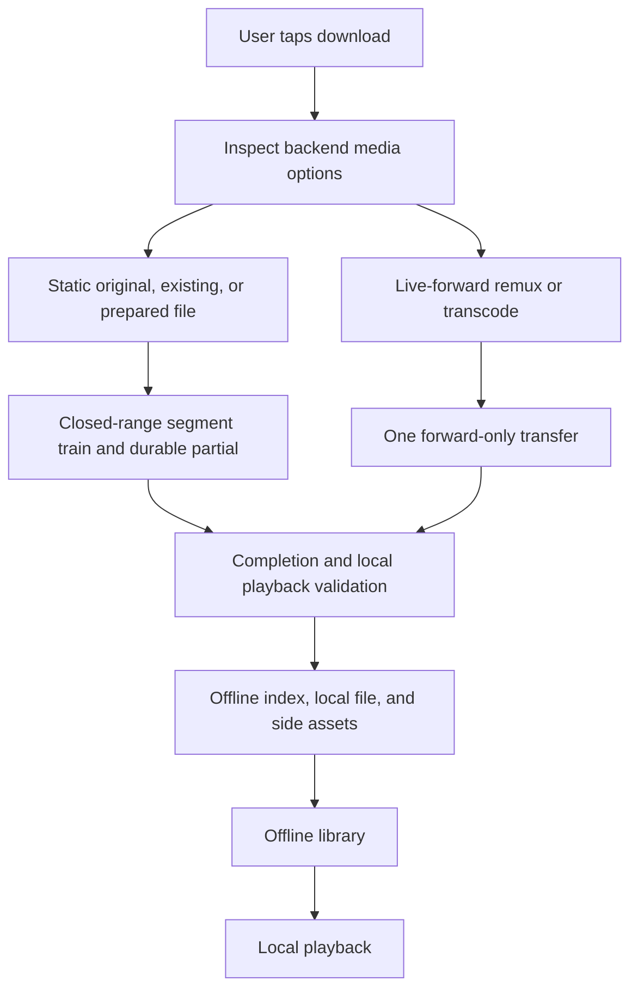
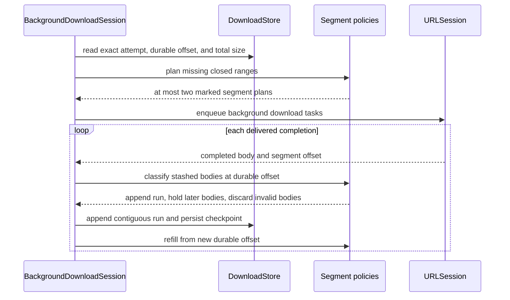

# Downloads and offline playback

Labstream downloads are implemented for the visionOS, iOS/iPadOS, and macOS targets and are designed
to end in a local file the current device can play, plus enough metadata to show the item in the
offline library and resume safely. The same engine is present in the [macOS target](MACOS.md), where
background recovery remains a pre-release acceptance gate rather than a reliability promise. The
[tvOS target](TVOS.md) compiles no Downloads capability or Offline surface.

## Core rules

- A completed download must have a local playable file and a durable offline record.
- Direct original downloads are offered only when Labstream expects the file to play locally.
- Server-rendered or server-prepared routes are used when the original is not a safe local target.
- Transfers reconcile on relaunch. Static/original and server-prepared static routes
  resume from durable checkpoints when their persisted authority remains valid; live-forward
  remux/transcode streams may become retryable and restart from the beginning
  rather than claiming unsafe byte-offset resume.
- Offline records must never contain access tokens. They do persist the minimum backend
  context needed to resume and clean up a job, which currently includes the owning backend,
  server base URL/server ID, MediaBrowser user ID where applicable, media/play-session IDs,
  and route/checkpoint state. Treat `index.json` as private app data, not a shareable profile.

## Backend routes

| Backend | Download choices |
| --- | --- |
| Plex | Compatible original, explicit existing version, and completed optimizer output all hand off to a static file transfer. |
| Jellyfin | Original is static/range-resumable. Compatible remux and capped transcode are live forward-only streams. |
| Emby | Original, reusable existing version, and completed Convert output are static. Compatible remux is live forward-only; a requested transcode is normally rerouted through persistent Convert-then-static. |

## Transfer lifecycle

```mermaid
stateDiagram-v2
  accTitle: Persisted download row states
  accDescr: A persisted row begins queued. Emby Convert is the only route that serializes preparing. Plex optimize stays queued until the static handoff. Bytes download next. Interruption can pause a row, errors can fail it, and validation ends as complete or unverified when the file is retained but the local playback probe is inconclusive.
  state "queued" as Queued
  state "preparing" as Preparing
  state "downloading" as Downloading
  state "paused" as Paused
  state "failed" as Failed
  state "complete" as Complete
  state "unverified" as Unverified
  [*] --> Queued
  Queued --> Preparing: Emby Convert job
  Queued --> Downloading: transfer starts
  Preparing --> Downloading: prepared source ready
  Preparing --> Paused: recoverable interruption
  Preparing --> Failed: preparation fails
  Downloading --> Paused: recoverable interruption
  Downloading --> Failed: transfer or validation fails
  Downloading --> Complete: file validated and playable
  Downloading --> Unverified: file retained; playback probe inconclusive
  Paused --> Queued: resume or retry
  Failed --> Queued: retry
  Complete --> [*]
  Unverified --> [*]
```

These labels are the serialized `DownloadStatus` values, not UI-only phases. `.preparing` is
Emby Convert only: that row carries a server-side Sync job and launch reconciliation keeps
polling it. Plex optimizer rows stay `.queued` until they hand off to a static transfer;
recovery and pause treat that Plex prep as queued server-prep, not `.preparing`. In particular,
there is no persisted `verifying` state: finalization rewrites HEVC `hev1` to `hvc1` and then
transitions the active `downloading` row to `complete`, `unverified`, or `failed`. Both
terminal success states retain the local file; `unverified` records that the startup probe
could not prove playability. The opaque and static-range pipelines share that completion
path.

## Background downloads and sleeping devices

Downloading while the app is backgrounded, suspended, or the device is locked/asleep is
fundamentally constrained by the platform, not by the server or the app:

- **Only system-owned transfers keep running.** True background `URLSessionDownloadTask`s owned
  by the system daemon (`nsurlsessiond`) may continue; app-side work (server-prep polling,
  keepalives, timers) is frozen while the app is suspended.
- **Background transfers are deprioritized.** The OS gives interactive networking and power
  management priority over background bulk transfers, so throughput can be several times slower
  than the same download with the app active.
- **Background app wake-ups are rate-limited.** Each time the system relaunches the app for a
  background-session event, it may delay the next opportunity to do app work. Any design that
  needs an app wake-up per bounded transfer therefore stalls after a handful of handoffs
  regardless of transfer size.
- **Background scheduling remains system-controlled.** Labstream asks for non-discretionary
  transfers, but the OS still decides when background work runs and how much network/power budget
  it receives.

Labstream's static byte-range lane is shaped around these limits and follows the simplest
Apple-standard architecture we can make stable:

- **A pre-queued train of closed-range segment tasks for known-size static files.** The
  same segment-train engine runs on visionOS, iOS/iPadOS, and macOS; Mac background recovery
  remains a platform-specific release-acceptance gate.
  Static Plex/Jellyfin/Emby file routes enqueue up to `maxQueuedSegments` (currently 2) background
  `URLSessionDownloadTask`s ahead of the durable checkpoint, each a closed
  `Range: bytes=<offset>-<offset+segmentBytes-1>` request of `segmentBytes` (512 MiB) —
  roughly 1 GiB of queued runway per file. The two-task cap is intentional: one head plus
  one look-ahead preserves overlap without multiplying several visible downloads into
  dozens of concurrent transfers. `StaticRangeSegmentQueuePolicy` is the pure
  planner: given the durable offset, the expected total size, and the segment offsets
  already live in the session, it emits the closed ranges still needed, up to the queue
  depth. When the expected total size is unknown, the planner falls back to a single
  open-ended `Range: bytes=<durableOffset>-` plan — the same shape used before segmentation,
  so that fallback is a zero-regression path rather than a special case.
  `StaticRangeTransferConfiguration` owns only the segment size and queue-depth constants;
  transfer shape remains planner-owned so the unknown-total open-ended fallback follows the
  same attempt and durable-checkpoint rules as the closed train.
- **Segments are attempt-marked and stashed, then assembled in order.** Each new segment
  task's `taskDescription` combines the rating key and current
  `lbs-segment:v3:<offset>:<attemptID>` marker with a U+001F separator. Relaunch/reattach
  therefore requires both the row and exact attempt, not merely a reused rating key.
  Old V1/V2 segment markers, V1 opaque markers, bare descriptions, and URL-derived identity are
  no longer parsed or adopted. `StaticRangeReattachPolicy` accepts only a current,
  offset-matching task for the row's exact attempt; every unmarked, malformed, stale-attempt, or
  mismatched task is cancelled.
  When a segment task
  finishes, its body is stashed by offset; `StaticRangeSegmentAssemblyPolicy` — a pure
  assembler — decides, given the durable offset and the set of stashed finished bodies,
  which stashes form the maximal contiguous run starting exactly at the durable offset
  (appended now), which are held (a later segment finished out of order, waiting on a gap),
  and which are discarded (fully behind the checkpoint, or overlapping but not
  offset-aligned — the same non-negotiable append-alignment invariant as the pre-segment
  design). Appending a run advances the durable checkpoint and refills the train back up
  to the queue depth.
- **URLSession resume data remains first-class only for the single open-ended fallback.**
  The store has one resume-blob slot per download row. When an unknown-size static source uses
  `Range: bytes=<durableOffset>-`, pausing can preserve that task's OS temp progress and display
  watermark in a blob. Adoption requires the blob's original open-ended Range offset to equal the
  current durable partial.
- **Closed train segments never persist or adopt URLSession resume data, including the head.**
  CFNetwork can replay a resumed closed request past its original end, so pausing a segment train
  clears any old blob/watermark and plain-cancels unfinished segments. The app-owned durable partial
  remains authoritative. Completed held bodies are durably manifested and may be rehydrated across
  relaunch only when their exact attempt, length, and validator checks still match; mismatches fail
  closed and re-fetch. Unfinished ranges are planned again on Resume.
- **The durable partial is the fallback.** A rejected old-format closed-range blob, or an open-ended blob that is
  missing, malformed, stale, exhausted, or backed by a deleted temp file, is rejected and cleared
  together with its display watermark. Recovery then re-plans from the durable partial's current
  file size rather than appending unvalidated bytes.
- **HTTP safety checks still guard the append.** Completed bodies are validated for
  `Content-Range` start alignment, pinned validator mismatches, HTTP `200` full-body
  replacement/restart behavior, `416` total validation, temp disappearance fallback, and safe
  resume-blob adoption/clearing. A strangely resumed transfer is rejected, restarted, or
  falls back to the durable partial rather than appending unvalidated bytes.
- **Why segments, not one task:** a visionOS wake bounce can silently restart the body of an
  in-flight custom-`Range` request with no error and no resume-data callback (see the
  [verified platform finding](DEVELOPMENT.md#verified-platform-findings)). With one open-ended task, that restart forfeits
  every un-appended byte transferred off-head, unbounded overnight. With a segment train,
  nsurlsessiond executes pre-queued segments with the process dead — no per-continuation app
  wake is required — and a wake-time bounce can only restart the one segment that was mid-flight
  (at most `segmentBytes`). Markers allow surviving tasks and delivered completions to be
  mapped back to their row and offset after reattach, but do not assume the OS will always
  redeliver a completion that occurred while the process was dead. Only bodies actually
  recovered through the background-session lifecycle are adopted; otherwise the durable
  partial remains authoritative and the missing range is re-planned and re-fetched.

Simulator caveat: Labstream intentionally uses a foreground/default `URLSession`
in simulator builds because the background transfer daemon is unreliable there.
Simulator passes can validate routing, progress UI, and retry policy, but not
real background continuation, lock/off-head scheduling, or cellular policy.

User-facing expectations worth setting (the "downloads disclaimer"):

- Very large background downloads are best-effort. Keeping the device on power helps; briefly
  foregrounding the app gives Labstream a chance to process delivered completions or recover
  app-owned work, without guaranteeing any change to the OS scheduler.
- Plex optimize and Emby Convert are server-side preparation jobs. Their app-side polling and
  handoff cannot run while the app is suspended; Emby Convert job identity is persisted so polling
  can resume after relaunch. Once either route hands off to a static file, the byte transfer can use
  the static recovery path.
- Jellyfin optimized/compatible-remux downloads, and Emby compatible-remux
  downloads, can be live-forward encoder streams. They may continue as
  system-owned transfers while the OS allows it, but they are not durable
  byte-range checkpoints and can require retry/restart after interruption.
- Cellular downloads are off by default where cellular data is available.
  Settings ▸ Downloads ▸ **Use cellular data for downloads** applies to newly
  created request-based transfer tasks; active tasks and tasks resumed from OS
  resume data keep the policy they were created with.

## Module ownership

| Component | Owns |
| --- | --- |
| `DownloadManager` | Main-actor queue coordination and user-visible state. |
| `DownloadKeepaliveCoordinator` | Exact-attempt Jellyfin/Emby keepalive task ownership and credential-generation quarantine. |
| Backend-specific manager extensions | Plex/Jellyfin/Emby route setup and server-prep polling. |
| `BackgroundDownloadSession` | URLSession tasks, segment-train enqueue/refill, transfer callbacks, finalization, and wake-release effects. |
| `BackgroundDownloadWakeCoordinator` | Locked background-completion gate, atomic deferred-revalidation keys, and range-rebuild grace generations. |
| `DownloadManager+SeasonPlanner` and `SeasonDownloadPlannerSheet` | Immutable season drafts and one atomic Store commit of new rows plus retry markers. |
| `DownloadOptionsModel` | Typed per-item option resolution for the download sheet; it does not own season planning. |
| `DownloadVolumeFreeSpace` | Purgeable-inclusive free-space measurement used by storage-full parking. |
| `DownloadStore` | Schema-v4 index state, exact-attempt mutation admission, and transactional artifact state. |
| `DownloadArtifactLifecycleCoordinator` and file-effect seams | Order attempt-scoped resume/checkpoint/promotion/deletion work with its terminal persistence outcome. |
| `DownloadWorkRegistry` | Attempt-scoped side-cache and encoder-task ownership. |
| `DownloadCleanupIntentJournal` | Independent durable, credential-free Jellyfin/Emby server-cleanup authority. |
| `EmbyConvertCleanupJournal` | Compatibility Emby Convert tombstone persistence under a queue-private lock. |
| PMSKit download policies | Pure route, retry, row-display, and recovery decisions, including the segment-train planner and assembler. |

## Offline metadata

Offline records keep enough information to display and play the item without a live server:

- backend and item identity;
- title/metadata needed for the offline library;
- local file URL and byte counts;
- selected media characteristics;
- optional poster and side-asset references;
- resume/progress state where applicable.

Paths in the JSON index are one-level paths relative to the Downloads directory and are
re-hydrated against the current sandbox at load time. Absolute container paths are not
stable across installs. URLSession resume data is stored as a protected, backup-excluded
sibling artifact and referenced by relative path; it is only valid for static/range-resumable
sources.

Side assets such as posters, chapters, and compatible external text subtitles are cached next to the download record when available. They are treated as convenience metadata; the main playable file remains the durable core of the download.

## Reconcile and resume

On launch, Labstream compares the offline index, files on disk, active transfers, persisted
artifact reservations, and durable cleanup intents. Current reconciliation:

Startup first installs all transfer callbacks and registers the still-dormant session with the
background-completion registry. When the Store admits a healthy current index, the initial
transport submission crosses one bounded MainActor turn and retains the manager until that
submission occurs. A retry before that turn cancels the deferred edge and owns the one immediate
submission, so retry cannot overtake it or submit activation twice. Unsupported schemas retain
their explicit reset path, while unreadable indexes and malformed current ownership remain
fail-closed. The deferral changes critical-path scheduling only: it does not delete the background
transport, recovery work, persistence barriers, or background-completion durability.

- adopts only current task markers whose exact attempt matches the durable row;
- keeps current malformed/ownerless active rows fail-closed rather than guessing ownership;
- resumes/retries recoverable transfers and surfaces terminal failures in the row. A row whose
  last failure was storage-full is not automatically redriven: every automatic static-range
  redrive (rebuilds, backend-ready drains, launch recovery) first re-measures free space —
  counting iOS purgeable space, matching the Settings storage gauge — and, if the volume still
  cannot hold the remaining bytes plus headroom, parks the row as a pending resume instead of
  retrying. A user-initiated Retry always dispatches regardless of this gate;
- replays required server cleanup from the independent journal when the matching backend
  session is available;
- inventories and repairs missing posters, subtitles, chapters, Plex/Emby BIF, and Jellyfin
  trick-play playlists/tiles for completed rows without re-downloading playable media. Work runs
  off-main, validates image/BIF/text payloads before promotion, and batches metadata publication.
  Retry authority is exact attempt + source + resource kind and is charged only when an eligible
  waiter actually admits transport; coalesced cancellation or a stale waiter hands authority to the
  next eligible waiter. Playlist repair audits every locally referenced tile. Successful promotion,
  including a same-path replacement, advances the side-asset generation so byte accounting and
  storage-cap snapshots cannot retain stale cache values;
- keeps completed media available without requiring the source server to be reachable;
- treats sign-out of a backend as a resumable pause of that backend's active rows. Records
  and files stay; `DownloadManager.pauseDownloadsForBackendSignOut` runs while credentials
  still exist so encoder teardown can use the right session. This is not cancel or delete.

If the selected saved session cannot be restored because its server or network is temporarily
unreachable, launch finishes in a restricted Offline surface when at least one completed media
file is still present. This surface exposes only the local library/player plus reconnect,
sign-in, Settings, resume-position, and deletion controls; it does not fabricate an authenticated
browse session. Missing or explicitly invalid credentials continue to show sign-in instead, and
tvOS never enters this path because it does not ship downloads.

Season confirmation captures one immutable draft containing new rows and exact retry attempts. The
Store validates every owner and commits insertions plus retry admission markers in one schema-v4
snapshot before any lane starts; stale ownership, a normal persistence failure, and an indeterminate
atomic-write outcome remain distinct, with the last case pausing download admission. Offline list
snapshots contain scalar presentation/action identity only; full records resolve at exact-attempt
action or playback edges. Storage presentation separates known, unknown, and not-applicable bytes
instead of turning unknown side assets or reservations into false zeroes.
