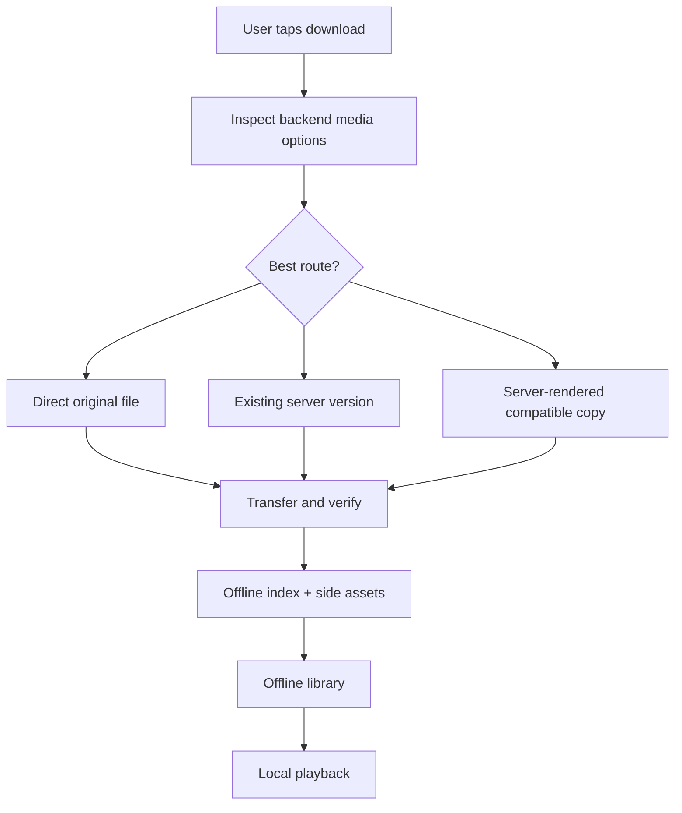
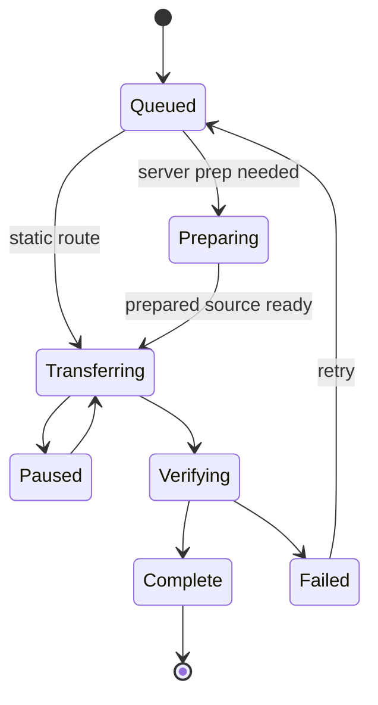

# Downloads and offline playback

Labstream downloads are designed to end in a local file the current device can play, plus enough metadata to show the item in the offline library and resume safely.

## Core rules

- A completed download must have a local playable file and a durable offline record.
- Direct original downloads are offered only when Labstream expects the file to play locally.
- Server-rendered or server-prepared routes are used when the original is not a safe local target.
- Transfers reconcile on relaunch. Static/original and server-prepared static routes
  resume from durable checkpoints when their persisted authority remains valid; live-forward
  remux/transcode streams may become retryable and restart from the beginning
  rather than claiming unsafe byte-offset resume.
- Offline records must never contain access tokens. They do persist the minimum backend
  context needed to resume and clean up a job, which currently includes the owning backend,
  server base URL/server ID, MediaBrowser user ID where applicable, media/play-session IDs,
  and route/checkpoint state. Treat `index.json` as private app data, not a shareable profile.

## Backend routes

| Backend | Download choices |
| --- | --- |
| Plex | Compatible original, explicit existing version, and completed optimizer output all hand off to a static file transfer. |
| Jellyfin | Original is static/range-resumable. Compatible remux and capped transcode are live forward-only streams. |
| Emby | Original, reusable existing version, and completed Convert output are static. Compatible remux is live forward-only; a requested transcode is normally rerouted through persistent Convert-then-static. |

## Transfer lifecycle

## Background downloads and sleeping devices

Downloading while the app is backgrounded, suspended, or the device is locked/asleep is
fundamentally constrained by the platform, not by the server or the app:

- **Only system-owned transfers keep running.** True background `URLSessionDownloadTask`s owned
  by the system daemon (`nsurlsessiond`) may continue; app-side work (server-prep polling,
  keepalives, timers) is frozen while the app is suspended.
- **Background transfers are deprioritized.** The OS gives interactive networking and power
  management priority over background bulk transfers, so throughput can be several times slower
  than the same download with the app active.
- **Background app wake-ups are rate-limited.** Each time the system relaunches the app for a
  background-session event, it may delay the next opportunity to do app work. Any design that
  needs an app wake-up per bounded transfer therefore stalls after a handful of handoffs
  regardless of transfer size.
- **Transfers started while backgrounded are treated as discretionary** — the system schedules
  them at its own pace regardless of configuration.

Labstream's static byte-range lane is shaped around these limits and follows the simplest
Apple-standard architecture we can make stable:

- **A pre-queued train of closed-range segment tasks for known-size static files.** The
  current compile-time regime is `.segmentTrain` on visionOS, iOS/iPadOS, and macOS.
  Static Plex/Jellyfin/Emby file routes enqueue up to `maxQueuedSegments` (currently 2) background
  `URLSessionDownloadTask`s ahead of the durable checkpoint, each a closed
  `Range: bytes=<offset>-<offset+segmentBytes-1>` request of `segmentBytes` (512 MiB) —
  roughly 1 GiB of queued runway per file. The two-task cap is intentional: one head plus
  one look-ahead preserves overlap without multiplying several visible downloads into
  dozens of concurrent transfers. `StaticRangeSegmentQueuePolicy` is the pure
  planner: given the durable offset, the expected total size, and the segment offsets
  already live in the session, it emits the closed ranges still needed, up to the queue
  depth. When the expected total size is unknown, the planner falls back to a single
  open-ended `Range: bytes=<durableOffset>-` plan — the same shape used before segmentation,
  so that fallback is a zero-regression path rather than a special case.
  `StaticRangeTransferRegime` (`Labstream/Downloads/StaticRangeTransferRegime.swift`) is a
  compile-time switch between `.segmentTrain` (current, all platforms) and
  `.openEndedRemainder` (the prior single-task shipping behavior); flipping a platform back
  is a one-line change, and both regimes recover from the same durable-partial checkpoint,
  so switching regimes across launches is safe.
- **Segments are attempt-marked and stashed, then assembled in order.** Each new segment
  task's `taskDescription` combines the rating key and current
  `lbs-segment:v3:<offset>:<attemptID>` marker with a U+001F separator. Relaunch/reattach
  therefore requires both the row and exact attempt, not merely a reused rating key.
  V1 markers have no attempt identity and V2 markers use the older string marker version;
  both are parseable for migration/diagnostics but are not current adoptable authority.
  `StaticRangeReattachPolicy` adopts only a current, offset-matching task for the row's
  exact attempt; unmarked, legacy, stale-attempt, or mismatched tasks are purged/rebuilt.
  When a segment task
  finishes, its body is stashed by offset; `StaticRangeSegmentAssemblyPolicy` — a pure
  assembler — decides, given the durable offset and the set of stashed finished bodies,
  which stashes form the maximal contiguous run starting exactly at the durable offset
  (appended now), which are held (a later segment finished out of order, waiting on a gap),
  and which are discarded (fully behind the checkpoint, or overlapping but not
  offset-aligned — the same non-negotiable append-alignment invariant as the pre-segment
  design). Appending a run advances the durable checkpoint and refills the train back up
  to the queue depth.
- **URLSession resume data remains first-class only for the single open-ended fallback.**
  The store has one resume-blob slot per download row. When an unknown-size static source uses
  `Range: bytes=<durableOffset>-`, pausing can preserve that task's OS temp progress and display
  watermark in a blob. Adoption requires the blob's original open-ended Range offset to equal the
  current durable partial.
- **Closed train segments never persist or adopt URLSession resume data, including the head.**
  CFNetwork can replay a resumed closed request past its original end, so pausing a segment train
  clears any old blob/watermark and plain-cancels unfinished segments. The app-owned durable partial
  remains authoritative, completed held bodies remain reusable during that process lifetime, and
  unfinished ranges are planned again on Resume.
- **The durable partial is the fallback.** A legacy closed-range blob, or an open-ended blob that is
  missing, malformed, stale, exhausted, or backed by a deleted temp file, is rejected and cleared
  together with its display watermark. Recovery then re-plans from the durable partial's current
  file size rather than appending unvalidated bytes.
- **HTTP safety checks still guard the append.** Completed bodies are validated for
  `Content-Range` start alignment, pinned validator mismatches, HTTP `200` full-body
  replacement/restart behavior, `416` total validation, temp disappearance fallback, and safe
  resume-blob adoption/clearing. A strangely resumed transfer is rejected, restarted, or
  falls back to the durable partial rather than appending unvalidated bytes.
- **Why segments, not one task:** a visionOS wake bounce can silently restart the body of an
  in-flight custom-`Range` request with no error and no resume-data callback (see the verified
  platform finding in `docs/DEVELOPMENT.md`). With one open-ended task, that restart forfeits
  every un-appended byte transferred off-head, unbounded overnight. With a segment train,
  nsurlsessiond executes pre-queued segments with the process dead — no per-continuation app
  wake is required — and a wake-time bounce can only restart the one segment that was mid-flight
  (at most `segmentBytes`). Markers allow surviving tasks and delivered completions to be
  mapped back to their row and offset after reattach, but do not assume the OS will always
  redeliver a completion that occurred while the process was dead. Only bodies actually
  recovered through the background-session lifecycle are adopted; otherwise the durable
  partial remains authoritative and the missing range is re-planned and re-fetched.

Simulator caveat: Labstream intentionally uses a foreground/default `URLSession`
in simulator builds because the background transfer daemon is unreliable there.
Simulator passes can validate routing, progress UI, and retry policy, but not
real background continuation, lock/off-head scheduling, or cellular policy.

User-facing expectations worth setting (the "downloads disclaimer"):

- Very large background downloads are best-effort. Keeping the device on power helps; briefly
  foregrounding the app resets the system's background rate limiter and gives Labstream a chance
  to process completed tasks or recover from a failed resume blob.
- Plex optimize and Emby convert have a server-preparation phase that needs the
  app awake; after they hand off to a static file, the byte transfer can use the
  static recovery path.
- Jellyfin optimized/compatible-remux downloads, and Emby compatible-remux
  downloads, can be live-forward encoder streams. They may continue as
  system-owned transfers while the OS allows it, but they are not durable
  byte-range checkpoints and can require retry/restart after interruption.
- Cellular downloads are off by default where cellular data is available.
  Settings ▸ Downloads ▸ **Use cellular data for downloads** applies to newly
  created request-based transfer tasks; active tasks and tasks resumed from OS
  resume data keep the policy they were created with.

## Module ownership

| Component | Owns |
| --- | --- |
| `DownloadManager` | Main-actor queue coordination and user-visible state. |
| Backend-specific manager extensions | Plex/Jellyfin/Emby route setup and server-prep polling. |
| `BackgroundDownloadSession` | URLSession tasks, segment-train enqueue/refill, transfer callbacks, finalization. |
| `DownloadStore` | Schema-v4 index state, exact-attempt mutation admission, and transactional artifact state. |
| `DownloadArtifactLifecycleCoordinator` and file-effect seams | Order attempt-scoped resume/checkpoint/promotion/deletion work with its terminal persistence outcome. |
| `DownloadWorkRegistry` | Attempt-scoped side-cache and encoder-task ownership. |
| `DownloadCleanupIntentJournal` | Independent durable, credential-free Jellyfin/Emby server-cleanup authority. |
| PMSKit download policies | Pure route, retry, row-display, and recovery decisions, including the segment-train planner and assembler. |

## Offline metadata

Offline records keep enough information to display and play the item without a live server:

- backend and item identity;
- title/metadata needed for the offline library;
- local file URL and byte counts;
- selected media characteristics;
- optional poster and side-asset references;
- resume/progress state where applicable.

Paths in the JSON index are one-level paths relative to the Downloads directory and are
re-hydrated against the current sandbox at load time. Absolute container paths are not
stable across installs. URLSession resume data is stored as a protected, backup-excluded
sibling artifact and referenced by relative path; it is only valid for static/range-resumable
sources.

Side assets such as posters, chapters, and compatible external text subtitles are cached next to the download record when available. They are treated as convenience metadata; the main playable file remains the durable core of the download.

## Reconcile and resume

On launch, Labstream compares the offline index, files on disk, active transfers, persisted
artifact reservations, and durable cleanup intents. Current reconciliation:

- adopts only current task markers whose exact attempt matches the durable row;
- rebuilds legacy or ownerless active rows under a newly persisted attempt before work starts;
- resumes/retries recoverable transfers and surfaces terminal failures in the row;
- replays required server cleanup from the independent journal when the matching backend
  session is available;
- repairs missing poster and chapter-image files for completed rows when a matching backend
  session is available and the row/kind still has retry budget, without re-downloading the playable
  file or side assets already on disk. Across completed-row scans, a missing `(row, asset kind)` can
  be offered for rehydrate at most five times during the current process lifetime. A scan consumes
  an offer before backend-session resolution, so repeated scans while the matching backend is
  unavailable can exhaust that process's budget without issuing a request. Poster and
  chapter-image-kind budgets are independent, as are different rows; all chapter images for one row
  share the chapter-image-kind budget. The in-memory counts reset on the next launch so transient
  misses receive another chance while permanently unavailable kinds eventually stop re-arming;
- keeps completed media available without requiring the source server to be reachable.
