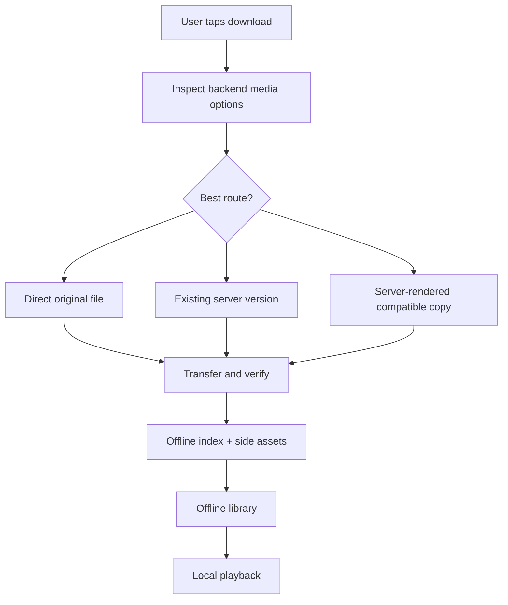
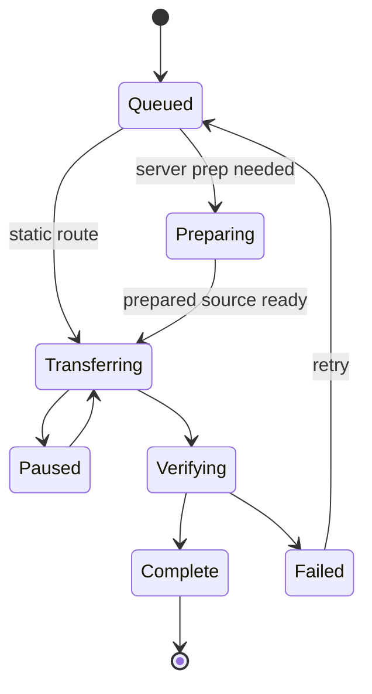

# Downloads and offline playback

Labstream downloads are designed to end in a local file the headset can play, plus enough metadata to show the item in the offline library and resume safely.

## Core rules

- A completed download must have a local playable file and a durable offline record.
- Direct original downloads are offered only when Labstream expects the file to play locally.
- Server-rendered or server-prepared routes are used when the original is not a safe local target.
- Transfers must tolerate interruption and reconcile state on relaunch.
- Offline records must not contain tokens, private server URLs, or unnecessary user-identifying details.

## Backend routes

| Backend | Download choices |
| --- | --- |
| Plex | Direct original when compatible, explicit existing versions when available, or server-rendered compatible copies. |
| Jellyfin | Static original/range transfer when safe, otherwise server-selected remux/transcode output where available. |
| Emby | Direct static, existing/prepared source reuse, compatible remux, or convert-then-static depending on server response. |

## Transfer lifecycle

## Module ownership

| Component | Owns |
| --- | --- |
| `DownloadManager` | Main-actor queue coordination and user-visible state. |
| Backend-specific manager extensions | Plex/Jellyfin/Emby route setup and server-prep polling. |
| `BackgroundDownloadSession` | URLSession tasks, byte-range checkpointing, transfer callbacks, finalization. |
| `DownloadStore` | Offline index persistence and file-side effects. |
| PMSKit download policies | Pure route, retry, row-display, and recovery decisions. |

## Offline metadata

Offline records keep enough information to display and play the item without a live server:

- backend and item identity;
- title/metadata needed for the offline library;
- local file URL and byte counts;
- selected media characteristics;
- optional poster and side-asset references;
- resume/progress state where applicable.

Side assets such as posters, chapters, and compatible external text subtitles are cached next to the download record when available. They are treated as convenience metadata; the main playable file remains the durable core of the download.

## Reconcile and resume

On launch, Labstream compares the offline index, files on disk, and any active transfers. It should:

- resume or retry recoverable transfers;
- surface failed items clearly;
- avoid deleting user data unless the user asked for cleanup;
- keep orphan detection conservative;
- preserve completed downloads even when the source server is temporarily unavailable.
