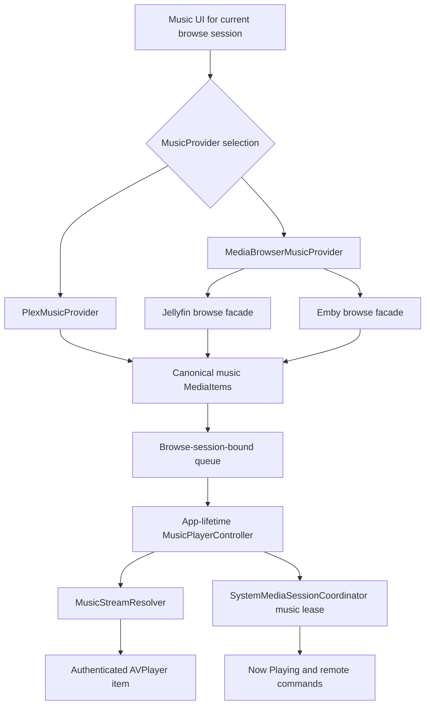

# Music architecture

Labstream includes a music surface for browsing and playing tracks from the active backend.

## Surface

The music UI is organized around familiar library pivots:

- home/discovery rails;
- artists;
- albums;
- playlists;
- album and track detail views;
- queue and playback controls.

## Provider boundary

The app uses backend-specific providers behind a shared UI shape. Providers adapt each server's artist, album, playlist, and track APIs into the music screens without forcing the servers into a single wire protocol.

`MusicProvider` returns the same canonical `MediaItem` shape for every backend. Plex fills
that shape from its native library/hub APIs. Jellyfin and Emby share
`MediaBrowserMusicProvider`, whose small `MediaBrowserMusicBrowsing` seam adapts their
browse services; the generic MediaBrowser DTO maps `MusicArtist`/`AlbumArtist`,
`MusicAlbum`, `Audio`, and `Playlist` into the historical Plex-shaped kinds
`artist`/`album`/`track`/`playlist`.

The shared screen does not imply feature parity. Plex supplies richer artist shelves such
as popular tracks, categorized releases, appears-on, and similar artists. MediaBrowser
providers leave unsupported sections empty and use their `/Items`, album-artist, latest,
and playlist endpoints for the common artist/album/track/playlist surface.

## Playback and queue

`MusicPlayerController` owns one long-lived `AVPlayer`, audio-session state, queue mutation,
shuffle/repeat traversal, failure auto-advance, and per-track observer cleanup. It receives
backend-resolved track URLs from `MusicStreamResolver`, then drives playback independently
from the video `PlaybackController`.

Track replacement advances `MusicPlaybackLifecycle` and rebinds player, item, and audio
session observers to that generation. Queued callbacks and artwork completions must still
match the current generation/request before they mutate state; observer removal alone does
not grant that authority.

Plex streams a direct part URL with its token in the URL. Jellyfin and Emby resolve their
audio endpoints and attach the required authorization headers to `AVURLAsset`; credentials
must not be copied into logs. The queue records the browse-session identity that created it
and refuses or clears stale actions after a backend/auth session change.

Video and music progress support are not currently symmetric. Video has a shared
MediaBrowser progress context that sends Jellyfin/Emby Playing/Progress/Stopped requests.
Music's per-track `TimelineReporter` is currently created only for Plex, using Plex timeline
and scrobble endpoints. Jellyfin/Emby music plays normally but does not yet report server
progress or scrobble; do not claim otherwise in backend or playback documentation.

## System integration

The controller acquires a music lease from the shared `SystemMediaSessionCoordinator`,
which publishes track metadata, artwork, duration, playhead, and rate to
`MPNowPlayingInfoCenter` and installs play/pause/next/previous/scrub handlers on
`MPRemoteCommandCenter`. Video can temporarily take the process-wide lease; when video
releases it, the coordinator restores the surviving music owner and republishes its current
state. In-app Now Playing artist/album navigation returns to the Music tab. The current
Spotlight and App Intent index deliberately excludes music items; those surfaces remain
video-only. On visionOS, Now Playing uses an app-owned player panel and inert dimmed
backdrop: its top-leading close control and a tap in the surround both dismiss without
stopping playback or activating the obscured browse UI; Stop remains a distinct trailing
playback action.
