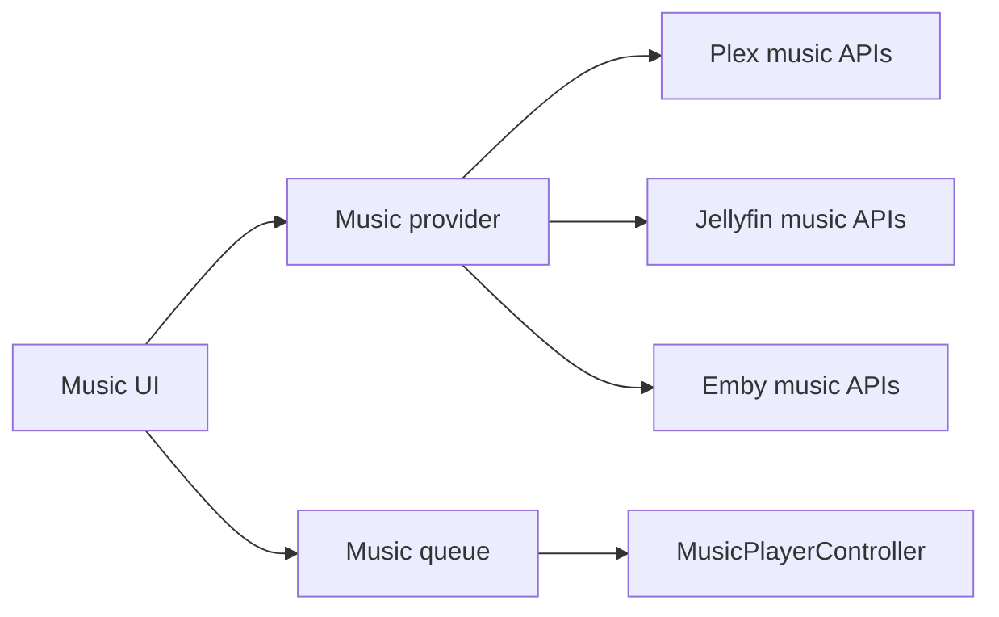

# Music architecture

Labstream includes a music surface for browsing and playing tracks from the active backend.

## Surface

The music UI is organized around familiar library pivots:

- home/discovery rails;
- artists;
- albums;
- playlists;
- album and track detail views;
- queue and playback controls.

## Provider boundary

The app uses backend-specific providers behind a shared UI shape. Providers adapt each server's artist, album, playlist, and track APIs into the music screens without forcing the servers into a single wire protocol.

## Playback and queue

`MusicPlayerController` owns audio playback state and queue mutation. It receives backend-resolved track URLs from the active provider, then drives playback independently from the video `PlaybackController`.

## System integration

Music results can participate in the same app navigation model as video content. Any future expansion to Spotlight, Shortcuts, or broader media suggestions should route through the same system-entry router used elsewhere in the app.
