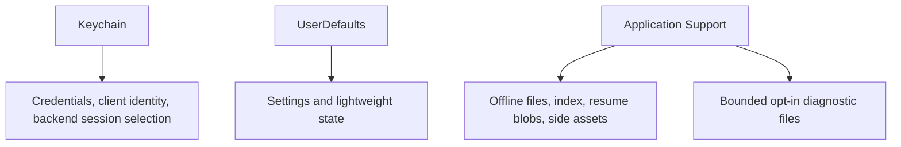

# Persistence

Labstream uses separate storage layers for secrets, preferences, and offline media.

## Keychain

`KeychainStore` uses generic-password items with after-first-unlock accessibility. It stores:

- the Plex account token;
- the per-install `clientIdentifier`;
- selected backend and selected Plex server ID;
- Jellyfin/Emby server URL, access token, user ID, and server ID.

Not every one of those values is secret, but keeping each backend's session as one
device-local credential set avoids splitting restoration state between storage systems.

Exactly one item is iCloud-synchronizable: the Plex account token. The per-install client
identifier, backend/server selection, and Jellyfin/Emby session values remain device-local.
When a synchronized Plex token is observed, any legacy local copy is retired; deleting the
token removes both sync domains so a stale local token cannot be promoted after sign-out.

Do not write tokens to logs, diagnostics, issue templates, UserDefaults, or JSON profile indexes.

Credential and selected-backend/session writes fail closed if Keychain persistence fails.
The non-secret Plex client identifier may fall back to a process-local value for one launch
so background events can still drain; a later launch retries durable storage. A protected,
backup-excluded secret-file fallback is allowed only for DEBUG simulator workflows. Native
macOS development apps with non-canonical, per-worktree keychain service identities may opt
into the same development file storage to avoid repeated prompts; the canonical shipping
service continues to use Keychain and Plex-token sync.

## UserDefaults

UserDefaults is for non-secret settings and lightweight state, such as:

- home/remote quality, adaptive bitrate, and download preferences;
- audio/subtitle language and playback-speed preferences;
- Up Next, skip, and Cinema placement preferences;
- feature toggles;
- diagnostic logging enabled/disabled and privacy-reduced MetricKit summaries;
- queue-paused and display state.

Selected backend is **not** a UserDefaults value; it is restored from the device-local
Keychain item described above.

Use token-free, hashed, or backend-scoped identifiers when preferences need to be tied to a server/session.

## App container

`Application Support/Labstream` stores:

- `Downloads/index.json`, downloaded media, durable partials, protected URLSession resume
  blobs, and cached posters/subtitles/trick-play/chapter assets;
- bounded, rotated, already-redacted diagnostic JSONL files when diagnostic logging is
  enabled.

The app container's temporary directory also holds short-lived range-response and
out-of-order segment stashes. They are transfer intermediates, not durable index state, and
are consumed or swept rather than relied on across relaunch.

The download index is currently a schema-v4 versioned envelope and retains
backward-compatible decoding/migration for older row shapes. Active rows carry a typed
`DownloadAttemptID`; asynchronous tasks, artifact reservations, and cleanup compare the
full rating-key/attempt key so stale work cannot mutate a retry or re-download of the same
item. Media and side-asset paths are persisted as validated one-level paths
relative to the Downloads directory, then re-hydrated against the live container. Never
persist an absolute sandbox path; the container location can change across installs.

The index contains no access tokens, but it is not anonymous: retry and cleanup require
backend/server identity, a server base URL, MediaBrowser user ID where applicable,
media/play-session IDs, source selection, route, validators, and server-prep job metadata.
Treat it as private app data. Cached Jellyfin trick-play playlists are rewritten to local
filenames so token-bearing server URLs are not retained.

Index writes are revisioned and serialized; filesystem publication/checkpoint/resume/delete
work is registered before it starts and reaches a terminal index outcome before its
lifecycle ticket is released. Required Jellyfin/Emby active-encoding or Emby Convert cleanup
also has an independent `download-cleanup-intents.json` journal containing an exact attempt,
credential-free server identity, and cleanup operation. The journal deliberately does not
share the index transaction domain, so row deletion cannot erase the only cleanup authority.

The Downloads directory, resume blobs, and development credential artifacts are excluded
from backup. PMSKit's `CredentialArtifactStorage` applies appropriate file protection on
iOS/visionOS; macOS host paths do not claim iOS file-protection semantics.

Container paths are implementation details and should not appear in user-submitted diagnostic reports.

## Compatibility identifiers

Some persisted identifiers still contain the original app identity, including the bundle identifier and a few app-support/session names. They are intentionally preserved so existing installs, Keychain entries, downloads, background sessions, and Spotlight state continue to work.
