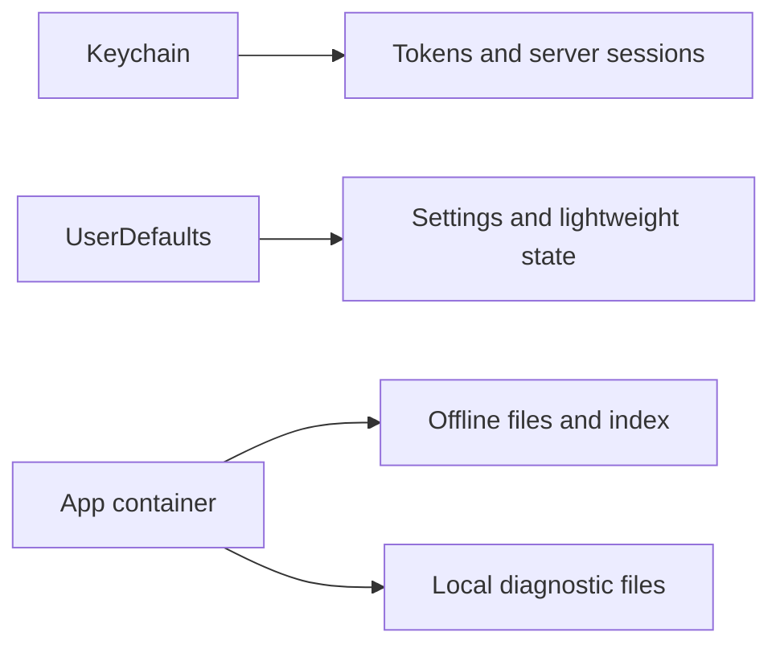

# Persistence

Labstream uses separate storage layers for secrets, preferences, and offline media.

## Keychain

Secrets belong in Keychain:

- Plex account/server tokens;
- Jellyfin access tokens;
- Emby access tokens;
- stable secret material needed for backend sessions.

Do not write tokens to logs, diagnostics, issue templates, UserDefaults, or JSON profile indexes.

## UserDefaults

UserDefaults is for non-secret settings and lightweight state, such as:

- selected backend;
- quality preferences;
- feature toggles;
- diagnostic logging enabled/disabled;
- display preferences.

Use token-free, hashed, or backend-scoped identifiers when preferences need to be tied to a server/session.

## App container

The app container stores:

- downloaded media files;
- the offline index;
- cached posters and side assets;
- bounded local diagnostic files.

Container paths are implementation details and should not appear in user-submitted diagnostic reports.

## Compatibility identifiers

Some persisted identifiers still contain the original app identity, including the bundle identifier and a few app-support/session names. They are intentionally preserved so existing installs, Keychain entries, downloads, background sessions, and Spotlight state continue to work.
