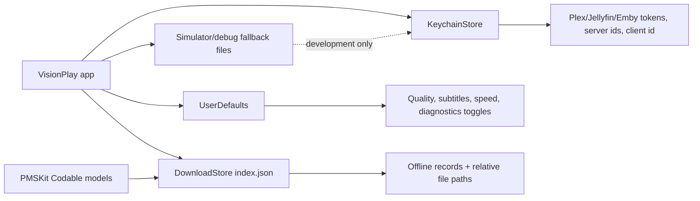
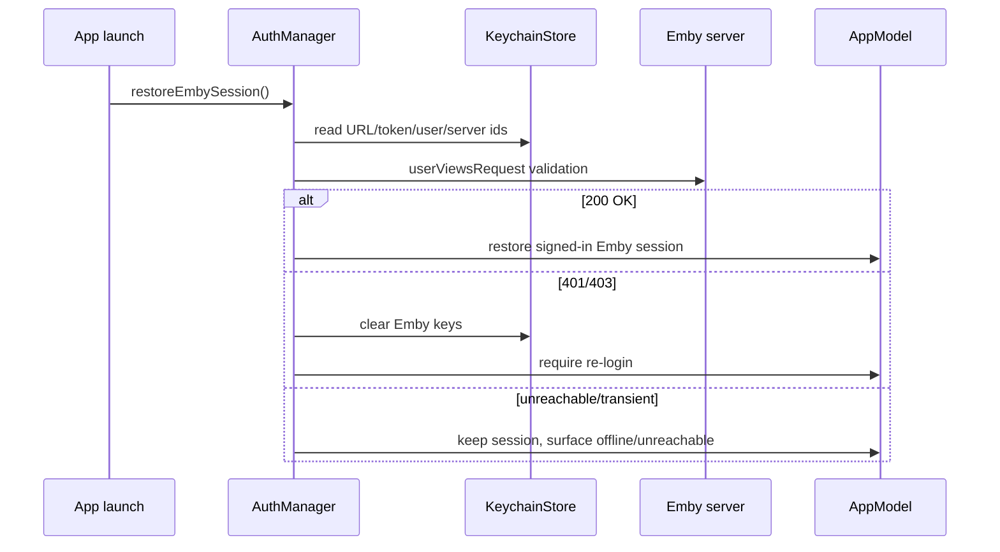

# Persistence

## Keychain

Secrets and stable identifiers belong in `KeychainStore`:

- Plex account token
- stable client identifier (`clientIdentifier`), reused as the Jellyfin/Emby device id through `ClientIdentity`
- selected backend and selected Plex server id
- Jellyfin server URL, access token, user ID, and server ID
- Emby server URL, access token, user ID, and server ID

Passwords are not persisted. Emby Connect cloud tokens/access keys are used only during the PIN exchange and are not stored; once exchange succeeds, the app persists only the normal local Emby server session.

`KeychainStore` uses `kSecAttrAccessibleAfterFirstUnlock`. Simulator/debug fallback files are only a development/migration escape hatch and should not be treated as a second source of truth.

### Emby session fields

`KeychainStore` persists four Emby session keys: `embyServerURL`, `embyAccessToken`, `embyUserID`, and `embyServerID`.

The saved Emby server URL preserves the API base path. Manual URL login preserves any user-entered path, and Emby Connect addresses are normalized through `EmbyConnect.apiBaseURL(forConnectAddress:)`, which appends `/emby` unless it is already present. Do not strip that base path: PlaybackInfo can return relative stream URLs that must be joined back onto the same server base.

The stable device id is not a separate Emby key. It comes from `ClientIdentity.emby`, so the same app client identifier is reused across Emby sessions.

On launch, `AuthManager.restoreEmbySession()` reads those keys back into `AppModel` and validates the token with an `EmbyLibrary.userViewsRequest`. Treat failures differently:

- `401`/`403`: clear the session and force re-login via `signOutEmby()`.
- transient unreachable/server errors: keep the saved session and surface an offline/unreachable state rather than logging the user out.

On explicit sign-out, the Emby keys are cleared locally.

The Emby access token is a secret: redact it, `api_key`, and `X-Emby-Token` values from logs and diagnostics.

## UserDefaults

UserDefaults stores non-secret preferences and feature toggles, including:

- home/remote/legacy streaming quality preferences
- playback speed
- preferred audio/subtitle languages, subtitle auto-select mode, subtitle burn mode, and subtitles-off state
- adaptive bitrate preference
- diagnostics/MetricKit preference state
- non-secret UI preferences and local feature toggles

Keep quality preference migrations explicit. Home and remote quality settings are intentionally separate.

Download/offline persistence is intentionally not covered in this document.
