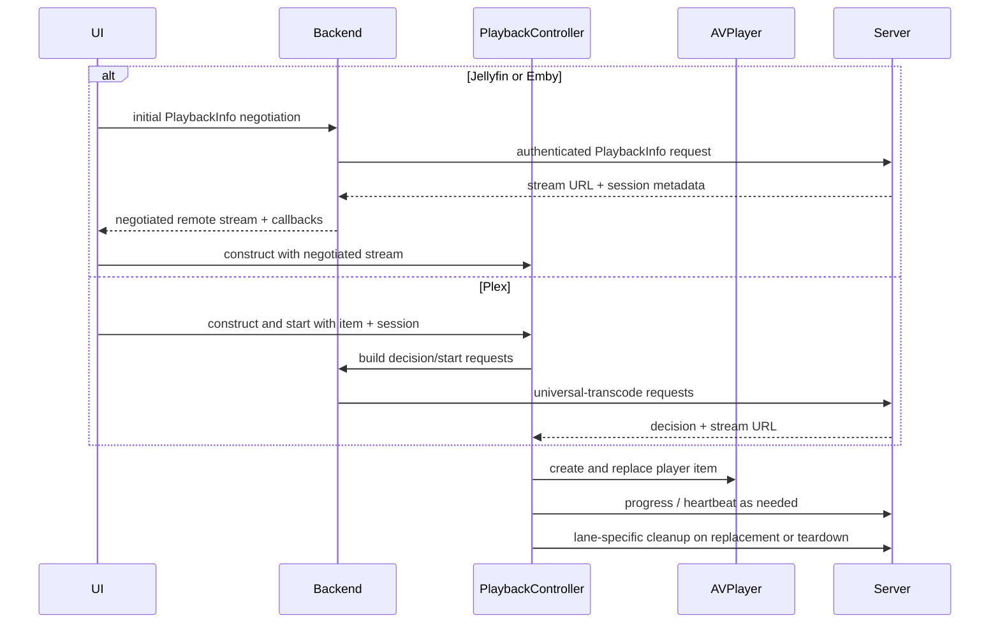

# Playback architecture

Video playback is split by backend, then converges on one app-owned `PlaybackController`.
The controller owns its `AVPlayer`, progress reporting, diagnostics, seeking, recovery, and
teardown. Presenter views own the `AVPlayerLayer` instances that display that player:
`CustomPlayerView` hosts `PlayerLayerView` in a window, and the Cinema attachment hosts another
presenter for the same live controller. The retired `AVPlayerViewController` path is not part of
the current architecture.

Each item replacement advances a playback generation. Observer callbacks, notifications,
timers, artwork/metadata loads, reconnect watchdogs, and other queued work capture that
generation and re-check it on the main actor through `PlaybackLifecycleCallbackSink` and
`VideoPlaybackLifecyclePolicy`. Removing an observer is cleanup, not proof that a callback
already queued for the old item was cancelled.

## Plex

Plex playback asks the universal-transcode decision endpoint whether video/audio should be
played, copied, or transcoded, then loads the resulting `start.m3u8`. Quality settings can
force a capped transcode; Direct Play / Maximum preserves the user's no-cap/copy intent and
is not silently converted to a lower-quality transcode after a stall.

The profile and quality parameters are load-bearing. `TranscodeRequest` uses the built-in
Plex profile name `Generic` plus explicit profile-extra directives. Unknown or missing
profile names can make PMS return HTTP 400, while the previously tried `Safari` profile
regressed high-bitrate 10-bit HEVC. Do not change these values casually.

## Jellyfin

`DetailPlaybackLauncher` orchestrates Jellyfin's initial PlaybackInfo negotiation through
`JellyfinBrowseService` before `PlaybackController` is constructed. The controller receives the
resolved stream and callbacks it needs for later reopens, progress, and cleanup. The app adapts
the native open result to the neutral MediaBrowser carrier at the app boundary,
preserves required request headers, and reports `Sessions/Playing`,
`Sessions/Playing/Progress`, and `Sessions/Playing/Stopped` with the current play session,
media source, method, and absolute position ticks. A reopen that mints a new session must
replace that progress context.

## Emby

Emby playback uses its own MediaBrowser-family lane. Like Jellyfin, `DetailPlaybackLauncher`
orchestrates its initial PlaybackInfo request through `EmbyBrowseService` before controller
construction; the resulting stream and reopen/cleanup callbacks are then supplied to the
controller. It reports progress through the same neutral app progress seam, but with Emby's
request dialect. `POST /Sessions/Playing/Stopped` reports
playback state only; it does **not** stop an encoder. A source whose open result says it used
server encoding must also call Emby's active-encoding delete endpoint. Keep those two teardown
operations separate.

Jellyfin and Emby share DTOs, quality/progress policy, and app-facing carriers, not a single
wire implementation. See `BACKENDS.md` for the exact boundary.

## HLS startup and failure detection

AVFoundation applies hard per-media-file startup deadlines. A large first HLS segment can
miss those deadlines even when the server and link are otherwise healthy; a one-variant
playlist then has no alternate rendition left. The failure shape also differs: Plex can
remain `.unknown` while the decisive codes appear only in `AVPlayerItem.errorLog()`, whereas
a MediaBrowser item may become `.failed`.

Current invariants:

- `HLSSessionPrewarmer` is lane-specific rather than a universal HLS prerequisite. Plex uses
  its full 20-second budget only when the selected quality is Direct Play / Maximum.
  Jellyfin/Emby use an 8-second head start only for a transcoded stream with a nonzero resume
  or reopen target; progressive/direct streams and zero-offset remote starts attach without
  that prewarm. All outcomes are soft and AVPlayer still gets a chance to load.
- Failure handling scans the complete error log for the startup-deadline/variant-removal
  codes; a notification can cover more than its last appended event.
- A startup-deadline abandonment gets at most one automatic warm retry. The allowance is
  re-armed by explicit user intent such as Retry, a quality/audio reload, or a new seek,
  not by a transient `.playing` callback. Exhaustion produces the visible Retry surface.
- Preparation and reconnect watchdogs bound negotiations or rebuilds that produce neither
  an AVPlayer failure nor a useful state transition.

## Buffering and stalls

Plex universal-transcode playlists are live-ish while their server session is open, even
for video-copy routes. Any remote `.m3u8` therefore enables
`canUseNetworkResourcesForLiveStreamingWhilePaused`; otherwise pause-to-buffer can stop
network loading completely. Jellyfin/Emby progressive direct streams are ordinary VOD.

HLS buffer-ahead values advance by completed segment, so a high-bitrate stream can remain at
0 seconds for a while and then jump by the segment duration. That staircase is not itself a
stall. Diagnostics distinguish active transfer from a stale/idle observed-bitrate sample.

Network loss frequently leaves AVPlayer waiting with an empty buffer without changing the
item to `.failed`. Stall deadlines depend on the active lane: Jellyfin/Emby remote transcodes
use 45 seconds, other Direct Play / Maximum-selected paths use 90 seconds, and all remaining
paths use 15 seconds. For every network-backed stream—Plex, Jellyfin, or Emby—growth in
transferred bytes or loaded range at expiry rearms the watchdog instead of failing a
slow-but-working prime. Local-file playback does not use this deferral. Once progress stops, the
controller uses the startup error log when available and otherwise surfaces a recoverable
network/capacity message.

Client-driven adaptive bitrate is an optional Settings feature and is default-off. When enabled,
it can reopen supported capped Plex or MediaBrowser streams at bounded rungs after a sustained
stall and later upshift after healthy playback. It never silently converts an explicit Direct
Play / Maximum choice to a capped transcode. The requested forward-buffer duration remains a
hint, not a guarantee; a full server throttle window, a single-rendition copy stream, or
AVPlayer's realized buffer is not itself an adaptive bitrate ladder.

## Seeking and restart budgets

The custom scrubber owns user seek intent. `RemoteSeekModePolicy` selects native in-buffer
or copy-lane seeking versus a backend/session reopen. Out-of-buffer server-encoded seeks are
debounced into one settled final-target rebuild instead of restarting for every drag sample.

- Plex streaming-copy HLS seeks natively within its full-timeline playlist; do not kill and
  re-mint that copy session merely to seek.
- Reopen/rebuild paths capture the live playhead, detach stale work, negotiate the final
  target, and hold the scrubber until the replacement item lands or fails.
- `FinalTargetRebuildPolicy` and `SeekRestartBudget` prevent concurrent/unbounded restart
  pipelines. When the budget is exhausted, recovery stops and the user gets Retry rather
  than a hidden server-hammering loop.
- Every intentional Plex in-place restart that supersedes a transcode (quality/audio
  reload, Retry, or final-target rebuild) stops the old job first with a bounded wait before
  requesting the replacement under the reused session id.
- Jellyfin/Emby replacement is deliberately ordered differently: detach the old `AVPlayerItem`,
  negotiate and attach the replacement item, then defer the prior active-encoding stop. If the
  backend reused the same play-session id, skip that prior stop so it cannot tear down the new
  stream.

## Local/offline playback

Completed downloads play from local file URLs. Local playback has no remote progress stream,
server session, or transcode cleanup path. Its playhead is persisted on the offline record,
and it still shares player UI, diagnostics, chapters/subtitles, Cinema, and error surfaces
with remote playback.

## HDR and Dolby Vision

Source classification and runtime observation are deliberately separate. PMSKit maps each
backend's available stream metadata into `VideoHDRMetadata`; `PlaybackHDRProbe` later reads
AVFoundation tracks and format descriptions after segments load. Stats may describe the
source as HDR10+ only when backend metadata can distinguish it, and must not claim that
AVPlayer rendered HDR10+ dynamic metadata. Bit depth alone is not HDR evidence.

Dolby Vision Profile 5 has no compatible base layer. With experimental DV signalling off
(the default), `DolbyVisionPlaybackPolicy` forces a tone-map transcode where the backend is
known to handle untagged P5, and blocks Emby rather than accepting a successful-looking but
incorrectly colored encode. A guard-forced transcode has a transport-progress-aware
first-frame deadline and a DV-specific failure surface.

Experimental DV signalling remains default-off and changes two separate decisions when enabled.
First, it defers the fallback-less Profile 5 safety gate so the experimental copy lane can be
attempted. Separately, server capability advertising and HLS master-playlist injection are enabled
only for the exact eligible item, and actual injection remains limited to Profile 8 streams with
a known compatible base layer. Profile 5 never receives `SUPPLEMENTAL-CODECS` injection. Do not
broaden either policy without device and bitstream verification.

## SharePlay on visionOS

The visionOS `App` owns one live app-lifetime `WatchTogetherCoordinator` and injects it into both
the main window and Custom Cinema. The local player is not coordinated merely because a
`GroupSession` exists: the participant must resolve and launch the exact local item first. A
surface-owned attachment-maintenance loop then binds that controller's
`AVPlayerPlaybackCoordinator` to the active session and reattaches whenever the group-session
generation or `AVPlayerItem` changes.

The window-to-Cinema handoff preserves the same `PlaybackController` and SharePlay session. The
window presenter disappearing during that handoff does not leave the activity; the Cinema
scaffold takes over attachment maintenance. A genuine player close, Cinema exit, active
browse-session identity change (backend, server, user, or auth session), or invalidated group
session leaves or clears participation. Payload privacy and participant-local resolution are
documented in [System integration](SYSTEM-INTEGRATION.md#shareplay-watch-together).

## System media ownership

visionOS video uses a controller-owned `VideoNowPlayingCoordinator` backed by a scoped
`MPNowPlayingSession(players:)`. It is created as a player item loads and stays active through
in-controller item replacement. Controller stop, a surfaced playback failure, or EOF without
autoplay tears it down. Metadata is published on each `AVPlayerItem`, including best-effort
Plex-authenticated or cached offline artwork when those inputs are available, and the session's
commands route play, pause, skip, and absolute seeks back through `PlaybackController`.

iOS/iPadOS and macOS use a separate process-wide lease model. Their platform coordinators wrap
`VideoNowPlayingCore`, which acquires an identity-guarded video lease on the app-lifetime
`SystemMediaSessionCoordinator` owned by `MusicPlayerController`. Video temporarily supersedes
music's Now Playing and remote commands; releasing video restores the most recent surviving music
owner, and stale artwork or teardown cannot clear a newer owner. visionOS video does not use this
lease path.

## Cinema ownership

Cinema is an app-owned visionOS immersive presentation, not AVKit expanded playback. It
hosts the same `PlayerLayerView` and `CustomPlayerChrome` in one RealityView attachment. The
attachment is scaled from its measured `visualBounds`; hard-coding points-to-meters density
can make a present and hit-testable surface effectively invisible.

The immersive session owns the active controller. Exit, Crown dismissal, EOF, and Up Next
stop that controller, reopen the main window, and route back
through `CinemaExitRouting` to the originating tab/item or the resolved next item. Do not
restore a hidden second player or reintroduce an AVKit-only control surface.

## Restart and cleanup principles

- Restart player items rather than mutating a stale AVPlayer item in place when the server route changes.
- Preserve each backend lane's replacement order: Plex stops the superseded in-place transcode
  before replacement, while Jellyfin/Emby detach the old item, attach the replacement, and only
  then schedule deferred prior active-encoding cleanup.
- Keep Plex transcode stop, MediaBrowser progress-stop, and MediaBrowser active-encoding
  cleanup as distinct operations.
- Treat cleanup failures as non-fatal where the user-visible playback path can continue.
- Keep diagnostic fields shape-level and redacted: no full URLs, tokens, hosts, titles, or filenames.
