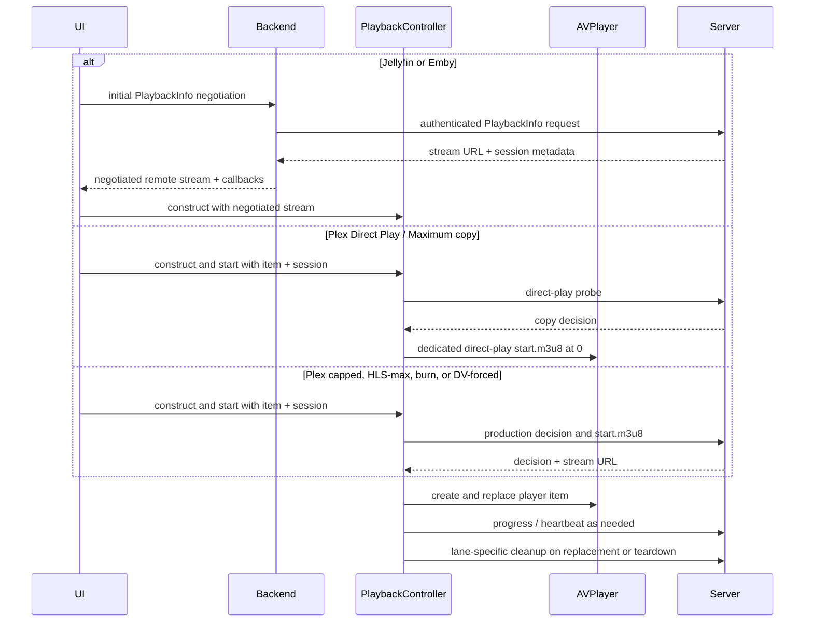
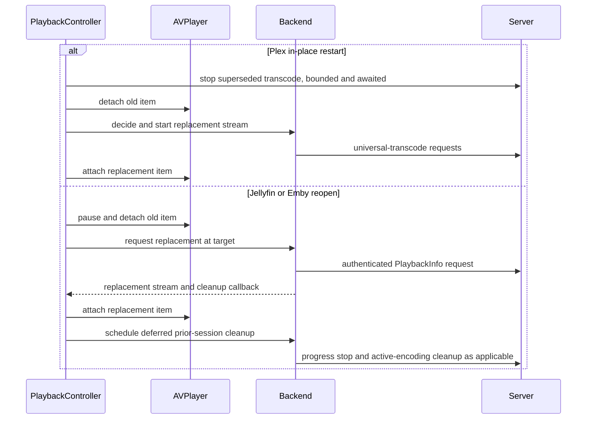

# Playback architecture

Video playback is split by backend, then converges on one app-owned `PlaybackController`.
The controller owns its `AVPlayer`, progress reporting, diagnostics, seeking, recovery, and
teardown. Presenter views own the `AVPlayerLayer` instances that display that player:
`CustomPlayerView` hosts `PlayerLayerView` in a window, and the Cinema attachment hosts another
presenter for the same live controller. The retired `AVPlayerViewController` path is not part of
the current architecture.

Every controller is constructed from one typed `PlaybackSessionSource`: `.plex` carries Plex
server authority, `.mediaBrowser` carries the negotiated Jellyfin/Emby stream together with its
reopener, progress context, and cleanup callback, and `.offline` carries the local file and side
assets. The controller never infers its lane from independent optional URLs, tokens, or callbacks.

Each item replacement advances a playback generation. Observer callbacks, notifications,
timers, artwork/metadata loads, reconnect watchdogs, and other queued work capture that
generation and re-check it on the main actor through `PlaybackLifecycleCallbackSink` and
`VideoPlaybackLifecyclePolicy`. Removing an observer is cleanup, not proof that a callback
already queued for the old item was cancelled.

## Plex

Plex playback uses two start paths. Do not collapse them into a single
“decision, then production `start.m3u8`” recipe.

1. **Direct Play / Maximum copy.** When the selected quality is Direct Play /
   Maximum, there is no subtitle burn, and Dolby Vision is not forcing a
   transcode, the controller first sends `directPlayProbeRequest()`. If PMS will
   copy video, it commits the dedicated `directPlayStartM3U8URL()`, preflights
   that playlist, and arms one playback-time fallback to production HLS. That
   copy-lane start omits `offset=`: the session starts at 0 and the playhead is
   restored with a client seek. Putting `offset=` on a copy session was observed
   to emit `#EXT-X-START:TIME-OFFSET` and then abandon the sole variant.
2. **Production decision / `start.m3u8`.** Capped quality rungs, Maximum (HLS),
   subtitle burn, and DV-forced transcodes skip the dedicated probe and use the
   production universal-transcode decision plus `start.m3u8`. Capped transcodes
   keep `offset=` priming so a deep resume does not wait on an unproduced
   segment.

Quality settings can force a capped transcode; Direct Play / Maximum preserves
the user's no-cap/copy intent and is not silently converted to a lower-quality
transcode after a stall.

The profile and quality parameters are load-bearing. `TranscodeRequest` uses the built-in
Plex profile name `Generic` plus explicit profile-extra directives. Unknown or missing
profile names can make PMS return HTTP 400, while the previously tried `Safari` profile
regressed high-bitrate 10-bit HEVC. Do not change these values casually.

## Jellyfin

`DetailPlaybackLauncher` orchestrates Jellyfin's initial PlaybackInfo negotiation through
`JellyfinBrowseService` before `PlaybackController` is constructed. The controller receives the
resolved stream and callbacks as one typed MediaBrowser session for later reopens, progress, and
cleanup. The app adapts
the native open result to the neutral MediaBrowser carrier at the app boundary,
preserves required request headers, and reports `Sessions/Playing`,
`Sessions/Playing/Progress`, and `Sessions/Playing/Stopped` with the current play session,
media source, method, and absolute position ticks. A reopen that mints a new session must
replace that progress context.

## Emby

Emby playback uses its own MediaBrowser-family lane. Like Jellyfin, `DetailPlaybackLauncher`
orchestrates its initial PlaybackInfo request through `EmbyBrowseService` before controller
construction; the resulting stream and reopen/cleanup callbacks are then supplied to the
controller. It reports progress through the same neutral app progress seam, but with Emby's
request dialect. `POST /Sessions/Playing/Stopped` reports
playback state only; it does **not** stop an encoder. A source whose open result says it used
server encoding must also call Emby's active-encoding delete endpoint. Keep those two teardown
operations separate.

Jellyfin and Emby share DTOs, quality/progress policy, and app-facing carriers, not a single
wire implementation. See `BACKENDS.md` for the exact boundary.

## HLS startup and failure detection

AVFoundation applies hard per-media-file startup deadlines. A large first HLS segment can
miss those deadlines even when the server and link are otherwise healthy; a one-variant
playlist then has no alternate rendition left. The failure shape also differs: Plex can
remain `.unknown` while the decisive codes appear only in `AVPlayerItem.errorLog()`, whereas
a MediaBrowser item may become `.failed`.

Current invariants:

- `HLSSessionPrewarmer` is lane-specific rather than a universal HLS prerequisite. Plex uses
  its full 20-second budget only when the selected quality is Direct Play / Maximum.
  Jellyfin/Emby use an 8-second head start only for a transcoded stream with a nonzero resume
  or reopen target; progressive/direct streams and zero-offset remote starts attach without
  that prewarm. All outcomes are soft and AVPlayer still gets a chance to load.
- After that MediaBrowser transcode prewarm, the controller stands up `MediaSessionProxy` to
  strip `starttimeticks` from the playlist and inject a playlist start-time offset, then
  attaches AVPlayer to the loopback URL. If proxy standup fails, it falls back to the original
  remote URL. Zero-offset and progressive/direct streams skip both the prewarm and the proxy.
- Failure handling scans the complete error log for the startup-deadline/variant-removal
  codes; a notification can cover more than its last appended event.
- A startup-deadline abandonment gets at most one automatic warm retry. The allowance is
  re-armed by explicit user intent such as Retry, a quality/audio reload, or a new seek,
  not by a transient `.playing` callback. Exhaustion produces the visible Retry surface.
- Preparation and reconnect watchdogs are each 20 seconds. The preparation watchdog covers
  attach after a poisoned `start.m3u8` that produces neither an AVPlayer failure nor a useful
  `timeControlStatus` transition. The reconnect watchdog covers in-flight recovery that
  replaces the player item. Both are progress-deferred so a slow-but-working prime is not
  false-failed.

## Buffering and stalls

Plex universal-transcode playlists are live-ish while their server session is open, even
for video-copy routes. In steady-state remote HLS playback, Labstream enables
`canUseNetworkResourcesForLiveStreamingWhilePaused`; otherwise pause-to-buffer can stop
network loading completely. An explicit out-of-buffer HLS seek temporarily uses the bounded
reopen/buffer path instead. Jellyfin/Emby progressive direct streams are ordinary VOD.

HLS buffer-ahead values advance by completed segment, so a high-bitrate stream can remain at
0 seconds for a while and then jump by the segment duration. That staircase is not itself a
stall. Diagnostics distinguish active transfer from a stale/idle observed-bitrate sample.

Network loss frequently leaves AVPlayer waiting with an empty buffer without changing the
item to `.failed`. Stall deadlines depend on the active lane: Jellyfin/Emby remote transcodes
use 45 seconds, other Direct Play / Maximum-selected paths use 90 seconds, and all remaining
paths use 15 seconds. For every network-backed stream—Plex, Jellyfin, or Emby—growth in
transferred bytes or loaded range at expiry rearms the watchdog instead of failing a
slow-but-working prime. Local-file playback does not use this deferral. Once progress stops, the
controller uses the startup error log when available and otherwise surfaces a recoverable
network/capacity message.

Client-driven adaptive bitrate is an optional Settings feature and is default-off. When enabled,
it can reopen supported capped Plex or MediaBrowser streams at bounded rungs after a sustained
stall and later upshift after healthy playback. It never silently converts an explicit Direct
Play / Maximum choice to a capped transcode. The requested forward-buffer duration remains a
hint, not a guarantee; a full server throttle window, a single-rendition copy stream, or
AVPlayer's realized buffer is not itself an adaptive bitrate ladder.

## Seeking and restart budgets

The custom scrubber owns user seek intent. `RemoteSeekModePolicy` selects native in-buffer
or copy-lane seeking versus a backend/session reopen. Out-of-buffer server-encoded seeks are
debounced into one settled final-target rebuild instead of restarting for every drag sample.

- Plex streaming-copy HLS seeks natively within its full-timeline playlist; do not kill and
  re-mint that copy session merely to seek.
- Reopen/rebuild paths capture the live playhead, detach stale work, negotiate the final
  target, and hold the scrubber until the replacement item lands or fails.
- `FinalTargetRebuildPolicy` and `SeekRestartBudget` prevent concurrent/unbounded restart
  pipelines. When the budget is exhausted, recovery stops and the user gets Retry rather
  than a hidden server-hammering loop.
- Playhead evidence is carried as typed `PlaybackPositionSample`s rather than parallel
  millisecond/timestamp/source/near-zero fields. `PlaybackPositionSnapshot` captures the chosen
  restart target and all evidence together; `PlaybackSeekHold` owns its target, latest generation,
  and 12-second deadline so a stale completion cannot release a newer seek.
- Explicit seek-to-zero samples remain authoritative. Unintended near-zero clocks observed while
  replacing an item are suppressed when newer meaningful evidence exists, and terminal reporting
  uses the same typed evidence without regressing to a detached item's transient zero.
- Track, quality, explicit-Retry, and adaptive-bitrate replacements enter the controller through
  a typed `PlaybackRestartIntent`. Its value-only `PlaybackRestartPlan` is reason-specific: every
  intent resets the final target, rearms the startup-deadline retry, and tears down observers;
  only `.explicitRetry` also clears the visible error and resets ABR. Callers must not assume
  every restart clears failure state.
- Every intentional Plex in-place restart that supersedes a transcode (quality/audio
  reload, Retry, or final-target rebuild) stops the old job first with a bounded wait before
  requesting the replacement under the reused session id.
- Jellyfin/Emby replacement is deliberately ordered differently: detach the old `AVPlayerItem`,
  negotiate and attach the replacement item, then defer the prior active-encoding stop. If the
  backend reused the same play-session id, skip that prior stop so it cannot tear down the new
  stream.

## Audio and subtitle selection

Player pickers consume one validated `PlaybackTrackSnapshot`: its rows and selected typed ID are
captured together, so a stale or magic numeric selection cannot describe a different list. Every
row carries exactly one mechanism—AVFoundation, Plex stream, MediaBrowser stream, or offline
sidecar—and subtitle Off is a lane-specific typed choice. Plex's `0` and MediaBrowser's `-1` Off
values exist only in the controller's backend adapter immediately next to wire-facing requests.

Offline subtitle menus read only the downloaded track metadata. The controller opens and parses
the selected SRT/VTT sidecar off the main actor when the viewer chooses it; opening the menu no
longer parses every sidecar up front. Offline subtitle and metadata-audio selections are
generation-fenced: a later track or Off choice invalidates stale async parse/PUT completions before
they can change the active track, preference, overlay, or restart the stream. Plex's account-sticky
audio PUTs also run through a serialized latest-intent tail: an in-flight mutation finishes before
the newest choice is sent, while superseded queued choices are skipped, making the newest intent
the final server mutation as well as the final local selection.

Subtitle delivery risk and caption styling are separate typed policies. `SubtitleBurnRiskPolicy`
maps backend evidence (including Plex's decision response and MediaBrowser transcode reasons) to
none, uncertain, or confirmed burn/transcode risk; only confirmed new risk interrupts selection
with a consequence-and-alternatives confirmation. `SubtitleStyleCapabilityPolicy` independently
decides whether the selected route can use an Apple caption appearance profile, is an app-rendered
offline sidecar, or is server/image rendered and therefore cannot be restyled.

The playback-owned caption appearance controller observes system Media Accessibility changes,
applies profiles system-wide only after explicit selection, and uses `AVPlayerLayer`'s native
profile preview on OS 26.4 and later. Preview is stopped before layer replacement and on picker,
item, playback, and Cinema teardown. The app-owned offline subtitle overlay mirrors the active
system profile's supported font, size, colors, opacity, edge, window, and corner settings.

## Local/offline playback

Completed downloads play from local file URLs. Local playback has no remote progress stream,
server session, or transcode cleanup path. Its playhead is persisted on the offline record,
and its typed offline session still shares player UI, diagnostics, chapters/subtitles, Cinema,
and error surfaces with remote playback. Transport-status presentation is source-aware:
`PlaybackTransportPresentationPolicy` maps AVPlayer's shared waiting state to local-preparation
wording for `.localFile` sessions instead of remote buffering language, while stall-watchdog
mechanics remain shared with remote playback.

## HDR and Dolby Vision

Source classification and runtime observation are deliberately separate. PMSKit maps each
backend's available stream metadata into `VideoHDRMetadata`; `PlaybackHDRProbe` later reads
AVFoundation tracks and format descriptions after segments load. Stats may describe the
source as HDR10+ only when backend metadata can distinguish it, and must not claim that
AVPlayer rendered HDR10+ dynamic metadata. Bit depth alone is not HDR evidence.

Dolby Vision Profile 5 has no compatible base layer. With experimental DV signalling off
(the default), `DolbyVisionPlaybackPolicy` forces a tone-map transcode where the backend is
known to handle untagged P5, and blocks Emby rather than accepting a successful-looking but
incorrectly colored encode. A guard-forced transcode has a transport-progress-aware
first-frame deadline and a DV-specific failure surface.

Experimental DV signalling remains default-off and changes two separate decisions when enabled.
First, it defers the fallback-less Profile 5 safety gate so the experimental copy lane can be
attempted. Separately, server capability advertising and HLS master-playlist injection are enabled
only for the exact eligible item, and actual injection remains limited to Profile 8 streams with
a known compatible base layer. Profile 5 never receives `SUPPLEMENTAL-CODECS` injection. Do not
broaden either policy without device and bitstream verification.

## SharePlay on visionOS

The visionOS `App` owns one live app-lifetime `WatchTogetherCoordinator` and injects it into both
the main window and Custom Cinema. The local player is not coordinated merely because a
`GroupSession` exists: the participant must resolve and launch the exact local item first. A
surface-owned attachment-maintenance loop then binds that controller's
`AVPlayerPlaybackCoordinator` to the active session and reattaches whenever the group-session
generation or `AVPlayerItem` changes.

The window-to-Cinema handoff preserves the same `PlaybackController` and SharePlay session. The
window presenter disappearing during that handoff does not leave the activity; the Cinema
scaffold takes over attachment maintenance. A genuine player close, Cinema exit, active
browse-session identity change (backend, server, user, or auth session), or invalidated group
session leaves or clears participation. Payload privacy and participant-local resolution are
documented in [System integration](SYSTEM-INTEGRATION.md#shareplay-watch-together).

## System media ownership

visionOS video uses a controller-owned `VideoNowPlayingCoordinator` backed by a scoped
`MPNowPlayingSession(players:)`. It is created as a player item loads and stays active through
in-controller item replacement. Controller stop, a surfaced playback failure, or EOF without
autoplay tears it down. Metadata is published on each `AVPlayerItem`, including best-effort
Plex-authenticated or cached offline artwork when those inputs are available, and the session's
commands route play, pause, skip, and absolute seeks back through `PlaybackController`.
The app-lifetime `ArtworkPipeline` supplies music/video system Now Playing, ordinary posters,
offline rows, offline player art, and `AVPlayerItem` external metadata on platforms where that API
is available, from the same exact authenticated/local flight and cost-cache boundary. macOS
publishes Now Playing artwork through `VideoNowPlayingCore` rather than `AVPlayerItem.externalMetadata`.
Completed image values cross the immutable
CGImage-backed `DecodedImage` boundary; original encoded bytes are retained only for
`AVMetadataItem` artwork, and AppKit/UIKit images are created only at native publication bridges.
Video and visionOS metadata completion additionally requires the exact descriptor, pipeline,
playback generation, and current `AVPlayerItem`; stale success/failure callbacks cannot overwrite a
replacement item.

The chapter info tab is the deliberate exception: AVKit hosts it in an independent
`UIHostingController` without the app's injected pipeline or a stable requested-pixel contract, so
`RequestBackedChapterImage` remains request-backed. BIF and sprite-sheet providers, Emby generated
per-position frames, Emby online/offline chapter fallback, and the player nearest-frame cache remain
provider-scoped time-indexed exceptions rather than `ArtworkPipeline` consumers. Authenticated
requests use the nonpersistent side-asset transport, and their leaf caches are memory-only and
bounded by both byte cost and entry count. The Chapters panel additionally holds a panel-session-scoped `ChapterThumbnailImageCache` — a
MainActor cost-bounded LRU (48 images / 48 MB) keyed by opaque side-asset request digest — that
keeps decoded thumbnails warm across lazy card reuse and releases all pixels when the panel closes
or under memory pressure. Sprite sheets and final scrub previews cross a detached,
eager ImageIO decode boundary before entering provider or MainActor cache state. A parsed BIF retains
one backing payload, maps safe offline files, and normal seek lookup copies only the selected frame;
the source-compatible `frames` accessor materializes all payloads only when explicitly read.
Largest-real-BIF and tile-sheet peak-RSS measurement is not a current release gate; the caches
remain bounded by the policies described above.
Those paths use `DecodedImage` at their image boundary, but that conversion is not shared-pipeline
migration.

iOS/iPadOS and macOS use a separate process-wide lease model. The mobile platform coordinator wraps
`VideoNowPlayingCore` alongside PiP/AirPlay behavior, while the Mac player owns the core directly.
The core acquires an identity-guarded video lease on the app-lifetime
`SystemMediaSessionCoordinator` owned by `MusicPlayerController`. Video temporarily supersedes
music's Now Playing and remote commands; releasing video restores the most recent surviving music
owner, and stale artwork or teardown cannot clear a newer owner. visionOS video does not use this
lease path. tvOS compiles neither `VideoNowPlayingCore` nor the visionOS
`VideoNowPlayingCoordinator`; it does not publish video Now Playing through either path.

## Playback explanation

Stats for Nerds shows a compact **Why** line from `PlaybackExplanation`: one lane headline and
at most two useful reasons, with provenance (backend-reported, app-requested, or inferred).
The normal player must not show raw backend reason arrays, IDs, or URLs. Emby Profile 5 is
blocked rather than forced through a tone-map, so an Emby no-fallback DV open should refuse; it
is not a requested tone-map explanation.

## Cinema ownership

Cinema is an app-owned visionOS immersive presentation, not AVKit expanded playback. It
hosts the same `PlayerLayerView` and `CustomPlayerChrome` in one RealityView attachment. The
attachment is scaled from its measured `visualBounds`; hard-coding points-to-meters density
can make a present and hit-testable surface effectively invisible.

The visionOS `App` retains the active controller in `CustomCinemaSessionStore`. The immersive
space presents that controller; it does not own it. Dropping the controller when the window
dismisses is a regression. `CinemaTransitionCoordinator` is the sole
presentation-transition owner: its pure reducer generation-fences open, appear, window-detach,
dismiss, and disappear callbacks. Explicit Exit, Crown/system dismissal, EOF, and Up Next all
converge on one exact-once finalizer ordered as SharePlay leave, controller stop, return routing,
main-window open, and retained-session clear. `CinemaExitRouting` preserves the originating
tab/item, resolved next item, or offline destination without introducing a server fetch for an
offline return. The player window detaches only after both the platform open result and the exact
immersive generation's appearance have succeeded; a failed or missing appearance leaves it in
place. Window disappearance during the accepted handoff is not an exit and preserves the same
controller, `AVPlayer`, and audio path. Stale scaffold generations cannot bind player callbacks,
maintain SharePlay attachment, tick, or finalize. Do not restore a hidden second player or
reintroduce an AVKit-only control surface.

## Restart and cleanup principles

- Restart player items rather than mutating a stale AVPlayer item in place when the server route changes.
- Preserve each backend lane's replacement order: Plex stops the superseded in-place transcode
  before replacement, while Jellyfin/Emby detach the old item, attach the replacement, and only
  then schedule deferred prior active-encoding cleanup.
- Keep Plex transcode stop, MediaBrowser progress-stop, and MediaBrowser active-encoding
  cleanup as distinct operations.
- Treat cleanup failures as non-fatal where the user-visible playback path can continue.
- Keep diagnostic fields shape-level and redacted: no full URLs, tokens, hosts, titles, or filenames.
