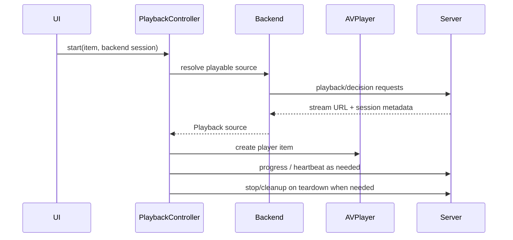

# Playback architecture

Playback is split by backend, then converges on a single `PlaybackController` that owns AVPlayer, progress reporting, diagnostics, and teardown.

## Plex

Plex playback chooses between direct/copy and server-transcoded HLS paths. Quality settings can force a capped transcode; Direct Play / Maximum starts from the server decision path and then builds the appropriate AVPlayer item.

The profile and quality parameters are load-bearing. Do not change them casually: they determine whether Plex copies, direct-streams, or transcodes.

## Jellyfin

Jellyfin playback uses MediaBrowser playback responses and resolved stream URLs. The app preserves server-selected stream behavior while keeping credentials out of logs and diagnostics.

## Emby

Emby playback uses its own MediaBrowser-family lane. It resolves stream URLs through Emby PlaybackInfo, reports progress to Emby's session endpoints, and stops active server encoding when a server-side encoding session was opened.

## Local/offline playback

Completed downloads play from local file URLs. Local playback has no remote progress stream, server session, or transcode cleanup path; it still shares player UI, diagnostics, and error surfaces with remote playback.

## Restart and cleanup principles

- Restart player items rather than mutating a stale AVPlayer item in place when the server route changes.
- Stop server sessions that Labstream intentionally opened before starting a replacement session.
- Treat cleanup failures as non-fatal where the user-visible playback path can continue.
- Keep diagnostic fields shape-level and redacted: no full URLs, tokens, hosts, titles, or filenames.
