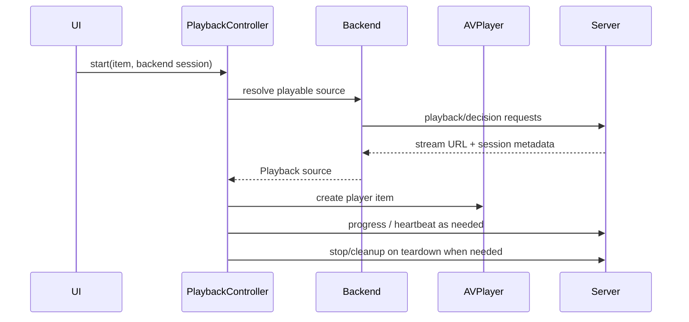

# Playback architecture

Video playback is split by backend, then converges on one app-owned `PlaybackController`.
It owns `AVPlayer`, the `AVPlayerLayer` surface, progress reporting, diagnostics, seeking,
recovery, and teardown. The retired `AVPlayerViewController` path is not part of the current
architecture.

## Plex

Plex playback asks the universal-transcode decision endpoint whether video/audio should be
played, copied, or transcoded, then loads the resulting `start.m3u8`. Quality settings can
force a capped transcode; Direct Play / Maximum preserves the user's no-cap/copy intent and
is not silently converted to a lower-quality transcode after a stall.

The profile and quality parameters are load-bearing. `TranscodeRequest` uses the built-in
Plex profile name `Generic` plus explicit profile-extra directives. Unknown or missing
profile names can make PMS return HTTP 400, while the previously tried `Safari` profile
regressed high-bitrate 10-bit HEVC. Do not change these values casually.

## Jellyfin

Jellyfin playback uses its native PlaybackInfo requests and resolved stream URLs. The app
adapts the native open result to the neutral MediaBrowser carrier at the app boundary,
preserves required request headers, and reports `Sessions/Playing`,
`Sessions/Playing/Progress`, and `Sessions/Playing/Stopped` with the current play session,
media source, method, and absolute position ticks. A reopen that mints a new session must
replace that progress context.

## Emby

Emby playback uses its own MediaBrowser-family lane. It resolves stream URLs through Emby
PlaybackInfo and reports progress through the same neutral app progress seam, but with
Emby's request dialect. `POST /Sessions/Playing/Stopped` reports playback state only; it
does **not** stop an encoder. A source whose open result says it used server encoding must
also call Emby's active-encoding delete endpoint. Keep those two teardown operations
separate.

Jellyfin and Emby share DTOs, quality/progress policy, and app-facing carriers, not a single
wire implementation. See `BACKENDS.md` for the exact boundary.

## HLS startup and failure detection

AVFoundation applies hard per-media-file startup deadlines. A large first HLS segment can
miss those deadlines even when the server and link are otherwise healthy; a one-variant
playlist then has no alternate rendition left. The failure shape also differs: Plex can
remain `.unknown` while the decisive codes appear only in `AVPlayerItem.errorLog()`, whereas
a MediaBrowser item may become `.failed`.

Current invariants:

- `HLSSessionPrewarmer` best-effort fetches the master and child playlists and polls the
  initialization/first media byte before attaching AVPlayer. Plex gets the full startup
  budget; MediaBrowser reopen gets a shorter bounded head start because Jellyfin may mint
  segments only on demand.
- Failure handling scans the complete error log for the startup-deadline/variant-removal
  codes; a notification can cover more than its last appended event.
- A startup-deadline abandonment gets at most one automatic warm retry. The allowance is
  re-armed by explicit user intent such as Retry, a quality/audio reload, or a new seek,
  not by a transient `.playing` callback. Exhaustion produces the visible Retry surface.
- Preparation and reconnect watchdogs bound negotiations or rebuilds that produce neither
  an AVPlayer failure nor a useful state transition.

## Buffering and stalls

Plex universal-transcode playlists are live-ish while their server session is open, even
for video-copy routes. Any remote `.m3u8` therefore enables
`canUseNetworkResourcesForLiveStreamingWhilePaused`; otherwise pause-to-buffer can stop
network loading completely. Jellyfin/Emby progressive direct streams are ordinary VOD.

HLS buffer-ahead values advance by completed segment, so a high-bitrate stream can remain at
0 seconds for a while and then jump by the segment duration. That staircase is not itself a
stall. Diagnostics distinguish active transfer from a stale/idle observed-bitrate sample.

Network loss frequently leaves AVPlayer waiting with an empty buffer without changing the
item to `.failed`. The 15-second stall watchdog is the backstop, but it defers while real
transport progress or other evidence of a slow working prime continues. On expiry it uses
the startup error log when available, otherwise surfaces a recoverable network/capacity
message. It never silently abandons Direct Play / Maximum for a capped transcode.

The requested forward-buffer duration is a hint, not a guarantee. Do not treat a full
server throttle window, a single-rendition copy stream, or AVPlayer's realized buffer as an
adaptive bitrate ladder.

## Seeking and restart budgets

The custom scrubber owns user seek intent. `RemoteSeekModePolicy` selects native in-buffer
or copy-lane seeking versus a backend/session reopen. Out-of-buffer server-encoded seeks are
debounced into one settled final-target rebuild instead of restarting for every drag sample.

- Plex streaming-copy HLS seeks natively within its full-timeline playlist; do not kill and
  re-mint that copy session merely to seek.
- Reopen/rebuild paths capture the live playhead, detach stale work, negotiate the final
  target, and hold the scrubber until the replacement item lands or fails.
- `FinalTargetRebuildPolicy` and `SeekRestartBudget` prevent concurrent/unbounded restart
  pipelines. When the budget is exhausted, recovery stops and the user gets Retry rather
  than a hidden server-hammering loop.
- Every intentional Plex in-place restart that supersedes a transcode (quality/audio
  reload, Retry, or final-target rebuild) stops the old session first with a bounded wait.
  Starting a replacement without cleanup can stack server transcoder jobs.

## Local/offline playback

Completed downloads play from local file URLs. Local playback has no remote progress stream,
server session, or transcode cleanup path. Its playhead is persisted on the offline record,
and it still shares player UI, diagnostics, chapters/subtitles, Cinema, and error surfaces
with remote playback.

## HDR and Dolby Vision

Source classification and runtime observation are deliberately separate. PMSKit maps each
backend's available stream metadata into `VideoHDRMetadata`; `PlaybackHDRProbe` later reads
AVFoundation tracks and format descriptions after segments load. Stats may describe the
source as HDR10+ only when backend metadata can distinguish it, and must not claim that
AVPlayer rendered HDR10+ dynamic metadata. Bit depth alone is not HDR evidence.

Dolby Vision Profile 5 has no compatible base layer. With experimental DV signalling off
(the default), `DolbyVisionPlaybackPolicy` forces a tone-map transcode where the backend is
known to handle untagged P5, and blocks Emby rather than accepting a successful-looking but
incorrectly colored encode. A guard-forced transcode has a transport-progress-aware
first-frame deadline and a DV-specific failure surface.

Experimental DV signalling remains default-off. Advertising is per-item, and playlist
injection is deliberately limited to eligible Profile 8 streams with a known compatible
base layer. Do not broaden that policy without device and bitstream verification.

## Cinema ownership

Cinema is an app-owned visionOS immersive presentation, not AVKit expanded playback. It
hosts the same `PlayerLayerView` and `CustomPlayerChrome` in one RealityView attachment. The
attachment is scaled from its measured `visualBounds`; hard-coding points-to-meters density
can make a present and hit-testable surface effectively invisible.

The immersive session owns the active controller. Exit, Crown dismissal, EOF, and Up Next
stop that controller, reopen the main window, and route back
through `CinemaExitRouting` to the originating tab/item or the resolved next item. Do not
restore a hidden second player or reintroduce an AVKit-only control surface.

## Restart and cleanup principles

- Restart player items rather than mutating a stale AVPlayer item in place when the server route changes.
- Stop server sessions that Labstream intentionally opened before starting a replacement session.
- Keep Plex transcode stop, MediaBrowser progress-stop, and MediaBrowser active-encoding
  cleanup as distinct operations.
- Treat cleanup failures as non-fatal where the user-visible playback path can continue.
- Keep diagnostic fields shape-level and redacted: no full URLs, tokens, hosts, titles, or filenames.
