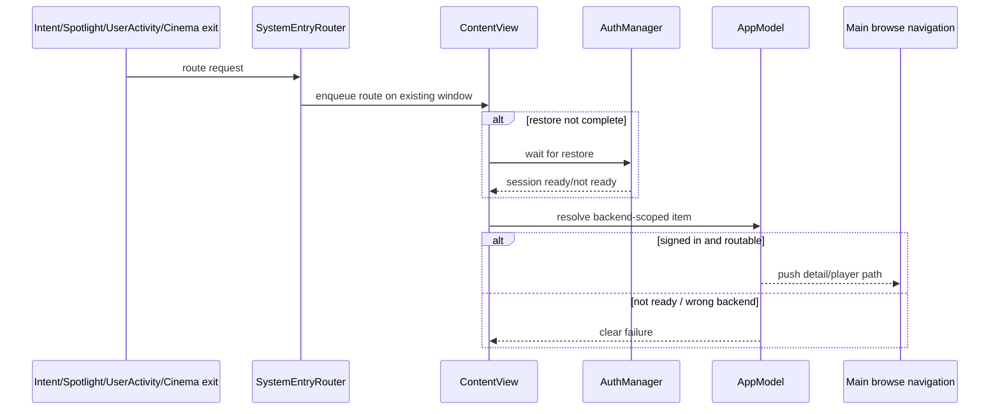

# System integration

## Single-window routing

System entries route through `SystemEntryRouter` into the existing app window. They should not create a second playback/window stack.

`ContentView` registers `AppModel` and `AuthManager` before restore completes so cold-launch intents and Spotlight opens can queue safely until browsing is ready.

## App Intents

VisionPlay exposes intents for:

- Play Media
- Open Media
- Continue Watching

The currently shipped media-title intents are Plex-scoped: entity suggestions/search/identifier resolution use the Plex browse context and refuse non-Plex backend-scoped IDs rather than resolving them against whichever backend is active. Resolved routes still push the normal detail/player paths. Signed-out or not-ready states should return a clear failure instead of partially opening UI.

The media-title entity queries used by Siri/Shortcuts are controlled by Settings → Playback → **Show Media in Spotlight & Siri**. Turning the control off stops VisionPlay's media-title App Intents entity queries, including suggestions and saved media-title parameters; explicit no-parameter actions such as Continue Watching can still run only after the user invokes them and the app can reach the signed-in Plex session.

## Spotlight

Spotlight indexing is best effort:

- index video items as they are browsed
- namespace identifiers by Plex server today; the parser already accepts a versioned backend-scoped shape for future non-Plex routes
- avoid thumbnails and sensitive server/title-adjacent metadata beyond what the system result requires
- delete the app’s index on sign-out and from the Settings maintenance action
- respect Settings → Playback → **Show Media in Spotlight & Siri**; turning it off stops new indexing and clears VisionPlay's Spotlight domain

Spotlight hits open the app and navigate to the detail page. Current Spotlight indexing is Plex-only; non-Plex backend-scoped identifiers are parsed defensively but not indexed or routable yet. Spotlight hits do not autoplay unless explicitly routed through a play intent.

## User activities and future deep links

CoreSpotlight continuation uses the same router and Home-stack detail navigation as App Intents. There is no separate URL-scheme/deep-link handler in the shipping app today; add any future deep links to `SystemEntryRouter` instead of creating another window/navigation path so restore, sign-out, and backend switching behavior stays consistent.
