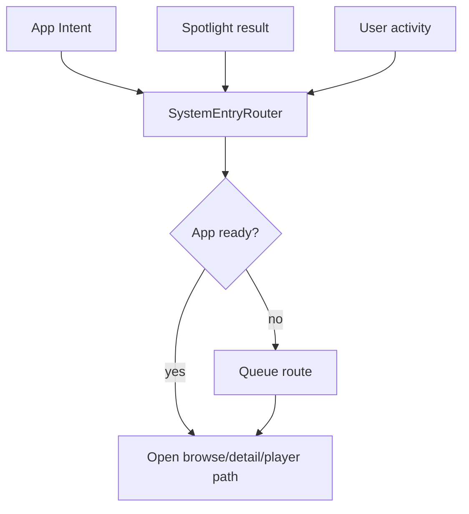

# System integration

Labstream integrates with Apple system surfaces through one routing layer so external entry points
behave like normal in-app navigation. The implementation is shared by the visionOS and mobile
targets and reused by the Mac development preview where the platform surface is available;
end-to-end validation remains platform-specific.

## Single-window routing

`SystemEntryRouter` is the app's central handoff point. It waits for restore/sign-in readiness when needed, then routes into the main browse window rather than opening separate navigation stacks. Its fallback restore calls `restoreSessionIfNoAuthorizationInProgress()` and keeps waiting if a user-facing login owns authorization, so a system entry cannot cancel or supersede that login. External media identifiers are resolved against the active backend/session only, so Plex, Jellyfin, and Emby entries never imply a cross-device or offline catalog.

## App Intents

App Intents expose selected Labstream actions and media entities to system surfaces. Intent handlers should:

- avoid leaking server URLs, tokens, or private identifiers in logs, docs, and shared diagnostics;
- fail clearly when signed out or when the active backend cannot satisfy the request;
- keep suggestions/search scoped to the active backend and non-music video items;
- route through `SystemEntryRouter` instead of duplicating navigation logic.

## Spotlight

Spotlight indexing is user-controllable from Settings. Indexed content uses non-token, backend/server-scoped identifiers and is cleared when the user disables media suggestions, signs out, or switches backend. Treat searchable identifiers as private because they may include a server namespace and media item id.

New backend-scoped identifiers use the neutral `ls1|backend|server|item` shape. The
router also accepts the legacy `vp1` prefix from early mobile-preview builds so saved
Shortcuts and Spotlight rows keep routing after upgrade; do not remove that alias without
a separate migration plan.

## User activities

User activities follow the same routing path as App Intents and Spotlight. Add new external-entry behavior to the router first, then connect the system surface to that route.

## Mac development preview

The Mac preview routes external entries through the same `SystemEntryRouter` and adds native Mac
window/menu navigation and separate video/music system-media coordination. Those hooks are present
for local source testing, but Shortcuts, Spotlight, media-key ownership, and real backend restore
remain preview validation items rather than released-platform guarantees. See
[macOS development preview](MACOS.md).
