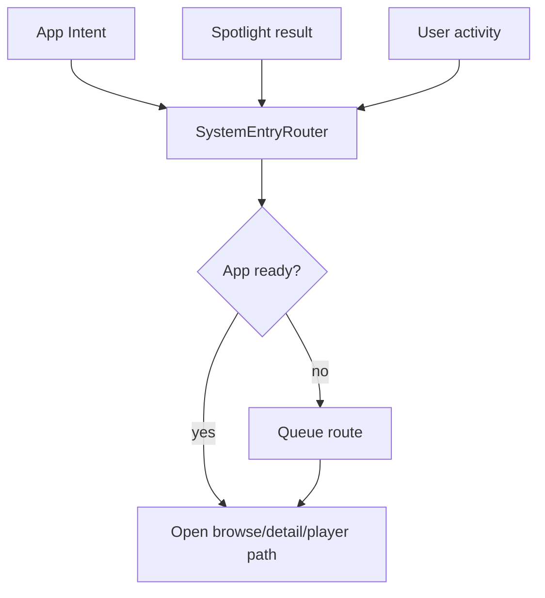

# System integration

Labstream integrates with Apple system surfaces through one routing layer so external entry points behave like normal in-app navigation. The implementation is shared by the visionOS and mobile targets, while end-to-end validation remains platform-specific.

## Single-window routing

`SystemEntryRouter` is the app's central handoff point. It waits for restore/sign-in readiness when needed, then routes into the main browse window rather than opening separate navigation stacks. External media identifiers are resolved against the active backend/session only, so Plex, Jellyfin, and Emby entries never imply a cross-device or offline catalog.

## App Intents

App Intents expose selected Labstream actions and media entities to system surfaces. Intent handlers should:

- avoid leaking server URLs, tokens, or private identifiers in logs, docs, and shared diagnostics;
- fail clearly when signed out or when the active backend cannot satisfy the request;
- keep suggestions/search scoped to the active backend and non-music video items;
- route through `SystemEntryRouter` instead of duplicating navigation logic.

## Spotlight

Spotlight indexing is user-controllable from Settings. Indexed content should use non-token identifiers, include backend/server scope where needed, and be cleared when the user disables media suggestions or signs out. Treat searchable identifiers as private because they may include a server namespace and media item id.

## User activities

User activities follow the same routing path as App Intents and Spotlight. Add new external-entry behavior to the router first, then connect the system surface to that route.
