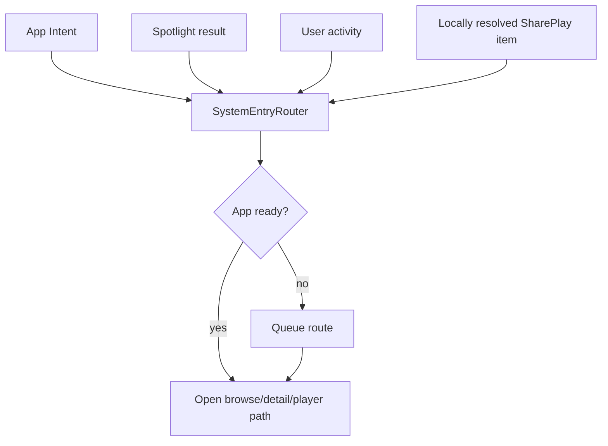
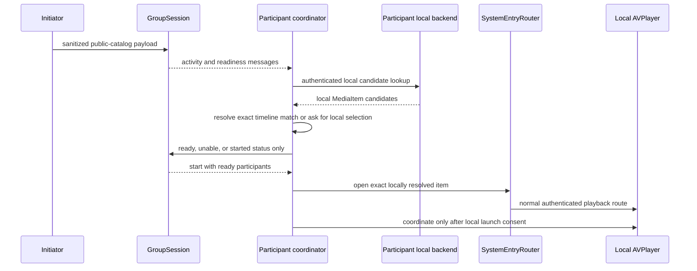

# System integration

Labstream integrates with Apple system surfaces through one routing layer so external entry points
behave like normal in-app navigation. The implementation is shared by the visionOS and mobile
targets and reused by the Mac development preview where the platform surface is available;
end-to-end validation remains platform-specific.

## Single-window routing

`SystemEntryRouter` is the app's central handoff point. It waits for restore/sign-in readiness when needed, then routes into the main browse window rather than opening separate navigation stacks. Its fallback restore calls `restoreSessionIfNoAuthorizationInProgress()` and keeps waiting if a user-facing login owns authorization, so a system entry cannot cancel or supersede that login. External media identifiers are resolved against the active backend/session only, so Plex, Jellyfin, and Emby entries never imply a cross-device or offline catalog.

## App Intents

App Intents expose selected Labstream actions and media entities to system surfaces. Intent handlers should:

- avoid leaking server URLs, tokens, or private identifiers in logs, docs, and shared diagnostics;
- fail clearly when signed out or when the active backend cannot satisfy the request;
- keep suggestions/search scoped to the active backend and non-music video items;
- route through `SystemEntryRouter` instead of duplicating navigation logic.

## Spotlight

Spotlight indexing is user-controllable from Settings. Indexed content uses non-token, backend/server-scoped identifiers and is cleared when the user disables media suggestions, signs out, or switches backend. Treat searchable identifiers as private because they may include a server namespace and media item id.

New backend-scoped identifiers use the neutral `ls1|backend|server|item` shape. The
router also accepts the legacy `vp1` prefix from early mobile-preview builds so saved
Shortcuts and Spotlight rows keep routing after upgrade; do not remove that alias without
a separate migration plan.

## User activities

User activities follow the same routing path as App Intents and Spotlight. Add new external-entry behavior to the router first, then connect the system surface to that route.

## SharePlay / Watch Together

Watch Together is currently a visionOS GroupActivity surface. Its app-generated cross-device
payload is intentionally not a backend playback descriptor: it contains a random activity id
plus a sanitized, allowlisted public-catalog identity and display label. The payload schema has
no dedicated fields for backend item/library ids, server URLs, credentials, filenames,
media-source ids, or play-session ids. Media-item payload construction rejects an unsafe display
title; unsafe optional display/comparable text and non-allowlisted or unsafe provider values are
omitted rather than transmitted. Readiness messages carry only the activity id and participant
state.

Each participant resolves the activity locally. `WatchTogetherMediaLookup` searches only that
participant's currently authenticated active online backend, attempts to hydrate candidate
metadata using their own credentials, and excludes offline downloads. Automatic PMSKit resolution
requires compatible logical identity and an exact rounded-timeline match. When automatic
resolution is absent or ambiguous, the UI offers only same-kind, timeline-compatible local
candidates for explicit selection instead of sending a server identifier between participants. A
payload that cannot produce a supported safe coordinator identity fails closed.

`WatchTogetherCoordinator` joins the GroupSession early enough to receive readiness messages and
present the join prompt. That message-level join is not consent to synchronize private local
playback: the coordinator does not bind a local `AVPlayer` until the participant has resolved and
launched the exact local item. The launch goes through `SystemEntryRouter.open`, so it uses the
normal authenticated navigation/player route rather than a parallel playback stack. The
coordinator is app-lifetime on visionOS; player attachment and Cinema continuity are described in
[Playback architecture](PLAYBACK-ARCHITECTURE.md#shareplay-on-visionos).

## Mac development preview

The Mac preview routes external entries through the same `SystemEntryRouter` and adds native Mac
window/menu navigation and separate video/music system-media coordination. Those hooks are present
for local source testing, but Shortcuts, Spotlight, media-key ownership, and real backend restore
remain preview validation items rather than released-platform guarantees. See
[macOS development preview](MACOS.md).
