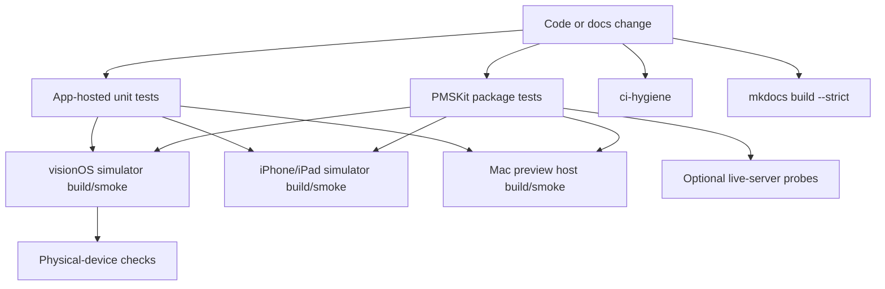

# Testing strategy

Labstream uses layered validation. Fast, hermetic tests protect the codebase by default; live-server and physical-device checks are opt-in because they depend on private servers, credentials, network conditions, and hardware.



## Required local checks

Run these before publishing code changes:

```sh
cd PMSKit && swift test
cd ..
scripts/ci-hygiene.sh
uv run --with-requirements requirements.txt mkdocs build --strict
```

Production changes should also run focused tests from the owning layer. Pure request/model/policy
coverage belongs in `PMSKit/Tests/PMSKitTests`. App-owned deterministic coverage lives in
`LabstreamTests/`; the same sources are hosted by `LabstreamTests` on an iOS simulator and
`LabstreamMacTests` on macOS. Run the affected host, or both hosts for shared app infrastructure:

```sh
scripts/worktree-sim.sh --platform iphone setup
SIMID=$(scripts/worktree-sim.sh --platform iphone id)
xcrun simctl boot "$SIMID" 2>/dev/null || true
scripts/xcodebuild-versioned.sh -project Labstream.xcodeproj \
  -scheme LabstreamMobile -testPlan LabstreamTests \
  -destination "platform=iOS Simulator,id=$SIMID" test CODE_SIGNING_ALLOWED=NO

scripts/xcodebuild-versioned.sh -project Labstream.xcodeproj \
  -scheme LabstreamMac -testPlan LabstreamMacTests \
  -destination 'platform=macOS,arch=arm64' test CODE_SIGNING_ALLOWED=NO
```

The app suites are host-app unit tests. They do not replace install/launch/screenshot smoke,
interactive UI checks, live-server probes, or physical-device acceptance.

## CI checks

Woodpecker provides the repository's default public, portable CI surface:

- `.woodpecker/docs.yml` builds MkDocs strictly and deploys the static site on relevant pushes to
  `main` (or a manual run).
- `.woodpecker/hygiene.yml` runs `scripts/ci-hygiene.sh`, including its Python tooling tests, on
  pushes, pull requests, and manual runs.
- `.woodpecker/pmskit.yml` runs PMSKit's hermetic Linux suite without credentials. XCTest and
  Swift Testing are separate invocations because their combined runner deadlocks under
  swift-corelibs-foundation; see that pipeline for the exact flags.

There is currently no enrolled macOS CI runner for Xcode app builds, app-hosted tests, simulator
smoke, or host-Mac smoke, so those remain local validation gates and must not be inferred from
portable CI. A separate [native macOS CI lane](MACOS-CI.md) is prepared for unsigned visionOS and
iOS/iPadOS builds. It remains manual/main-only and cannot execute until the explicitly labelled
physical runner is enrolled; fork pull requests are permanently outside that local-backend trust
boundary.

## Simulator checks

Use platform-specific worktree simulators for app build and launch smoke. VisionOS remains the default/golden-clone path:

```sh
SIMID=$(scripts/worktree-sim.sh --platform visionos id)
scripts/xcodebuild-versioned.sh -project Labstream.xcodeproj -scheme Labstream \
  -destination "platform=visionOS Simulator,id=$SIMID" \
  -configuration Debug build CODE_SIGNING_ALLOWED=NO
```

For the native iPhone/iPad target, opt into an iPhone simulator by default and build the `LabstreamMobile` scheme. Use `ipad` instead of `iphone` for the iPad pass:

```sh
printf 'iphone\n' > .simplatform
SIMID=$(scripts/worktree-sim.sh id)
scripts/xcodebuild-versioned.sh -project Labstream.xcodeproj -scheme LabstreamMobile \
  -destination "platform=iOS Simulator,id=$SIMID" \
  -configuration Debug build CODE_SIGNING_ALLOWED=NO
```

Simulator builds are useful for compile coverage, sign-in UI, settings, browse flows, compact/regular mobile shell regressions, and many download/playback routing checks. They are not a full substitute for headset playback or physical iPhone/iPad media-background behavior, cellular-transfer policy, PiP/AirPlay handoff, or system search/Shortcuts invocation.

## macOS development-preview checks

macOS has no simulator lane. The native `LabstreamMac` target runs on the host under a
per-worktree development identity. For Mac-specific or widely shared app changes, run the current
repeatable sweep:

```sh
scripts/validate-macos-228.sh
```

The script retains its issue-era filename, and combines static identity checks, a Mac host build,
shared-platform compile coverage, focused diagnostics tests, and a bounded launch smoke through
`scripts/smoke-macos-host.sh`. It does not prove real backend auth, subjective UI behavior,
media-key ownership, live playback, or background-download durability. See
[macOS development preview](MACOS.md) for host identity and cleanup rules.

## Optional live-server checks

Live probes are opt-in and must stay secret-gated. They validate real Plex/Jellyfin/Emby wire behavior without committing tokens, URLs, item IDs, media titles, or logs. Keep their env files gitignored and review generated output before sharing.

## Physical-device checks

Use real hardware for behavior the simulator cannot prove reliably. Use Apple
Vision Pro for visionOS media-plane and immersive/Cinema checks; use physical
iPhone/iPad hardware for mobile background playback, PiP/AirPlay,
cellular-transfer policy, Control Center/lock-screen behavior, and App
Intents/Spotlight invocation.

- AVPlayer media-plane rendering, especially on Apple Vision Pro;
- immersive/Cinema presentation on visionOS;
- background, locked, off-head, and cellular download scheduling;
- audio route/interruption behavior;
- Spotlight, Shortcuts, and App Intents end-to-end.

For the Mac development preview, use a real signed-in host session for keyboard/fullscreen
behavior, menu commands, system media keys, live playback, and download reconciliation. Keep that
evidence labeled as preview validation rather than released-platform support.

When a headset-only bug is reproduced, collect evidence with `scripts/headset-evidence.sh` before trying ad hoc log collection.
