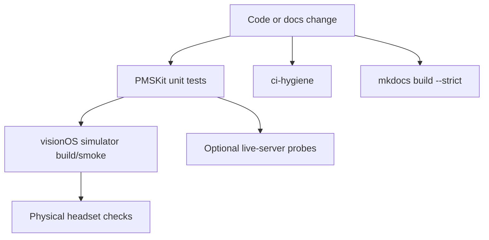

# Testing strategy

Labstream uses layered validation. Fast, hermetic tests protect the codebase by default; live-server and headset checks are opt-in because they depend on private servers, credentials, network conditions, and physical hardware.



## Required local checks

Run these before publishing code changes:

```sh
cd PMSKit && swift test
cd ..
scripts/ci-hygiene.sh
uv run --with-requirements requirements.txt mkdocs build --strict
```

## CI checks

The public CI surface is intentionally portable:

- MkDocs builds with `mkdocs build --strict` and deploys the static site.
- Repo hygiene scans for common secret, signing, and placeholder regressions.
- PMSKit's hermetic tests run without media-server credentials.

## Simulator checks

Use the worktree simulator for app build and launch smoke:

```sh
SIMID=$(scripts/worktree-sim.sh id)
scripts/xcodebuild-versioned.sh -project Labstream.xcodeproj -scheme Labstream \
  -destination "platform=visionOS Simulator,id=$SIMID" \
  -configuration Debug build CODE_SIGNING_ALLOWED=NO
```

The simulator is useful for compile coverage, sign-in UI, settings, browse flows, and many download/playback routing checks. It is not a full substitute for headset playback.

## Optional live-server checks

Live probes are opt-in and must stay secret-gated. They validate real Plex/Jellyfin/Emby wire behavior without committing tokens, URLs, item IDs, media titles, or logs. Keep their env files gitignored and review generated output before sharing.

## Physical-device checks

Use a real headset for behavior the simulator cannot prove reliably:

- AVPlayer media-plane rendering;
- immersive/Cinema presentation;
- background and off-head downloads;
- audio route/interruption behavior;
- Spotlight, Shortcuts, and App Intents end-to-end.

When a headset-only bug is reproduced, collect evidence with `scripts/headset-evidence.sh` before trying ad hoc log collection.
