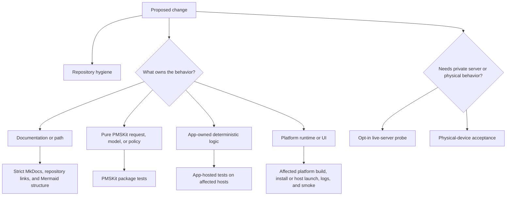

# Testing strategy

Labstream uses layered validation. Fast, hermetic tests protect the codebase by default; live-server and physical-device checks are opt-in because they depend on private servers, credentials, network conditions, and hardware.



## Required local checks

Run the canonical [core validation commands](DEVELOPMENT.md#core-validation-commands) before
publishing code changes.

Production changes should also run focused tests from the owning layer. Pure request/model/policy
coverage belongs in `PMSKit/Tests/PMSKitTests`. App-owned deterministic coverage lives in
`LabstreamTests/`; the same sources are hosted by `LabstreamTests` on an iOS simulator and
`LabstreamMacTests` on macOS. Run the affected host, or both hosts for shared app infrastructure,
using the exact test-plan commands in Development setup.

The app suites are host-app unit tests. They do not replace the canonical
[install/launch/log/screenshot smoke](DEVELOPMENT.md#install-and-observe-a-simulator-smoke),
interactive UI checks, live-server probes, or physical-device acceptance.

## CI checks

Woodpecker provides the repository's default public, portable CI surface:

- `.woodpecker/docs.yml` builds MkDocs strictly and deploys the static site on relevant pushes to
  `main` (or a manual run).
- `.woodpecker/docs-pr.yml` performs the same strict build and Mermaid structural check for pull
  requests without receiving a deployment key or running a deploy command.
- `.woodpecker/hygiene.yml` runs `scripts/ci-hygiene.sh`, including its Python tooling tests, on
  pushes, pull requests, and manual runs.
- `.woodpecker/pmskit.yml` runs PMSKit's hermetic Linux suite without credentials. XCTest and
  Swift Testing are separate invocations because their combined runner deadlocks under
  swift-corelibs-foundation; see that pipeline for the exact flags.

There is currently no enrolled macOS CI runner for Xcode app builds, app-hosted tests, simulator
smoke, or host-Mac smoke, so those remain local validation gates and must not be inferred from
portable CI. A separate [native macOS CI lane](MACOS-CI.md) is prepared for unsigned visionOS and
iOS/iPadOS builds. It remains manual/main-only and cannot execute until the explicitly labelled
physical runner is enrolled; fork pull requests are permanently outside that local-backend trust
boundary.

## Simulator checks

Use platform-specific worktree simulators and the exact-product procedures in Development setup:

- Before the first visionOS build or linked visionOS worktree, [bootstrap the first visionOS simulator](DEVELOPMENT.md#bootstrap-the-first-visionos-simulator), then [build the `Labstream` scheme](DEVELOPMENT.md#build-for-the-visionos-simulator).
- iPhone/iPad-only work needs no visionOS bootstrap: [build the universal `LabstreamMobile` scheme](DEVELOPMENT.md#build-for-an-iphone-or-ipad-simulator) with `PLATFORM=iphone` or `PLATFORM=ipad`.
- Both paths: complete the [observable smoke and shutdown](DEVELOPMENT.md#install-and-observe-a-simulator-smoke). Linked-worktree simulators must also follow the [closeout cleanup](DEVELOPMENT.md#linked-worktree-simulator-cleanup) when the worktree is removed.

Simulator builds are useful for compile coverage, sign-in UI, settings, browse flows, compact/regular
mobile shell regressions, and many download/playback routing checks. They are not a full substitute
for headset playback or physical iPhone/iPad media-background behavior, cellular-transfer policy,
PiP/AirPlay handoff, or system search/Shortcuts invocation.

## macOS development-preview checks

macOS has no simulator lane. The native `LabstreamMac` target runs on the host under a
per-worktree development identity. For Mac-specific or widely shared app changes, run the current
repeatable sweep:

```sh
scripts/validate-macos-228.sh
```

The script retains its issue-era filename, and combines static identity checks, a Mac host build,
shared-platform compile coverage, focused diagnostics tests, and a bounded launch smoke through
`scripts/smoke-macos-host.sh`. It does not prove real backend auth, subjective UI behavior,
media-key ownership, live playback, or background-download durability. See
[macOS development preview](MACOS.md) for host identity and cleanup rules.

## Optional live-server checks

Live probes are opt-in and must stay secret-gated. They validate real Plex/Jellyfin/Emby wire behavior without committing tokens, URLs, item IDs, media titles, or logs. Keep their env files gitignored and review generated output before sharing.

## Physical-device checks

Use real hardware for behavior the simulator cannot prove reliably. Follow the canonical
[Apple Vision Pro install](DEVELOPMENT.md#physical-apple-vision-pro-install) or
[iPhone/iPad install](DEVELOPMENT.md#physical-iphone-or-ipad-install) procedure first. Use Apple
Vision Pro for visionOS media-plane and immersive/Cinema checks; use physical iPhone/iPad hardware
for mobile background playback, PiP/AirPlay, cellular-transfer policy, Control Center/lock-screen
behavior, and App Intents/Spotlight invocation.

- AVPlayer media-plane rendering, especially on Apple Vision Pro;
- immersive/Cinema presentation on visionOS;
- background, locked, off-head, and cellular download scheduling;
- audio route/interruption behavior;
- Spotlight, Shortcuts, and App Intents end-to-end.

For the Mac development preview, use a real signed-in host session for keyboard/fullscreen
behavior, menu commands, system media keys, live playback, and download reconciliation. Keep that
evidence labeled as preview validation rather than released-platform support.

When a headset-only bug is reproduced, collect a bounded bundle with
`scripts/headset-evidence.sh` before trying ad hoc log collection, then triage it first with
`scripts/diagnostics-summarize.py <bundle> --auto-baseline`. Read `analysis/triage.md` and
`analysis/summary.json` before raw artifacts; open only a named, bounded source window when those
summaries leave a specific causal question. For later pulls, review the baseline delta reported in
those summaries and `analysis/novel-events.jsonl` instead of re-reading whole diagnostic directories
or broad unified logs.
