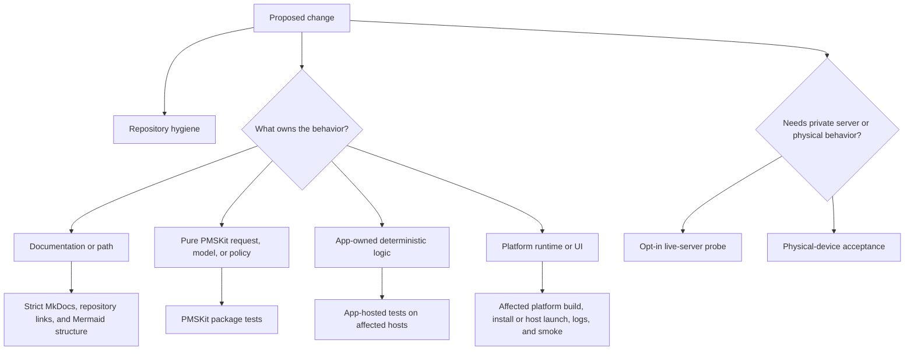

# Testing strategy

Labstream uses layered validation. Fast, hermetic tests protect the codebase by default; live-server and physical-device checks are opt-in because they depend on private servers, credentials, network conditions, and hardware.



## Required local checks

Run the canonical [core validation commands](DEVELOPMENT.md#core-validation-commands) before
publishing code changes.

Production changes should also run focused tests from the owning layer. Pure request/model/policy
coverage belongs in `PMSKit/Tests/PMSKitTests`. App-owned deterministic coverage lives in
`LabstreamTests/`; the same sources are hosted by `LabstreamTests` on an iOS simulator,
`LabstreamMacTests` on macOS, and `LabstreamTVTests` on tvOS. Run the affected host(s), or all
three for shared app infrastructure, using the exact test-plan commands in Development setup.

The app suites are host-app unit tests. They do not replace the canonical
[install/launch/log/screenshot smoke](DEVELOPMENT.md#install-and-observe-a-simulator-smoke),
interactive UI checks, live-server probes, or physical-device acceptance.

## Native Apple matrix driver

`scripts/native-test-matrix.py` is the checked source of truth for native smoke,
affected-platform, and full planning. Planning is side-effect free and is always the default:

```sh
# Compile/package smoke plan for all four app schemes plus hermetic PMSKit tests.
scripts/native-test-matrix.py smoke

# Plan from committed changes relative to main, or include local changes as well.
scripts/native-test-matrix.py affected --base main
scripts/native-test-matrix.py affected --base main --include-working-tree

# Plan one known path without consulting Git (useful in tooling and review automation).
scripts/native-test-matrix.py affected \
  --changed-file Labstream/Platforms/tvOS/App/LabstreamTV.swift

# Full correctness, hosted, and exhaustive-TV plan. Missing simulator IDs and the current
# visionOS-hosted gap are reported as BLOCKED/PLANNED rather than silently omitted.
scripts/native-test-matrix.py full
```

The driver reads `scripts/native-test-matrix.json`. The current source topology is explicit:
`Labstream/Shared/` selects all four app builds and every available hosted/UI suite;
`Labstream/Capabilities/Downloads/` selects visionOS, mobile, and Mac but not tvOS; and each
`Labstream/Platforms/<platform>/` root selects only its owning product lanes. A conservative
fallback still selects all app lanes for an unclassified path under `Labstream/`. Update the
manifest and its topology tests in the same change whenever target membership or an ownership
root changes.

Execution is deliberately lane-at-a-time. The driver never provisions or boots a simulator, and
`--run` requires an exact `--lane`. A simulator-hosted lane additionally requires the ID recorded
for this worktree by `worktree-sim.sh` (`.simid-iphone` or `.simid-tvos`) and
`--allow-simulator`, which is an assertion that the caller has acquired the repository's
one-simulator lease. The driver rejects an arbitrary simulator ID even when that simulator is
Booted. It also fails unless the owned simulator is already Booted **and every other simulator is
Shutdown**, so `xcodebuild` cannot silently boot an unleased device or run alongside another lane:

```sh
SIMID=$(scripts/worktree-sim.sh --platform tvos id)
xcrun simctl boot "$SIMID"
scripts/native-test-matrix.py affected \
  --changed-file Labstream/Platforms/tvOS/App/LabstreamTV.swift \
  --tvos-sim-id "$SIMID" --run --lane tvos-hosted --allow-simulator
xcrun simctl shutdown "$SIMID"
```

`pmskit-correctness` explicitly skips `Live*ProbeTests`; app-hosted lanes skip the Debug Plex
browse probe. Credentialless probe returns are readiness signals, not hermetic correctness
passes. Live probes remain separate opt-in commands. Timing benchmarks must likewise use a future
optimized benchmark target/lane and must not be added to smoke, affected, or ordinary hosted
correctness suites.

### PerformanceAudit comparison gate

Release-parity `PerformanceAudit` runs use the manifest/raw/summary contract documented in
the [scripts catalog](SCRIPTS.md#paired-performance-comparison). A comparison regenerates
every strict summary from its exact checksummed raw artifact, uses the closed phase/backend
correctness fields, freezes the minimum detectable effect from control-only evidence, and compares
seeded pairs through `scripts/perf-compare.py`. Warmup failures, missing/foreign spans, changed work
counts, reused run IDs, privacy-unsafe fields, invalid schedules, thermal/battery mismatch, storage
drift, or excessive pair gaps fail closed. Static inspection and unpaired timings are not
performance proof. Frozen-before-candidate timing remains operator-attested until the manifest
schema itself carries the frozen checksum.

Ordinary launch and Home/catalog/Search/artwork **latency** comparisons use a control-only
calibration freeze followed by separately collected seeded control/candidate pairs. A launch run
selects one closed attribution profile (`runtime.composition`, `runtime.download_manager`,
`runtime.download_store`, `runtime.download_transport_construct`, or
`runtime.download_transport_submission`) before capture. Browse artwork is admitted only for the
scoped `library_first_poster` span: one unique loaded AX image, one selected successful span, and at
least one successful fixture image response. That milestone does not claim that a viewport or every
poster loaded, nor does it establish a cache state.

Mac **idle** thresholds use a different two-run protocol. First complete one 1+5 paired pilot with
120-second arms, then run `perf-idle-compare.py freeze` on that result. The freeze derives thresholds
from the pilot's five measured control arms and binds their runner, manifests, control commit, and
product checksum. Record the printed threshold checksum before capturing a fresh, non-overlapping
1+5 paired verdict result with the same control product; only then run the idle comparison. Reusing
pilot evidence or comparison/order identities, or changing the control commit/product, fails closed.
The latency comparator's frozen MDE and pair-gap threshold are not idle thresholds: idle has
duration-normalized CPU/wakeup MDEs, and its start-gap tolerance must exceed the 120-second capture
window.

These paragraphs describe supported tooling and admission contracts, not completed measurements.
A planned, paused, or capture-only run remains `insufficient_data` until its required calibration,
fresh pairs, comparator output, and correctness/covariate gates all complete.

### Shared data-plane contracts

Phase 2 data-plane changes have deterministic contracts at their owning layer: opaque browse
authority replacement and repository fencing; off-main Plex/Jellyfin/Emby decode witnesses;
bounded fail-fast/partial fan-out; catalog force/failure/cancellation behavior; metadata
fresh/stale/provenance/action admission and watched-patch ordering; progressive Home snapshots and
failed-key-only retry; page-flight waiter cancellation; incremental movie-version projection;
duplicate-preserving long-playlist paging; `DecodedImage` color/orientation/crop bridges; and
artwork joining, priority, downsampling, privacy, cache cost, and clear epochs.

These hosted/package checks are not all-target or live-backend acceptance. Shared source still
requires the affected native matrix builds and isolated host/simulator smokes, and live Plex,
Jellyfin, and Emby request behavior remains an opt-in credentialed gate where a hermetic fixture
cannot establish server truth. Emby Home poster/rail corrections needing physical-device
confirmation should be verified on a physical iPhone signed into Emby: check Recently Added TV
Shows portrait art, a movie rail, and the episode Thumb/Backdrop fallback before closing the
tracking issue.

### visionOS hosted-test migration

There is no visionOS-hosted test target at this checkpoint. The matrix therefore includes a
non-executable `visionos-hosted` lane with a visible `PLANNED` result instead of implying coverage.
Use this migration sequence:

1. Move request/model/wire-format and platform-independent playback decisions into PMSKit with
   hermetic package tests. Keep app-owned lifecycle, presentation ownership, and Cinema handoff
   policy in the app layer.
2. Complete the platform source split so a vision test target can host only shared app-core plus
   narrow vision integration seams, without compiling mobile, TV, or Mac shell code by accident.
3. Add `LabstreamVisionTests`, a checked `.xctestplan`, and a concrete visionOS-simulator command
   to the existing `visionos-hosted` manifest lane. Start with window/Cinema handoff, scoped Now
   Playing, SharePlay attachment, and vision-only capability composition.
4. Keep physical Apple Vision Pro acceptance for media-plane rendering, spatial placement, and
   long Cinema transitions. Hosted tests and the simulator cannot promote those gates.

Do not create duplicate platform copies of pure policy merely to populate a hosted target. The
strategy is a small vision integration suite over shared tested policy, not a second PMSKit suite.

## Shared app-test support

`LabstreamTests/TestSupport.swift` owns the common temporary directory, locked box, continuation
gate, manual clock, and `TestURLProtocolStub`. The stub gives every session a uniquely routed
handler rather than replacing process-global state, so parallel tests remain isolated. New
deterministic app tests should use these helpers instead of adding file-local copies. Existing
local helpers can migrate when their own test files are touched; avoid a broad mechanical rewrite
that obscures safety-test changes.

## CI checks

Woodpecker provides the repository's default public, portable CI surface:

- `.woodpecker/docs.yml` builds MkDocs strictly and deploys the static site on relevant pushes to
  `main` (or a manual run).
- `.woodpecker/docs-pr.yml` performs the same strict build and Mermaid structural check for pull
  requests without receiving a deployment key or running a deploy command.
- `.woodpecker/hygiene.yml` runs `scripts/ci-hygiene.sh`, including its Python tooling tests, on
  pushes, pull requests, and manual runs.
- `.woodpecker/pmskit.yml` runs PMSKit's hermetic Linux suite without credentials. XCTest and
  Swift Testing are separate invocations because their combined runner deadlocks under
  swift-corelibs-foundation; see that pipeline for the exact flags.

There is currently no enrolled macOS CI runner for Xcode app builds, app-hosted tests, simulator
smoke, or host-Mac smoke, so those remain local validation gates and must not be inferred from
portable CI. A separate [native macOS CI lane](MACOS-CI.md) is prepared for unsigned visionOS and
iOS/iPadOS builds. It remains manual/main-only and cannot execute until the explicitly labelled
physical runner is enrolled; fork pull requests are permanently outside that local-backend trust
boundary.

## Simulator checks

Use platform-specific worktree simulators and the exact-product procedures in Development setup:

- Before the first visionOS build or linked visionOS worktree, [bootstrap the first visionOS simulator](DEVELOPMENT.md#bootstrap-the-first-visionos-simulator), then [build the `Labstream` scheme](DEVELOPMENT.md#build-for-the-visionos-simulator).
- iPhone/iPad-only work needs no visionOS bootstrap: [build the universal `LabstreamMobile` scheme](DEVELOPMENT.md#build-for-an-iphone-or-ipad-simulator) with `PLATFORM=iphone` or `PLATFORM=ipad`.
- tvOS work uses a fresh worktree-owned simulator rather than the visionOS golden clone: [build the streaming-only `LabstreamTV` scheme](DEVELOPMENT.md#build-for-an-apple-tv-simulator) and keep the download/offline absence gates enabled.
- Every path must complete the [observable smoke and shutdown](DEVELOPMENT.md#install-and-observe-a-simulator-smoke). Linked-worktree simulators must also follow the [closeout cleanup](DEVELOPMENT.md#linked-worktree-simulator-cleanup) when the worktree is removed.

Simulator builds are useful for compile coverage, sign-in UI, settings, browse flows, compact/regular
mobile shell regressions, TV focus/remote fixtures, and many download/playback routing checks. They
are not a full substitute for headset playback, physical iPhone/iPad media-background behavior,
cellular-transfer policy, PiP/AirPlay handoff, physical Apple TV Siri Remote/HDR/audio/HDMI and
long-play behavior, or system search/Shortcuts invocation.

### tvOS UI and evidence tiers

The affected-platform tier selects only the small deterministic TV UI smoke plan: launch plus the
fixture-backed Home-to-detail remote journey. Exhaustive focus, keyboard, remote-scrub, auto-hide,
and player-menu sweeps belong to the full/manual TV lane.

The DEBUG-only `UIWindow.sendEvent` evidence swizzle is never installed by default. Only launches
with `--tv-input-evidence` enable it; the exhaustive player UI fixture opts in explicitly. Ordinary
Debug launches, unit tests, and the small UI smoke plan therefore exercise the unswizzled event
path. Release builds still compile the recorder out entirely.

### Named agent evidence runners

The native matrix is the selection/execution authority; the named runners are the evidence-bundle
boundary for repeatable agent scenarios:

```sh
scripts/agent-mobile-run.sh iphone fixture-detail-semantic --allow-simulator
scripts/agent-mobile-run.sh ipad fixture-detail-semantic --allow-simulator
scripts/agent-tvos-run.sh fixture-home-semantic --allow-simulator
scripts/agent-tvos-run.sh fixture-player-basic --allow-simulator
scripts/agent-macos-run.sh fixture-detail
scripts/agent-sim-run.sh launch-fixture-home-passive
```

Simulator runners refuse a foreign booted device and require an explicit lease assertion where
applicable. Mobile and TV semantic scenarios retain XCTest attachments and result bundles in
addition to video, screenshots, logs, and `run.json`. macOS uses semantic Accessibility against an
isolated development identity. visionOS remains passive/probe-first because Xcode 27 Device
Interaction does not support its simulator; gaze, pinch-drag, immersive, and hardware-only checks
remain human/headset gates. Real backend credentials supplement these fixture loops but are never a
precondition for platform-loop closure.

## macOS development-preview checks

macOS has no simulator lane. The native `LabstreamMac` target runs on the host under a
per-worktree development identity. For Mac-specific or widely shared app changes, run the current
repeatable sweep:

```sh
scripts/validate-macos-228.sh
```

The script retains its issue-era filename, and combines static identity checks, a Mac host build,
shared-platform compile coverage, focused diagnostics tests, and a bounded launch smoke through
`scripts/smoke-macos-host.sh`. It does not prove real backend auth, subjective UI behavior,
media-key ownership, live playback, or background-download durability. See
[macOS development preview](MACOS.md) for host identity and cleanup rules.

## Optional live-server checks

Live probes are opt-in and must stay secret-gated. They validate real Plex/Jellyfin/Emby wire behavior without committing tokens, URLs, item IDs, media titles, or logs. Keep their env files gitignored and review generated output before sharing.

## Physical-device checks

Use real hardware for behavior the simulator cannot prove reliably. Follow the canonical
[Apple Vision Pro install](DEVELOPMENT.md#physical-apple-vision-pro-install) or
[iPhone/iPad install](DEVELOPMENT.md#physical-iphone-or-ipad-install) procedure first. Use Apple
Vision Pro for visionOS media-plane and immersive/Cinema checks; use physical iPhone/iPad hardware
for mobile background playback, PiP/AirPlay, cellular-transfer policy, Control Center/lock-screen
behavior, and App Intents/Spotlight invocation.

- AVPlayer media-plane rendering, especially on Apple Vision Pro;
- immersive/Cinema presentation on visionOS;
- background, locked, off-head, and cellular download scheduling;
- audio route/interruption behavior;
- Spotlight, Shortcuts, and App Intents end-to-end.

For the Mac development preview, use a real signed-in host session for keyboard/fullscreen
behavior, menu commands, system media keys, live playback, and download reconciliation. Keep that
evidence labeled as preview validation rather than released-platform support.

Semantic AX performance captures have a narrower admission boundary: keep the interactive Mac
session unlocked and available to the foreground, grant Accessibility trust to the invoking
process, and allow the exact audit app PID to become active. The driver does not use coordinates,
but it still cannot produce admissible Home, catalog, Search, or artwork evidence from a locked or
background-only login session. Missing trust, failed activation, ambiguous selectors, or a lost PID
fails the arm rather than becoming a timing sample.

When a headset-only bug is reproduced, collect a bounded bundle with
`scripts/headset-evidence.sh` before trying ad hoc log collection, then triage it first with
`scripts/diagnostics-summarize.py <bundle> --auto-baseline`. Read `analysis/triage.md` and
`analysis/summary.json` before raw artifacts; open only a named, bounded source window when those
summaries leave a specific causal question. For later pulls, review the baseline delta reported in
those summaries and `analysis/novel-events.jsonl` instead of re-reading whole diagnostic directories
or broad unified logs.
