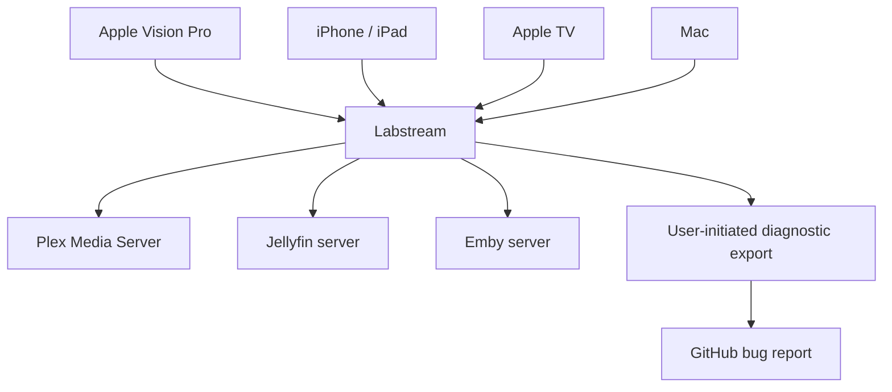

# Labstream docs

Labstream is a native Apple-platform media client for Plex, Jellyfin, and Emby. Its coordinated
pre-release App Store set includes Apple Vision Pro, one universal iPhone/iPad target, a
streaming-only Apple TV target, and a native Mac target. Labstream is distributed publicly as
source. A retired personal-identity visionOS build exists in invitation-only internal TestFlight,
and the neutral four-platform App Store record now has processed 1.6.1 (build 1) builds in
invitation-only internal TestFlight. Initial product metadata and privacy-safe screenshots are
staged, but review access, hardware acceptance, storefront scope, and App Review remain open.
There is no public App Store release. Labstream is designed
around privacy: the app has no
developer-operated backend, talks to the media services/server you choose, and does not
automatically send diagnostics or analytics to the developer.

## Start here

- **Users:** [Support & troubleshooting](support.md), [Report a bug](REPORTING-BUGS.md), [Privacy policy](privacy.md), and [Release and App Store status](RELEASES.md).
- **Contributors:** [Development setup](DEVELOPMENT.md), [Testing strategy](TESTING-STRATEGY.md), [manual validation checklist](https://github.com/jlipworth/Labstream/blob/main/TESTING-CHECKLIST.md), [iOS and iPadOS target](MOBILE-IOS.md), [tvOS target](TVOS.md), [macOS target](MACOS.md), and [Code map](CODE-MAP.md).
- **Architecture readers:** [Overview](ARCHITECTURE.md), [Backends](BACKENDS.md), [Playback](PLAYBACK-ARCHITECTURE.md), and [Downloads & offline](DOWNLOADS-OFFLINE.md).

## What the site is for

These pages describe the current source tree: how to build it, how to report problems safely, and how the major subsystems fit together. Repository-internal material stays outside the published navigation in explicit lanes: active plans under `docs/plans/`, unresolved investigations under `docs/research/`, immutable observations under `docs/evidence/`, and completed or superseded context under `docs/archive/`. The repository-root manual checklist remains a deliberate operational exception.

## Repository

Source lives at [github.com/jlipworth/Labstream](https://github.com/jlipworth/Labstream).
