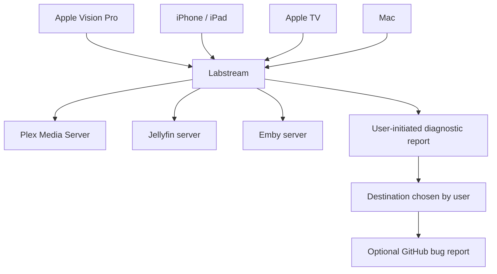

# Labstream

Labstream is a native Apple-platform media client for a Plex Media Server, Jellyfin server, or
Emby server that you administer or are authorized to access. It connects to the server you choose;
it does not provide, host, sell, or bundle media.

The repository contains four coordinated pre-release targets: Apple Vision Pro, one universal
iPhone/iPad target, a streaming-only Apple TV target, and a native Mac target. Labstream is
available as public source for local builds. The repository records invitation-only internal
TestFlight binaries, but there is no public App Store release. The
[release and App Store status](RELEASES.md) page is the single source of truth for the current
source version, processed binaries, platform gates, and submission readiness.

Labstream has no developer-operated backend and does not automatically send analytics or
diagnostics to the developer. A diagnostic report leaves the device only after you explicitly copy,
export, share, or open a bug report.

## Choose a path

### Users

- [Support and troubleshooting](support.md) — requirements, sign-in, playback, and diagnostics.
- [Report a bug](REPORTING-BUGS.md) — reproducible steps and the redacted report workflow.
- [Privacy policy](privacy.md) — local storage, server communication, and user-initiated reports.
- [Release and App Store status](RELEASES.md) — current source version, processed builds, and open
  acceptance gates.

### Contributors

- [Contributing](CONTRIBUTING.md) — workflow, architecture boundaries, documentation lanes, and
  privacy rules.
- [Development setup](DEVELOPMENT.md) — platform builds, exact-product smoke checks, and cleanup.
- [Testing strategy](TESTING-STRATEGY.md) — native matrix, hosted tests, evidence tiers, and
  physical-device gates.
- [Agent playback troubleshooting](AGENT-PLAYBACK-TROUBLESHOOTING.md) — bounded playback fixtures,
  admitted live scenarios, and evidence interpretation.
- [Manual validation checklist](https://github.com/jlipworth/Labstream/blob/main/TESTING-CHECKLIST.md)
  — the repository's current cross-platform acceptance matrix.

### Platform and architecture readers

- [iOS and iPadOS target](MOBILE-IOS.md), [tvOS target](TVOS.md), and [macOS target](MACOS.md).
- [Architecture overview](ARCHITECTURE.md), [code map](CODE-MAP.md), and [backend model](BACKENDS.md).
- [Playback](PLAYBACK-ARCHITECTURE.md), [downloads and offline](DOWNLOADS-OFFLINE.md),
  [music](MUSIC-DESIGN.md), [persistence](PERSISTENCE.md), and [system integration](SYSTEM-INTEGRATION.md).
- [Diagnostics and privacy](DIAGNOSTICS-PRIVACY.md) and [App Store screenshot automation](APP-STORE-SCREENSHOTS.md).

### Project policies

- [Security policy](https://github.com/jlipworth/Labstream/blob/main/SECURITY.md) — private
  vulnerability reporting.
- [Code of conduct](https://github.com/jlipworth/Labstream/blob/main/CODE_OF_CONDUCT.md).
- [GPLv3 App Store additional permission](app-store-exception.md).

## What this site contains

These pages describe the current source tree: how to build it, how to report problems safely, and
how the major subsystems fit together. Repository-internal material stays outside the published
navigation in explicit lanes: active plans under `docs/plans/`, unresolved investigations under
`docs/research/`, immutable observations under `docs/evidence/`, and completed or superseded
context under `docs/archive/`. The repository-root manual checklist remains a deliberate
operational exception and is linked above from GitHub.

## Repository

Source lives at [github.com/jlipworth/Labstream](https://github.com/jlipworth/Labstream).
