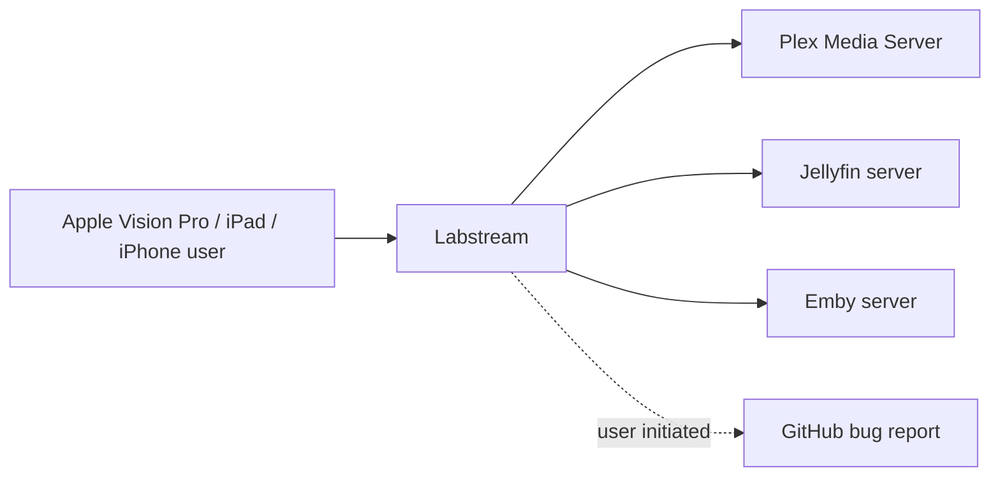

# Labstream docs

Labstream is a native Apple-platform media client for Plex, Jellyfin, and Emby. The primary shipping path remains Apple Vision Pro, and the repo now also contains a native iPhone/iPad target. It is distributed as source for local builds and is designed around privacy: the app talks to the media server you choose and does not send diagnostics or analytics to the developer.

## Start here

- **Users:** [Support & troubleshooting](support.md), [Report a bug](REPORTING-BUGS.md), and [Privacy policy](privacy.md).
- **Contributors:** [Development setup](DEVELOPMENT.md), [Testing strategy](TESTING-STRATEGY.md), [iOS and iPadOS target](MOBILE-IOS.md), and [Code map](CODE-MAP.md).
- **Architecture readers:** [Overview](ARCHITECTURE.md), [Backends](BACKENDS.md), [Playback](PLAYBACK-ARCHITECTURE.md), and [Downloads & offline](DOWNLOADS-OFFLINE.md).

## What the site is for

These pages describe the app as it exists for its first public source release: how to build it, how to report problems safely, and how the major subsystems fit together. Historical research, implementation plans, and superseded design notes are kept out of the published navigation so the site reads as product documentation rather than a project diary.

## Repository

Source lives at [github.com/jlipworth/Labstream](https://github.com/jlipworth/Labstream).
