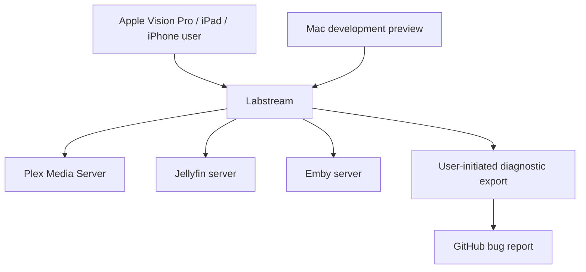

# Labstream docs

Labstream is a native Apple-platform media client for Plex, Jellyfin, and Emby. The primary
shipping path remains Apple Vision Pro, with a native universal iPhone/iPad target. The repository
also contains a native Mac target as a local-build development preview, not a released or supported
App Store product. Labstream is distributed as source for local builds and is designed around
privacy: the app has no developer-operated backend, talks to the media services/server you choose,
and does not automatically send diagnostics or analytics to the developer.

## Start here

- **Users:** [Support & troubleshooting](support.md), [Report a bug](REPORTING-BUGS.md), and [Privacy policy](privacy.md).
- **Contributors:** [Development setup](DEVELOPMENT.md), [Testing strategy](TESTING-STRATEGY.md), [manual validation checklist](https://github.com/jlipworth/Labstream/blob/main/TESTING-CHECKLIST.md), [iOS and iPadOS target](MOBILE-IOS.md), [macOS development preview](MACOS.md), and [Code map](CODE-MAP.md).
- **Architecture readers:** [Overview](ARCHITECTURE.md), [Backends](BACKENDS.md), [Playback](PLAYBACK-ARCHITECTURE.md), and [Downloads & offline](DOWNLOADS-OFFLINE.md).

## What the site is for

These pages describe the current source tree: how to build it, how to report problems safely, and how the major subsystems fit together. Repository-internal material stays outside the published navigation in explicit lanes: active plans under `docs/plans/`, unresolved investigations under `docs/research/`, immutable observations under `docs/evidence/`, and completed or superseded context under `docs/archive/`. The repository-root manual checklist remains a deliberate operational exception.

## Repository

Source lives at [github.com/jlipworth/Labstream](https://github.com/jlipworth/Labstream).
