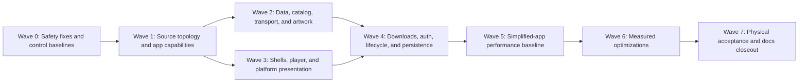

# Cross-platform simplification and performance program

Status: **Waves 0–4 implemented and validated; the independent Wave 6 simplification pass is complete; Wave 5 has resolved the admissible Mac composition regression, while browse foreground admission, long idle thresholds/capture, compile and artwork evidence, and physical acceptance remain open**

Audit baseline: `b3045bc0` (`Record tvOS merge checkpoint`) on
`codex/audit-simplification-performance`

Scope: visionOS, iOS/iPadOS, tvOS, native macOS, the shared app layer, PMSKit,
tests, performance tooling, and physical-device acceptance.

This plan owns the post-July-21 simplification and performance program. The
[July 10 remediation journal](2026-07-10-codebase-remediation.md) remains the
authority for already-landed correctness work and its still-open physical gates.
This plan must not reopen completed remediation slices or weaken download,
playback, auth, SharePlay, and platform invariants merely to reduce line count.

## Executive direction

The program has two ordered halves:

1. **Simplify ownership and execution paths without flattening platform UX.**
   Capture current contracts, remove provably dead paths, make unsupported
   capabilities absent, split platform presentation from shared policy, and
   consolidate duplicated network/data/state orchestration.
2. **Re-baseline and optimize the simplified app.** Measure launch, browse,
   artwork, playback, downloads, memory, energy, disk, network, rendering, and
   compile/test cost in an optimized profiling configuration. Optimize only
   demonstrated bottlenecks and compare every change against paired evidence.

A small pre-simplification measurement pass is still required. It is a control,
not permission to tune the current architecture before its ownership is clear.
The comparison chain has three immutable points, each recorded by exact commit
and artifact manifest: the original audited control, a post-safety/pre-structural
control using the final instrumentation, and the simplified-but-unoptimized
candidate. Optimization slices compare against the last applicable immutable
point; instrumentation changes require a new compatible control rather than a
hand-assembled comparison.

The target is not “fewest files” or “fewest `#if`s.” The target is:

- one clear owner for each state machine and side effect;
- shared policy below platform presentation forks;
- platform-only services absent from unsupported products;
- no duplicated polling, request fan-out, image decode, persistence, or metadata
  hydration where one scoped owner can serve all consumers;
- small, typed boundaries that preserve backend and platform differences; and
- performance claims backed by reproducible optimized-build and physical-device
  evidence.

## Audit snapshot

This section records the **pre-Wave 0 audited starting point**, not the current
post-Wave 1 tree. The audit was static and read-only. No builds, simulators, devices, live servers,
or runtime performance measurements were used, so all performance findings below
are hypotheses until the measurement phase proves them.

| Signal | Pre-Wave 0 baseline |
| --- | ---: |
| Production Swift | about 92,000 lines |
| App download implementation | 26,138 lines / 29 files |
| Shared player implementation | 14,923 lines / 29 files |
| Shared UI implementation | 13,860 lines / 34 files |
| PMSKit production | 27,748 lines / 219 files |
| App conditional compilation | 517 `#if` blocks + 67 `#elseif` branches |
| `CustomPlayerChrome.swift` | 3,320 lines / 120 conditional markers |
| `BackgroundDownloadSession.swift` | 7,243 lines |
| `DownloadStore.swift` | 5,739 lines |
| `PlaybackController.swift` | 5,684 lines |
| `DownloadManager.swift` | 5,522 lines |
| Recent high-churn surfaces | downloads, player chrome, library grid, Detail, SharePlay, Root |
| Existing runtime phases | 9 Debug-only browse/artwork/playback signposts |
| Existing committed runtime evidence | two small June Plex/visionOS-simulator baselines |

At that starting point, all four apps attached the same filesystem-synchronized `Labstream/`
source root. Platform ownership is therefore expressed almost entirely through
conditional compilation and no-op compatibility types. This is useful for truly
shared code, but it also causes tvOS to compile and instantiate unsupported
offline machinery and causes non-vision targets to carry inert Cinema, Reality
Theater, and SharePlay state.

## Program rules

1. **Contract capture precedes extraction.** Recent tvOS focus/remote work,
   Cinema handoff, downloads recovery, system media, and SharePlay are not moved
   until their current invariants have deterministic tests and device checklists.
2. **Mechanical movement and behavior change are separate commits.** Move a file,
   prove equivalence, then simplify it in a later slice.
3. **Share policy, not false platform sameness.** tvOS focus, Mac keyboard/window
   behavior, mobile PiP/orientation, and visionOS gaze/Cinema remain distinct.
4. **Make unsupported capabilities absent.** Do not construct a large real object
   and call it disabled because one registration flag is false.
5. **No native-resume-only download pivot.** The user has rejected a
   `URLSession` resume-data-only end state as too fragile. Retain an app-owned,
   deterministic checkpoint/recovery engine; simplify its unreachable and
   duplicated branches instead of deleting the recovery authority.
6. **ABR is evidence-gated, not sacred.** Client-driven playback ABR may be
   removed if measured benefit does not justify its reopen/restart/deadline
   complexity.
7. **No simulator-only performance conclusions.** Simulator runs are useful for
   deterministic comparisons; physical hardware closes launch, energy, thermal,
   HDR/audio, background, input, and system-surface claims.
8. **No giant cross-cutting PRs.** Each slice must be independently reviewable,
   reversible, and attributable in the paired performance data.
9. **Privacy remains load-bearing.** Never log or persist authenticated artwork
   keys, URLs, headers, media titles, server identities, tokens, or local paths.
10. **Performance wins do not excuse behavior drift.** A faster path that breaks
    offline integrity, focus, Cinema, PiP, SharePlay, playback progress, or
    backend ordering is a regression.
11. **Documentation ships with each durable change.** Every slice must review the
    current architecture, code-map, platform, testing, and operator docs that its
    changes could invalidate, and update affected current docs in the same slice.
    Wave 7 still performs the final whole-repository reconciliation and archives
    superseded plans/evidence; it is not the first time documentation is updated.

## Behaviors that must remain platform-specific

### visionOS

- one app-owned `PlaybackController` and `AVPlayer` across window/Cinema handoff;
- app-owned Custom Cinema with measured `visualBounds` placement;
- scoped `MPNowPlayingSession`, not the process-global mobile/Mac lease;
- exact participant-local SharePlay resolution and explicit consent before
  player attachment;
- ornament-based music presentation and proven gaze/hit-target behavior; and
- physical Vision Pro evidence for system surfaces, HDR/DV, Cinema, thermal, and
  device lifecycle.

### iOS/iPadOS

- native `.sidebarAdaptable` tab/navigation behavior, system sheets/lists/forms,
  `AVPictureInPictureController`, `AVRoutePickerView`, and MediaPlayer surfaces;
- justified iPhone landscape behavior and iPad pointer/multitasking behavior;
- background-download relaunch and real-device lock/background transitions; and
- separate compact/regular shell behavior rather than a phone-sized universal UI.

### tvOS

- five-tab TV shell with no Offline product surface;
- app-owned custom player and remote-native timeline, not default player chrome;
- hidden focus owner, guarded focus writes, focus sections, auto-hide timing, and
  TV-native pairing/search behavior;
- no general browser/pasteboard assumptions; and
- physical Siri Remote, search, HDR/audio/HDMI, long-play, and lifecycle gates.

### macOS

- native `NavigationSplitView`, desktop density, pointer/keyboard behavior,
  root-lifted full-window player, and focus-independent physical Escape route;
- process-wide music/video media ownership and native fullscreen/window behavior;
- staged-development credential isolation versus the canonical production
  Keychain identity; and
- host-app cleanup after validation.

### Backends and shared engine

- Plex `Generic` client profile plus explicit codec directives;
- backend-specific auth, URL, playback, subtitle, conversion, and cleanup rules;
- exact download-attempt ownership and cleanup durability;
- durable checkpoint, live OS-temp, and resumable-display bytes as distinct facts;
- source identity on all offline media and side assets;
- stop-before-restart and deferred prior-encoding cleanup ordering; and
- one terminal playback progress event with a non-regressing position.

## Decisions and open product questions

| Decision | Current direction | Needed by |
| --- | --- | --- |
| Download recovery | Keep app-owned deterministic checkpoint/recovery; native resume-data-only path rejected | Download decomposition |
| Client ABR | May be removed if paired measurements show little benefit | Playback typed restart work |
| Mac browse windows | **Resolved in Wave 1: one reusable main browse/player window plus singleton Settings.** Focused-scene multiwindow routing is intentionally out of scope | Mac shell extraction |
| visionOS Cinema | **Keep.** The shipping app-owned `CustomCinemaMode` remains a first-class visionOS capability; its ownership and implementation may be simplified, but the product surface and handoff invariants must remain | Every visionOS/player slice |
| Reality Theater prototype | **Removed in Wave 1.** Issue #12/#51 history and scene/chrome routing confirmed that the hidden `RealityTheater*` lab was independent from shipping `CustomCinemaMode`; useful historical context remains in Git/archive docs | visionOS source split |
| Offline Detail action | **Open.** Keep explicit “Play Offline” unless product direction says primary Play should prefer local media | Offline launch consolidation |
| Storage cap semantics | Recommendation: enforce durable bytes + known reservations; present side assets, held/resume data, and OS temp separately | Storage snapshot work |
| Legacy download schemas/tasks | **Remove fully.** Delete compatibility for legacy schemas and abandoned OS tasks; keep only the current schema and the app-owned checkpoint/recovery authority required by current downloads | Migration sunset |
| Physical matrix | Local discovery records this Apple-silicon Mac plus one paired iPhone, one paired iPad, and one accessible AVP (the mobile devices/headset were unavailable during discovery). The user has confirmed that no second AVP is available, so every two-headset/two-participant SharePlay cell is hardware-blocked rather than simulator-inferred. Physical Apple TV availability remains unconfirmed | Final acceptance |

## Safety findings to resolve before broad refactoring

These are correctness or bounded-execution findings discovered during the audit.
Each remains a static hypothesis until a focused reproduction/test confirms it.
Confirmed findings should be small slices before structural work because they can
invalidate performance data or make later extraction harder; disproven findings
must be retired rather than “fixed” speculatively.

A second independent code re-review on 2026-07-21 re-confirmed the cited
mechanism for `SAFE-01`, `SAFE-03` through `SAFE-08`, and `SAFE-10` at the
listed locations. `SAFE-09` was confirmed as a real cancellation/completion
ordering race, with the caveat that actor serialization already prevents a
double resume — the required fix is ordering determinism, not crash prevention.
At audit time `SAFE-02` remained verify-first: the session sets 5s/20s
`timeoutIntervalForRequest`, the built `URLRequest` never sets
`timeoutInterval` (so the 60s request default is in play), and observed
behavior with a hanging transport must decide whether any change is needed.
Focused reproductions/tests were therefore required before each fix; the Wave 0
journal below records the current disposition rather than treating the static
re-review as runtime proof.

| ID | Priority | Finding | Evidence | Required stroke |
| --- | --- | --- | --- | --- |
| `SAFE-01` | P0 | Cancelled system-entry readiness can spin on `MainActor` until its 12-second wall deadline because cancelled sleeps are suppressed | `Labstream/Shared/SystemIntegration/SystemEntryRouter.swift:151-166` | Propagate cancellation immediately; then replace polling with a readiness single-flight |
| `SAFE-02` | P0 verify | Recovery/proxy request deadlines may not produce the intended 5s/20s behavior; session configuration may already be sufficient | `PMSKit/Sources/PMSKit/PlexSessionConfiguration.swift:13-47`; `PlexRequest+URLRequest.swift:24-30` | First prove actual behavior with a hanging transport; change request preparation only if the configured deadline is not enforced |
| `SAFE-03` | P0 | Rotating one HLS upstream session can cancel unrelated healthy sibling requests | `PMSKit/Sources/PMSKit/MediaSession/UpstreamConnection.swift:15-45`; `MediaSessionProxy.swift:211-241` | Generation-tagged session swap; old work drains and stale failures cannot rotate the new session |
| `SAFE-04` | P0 | Closing during an itemless playback reopen can send terminal progress at zero | `Labstream/Shared/Player/PlaybackController.swift:5163-5189`; `Labstream/Shared/Player/TimelineReporter.swift:90-107` | Canonical position snapshot: live clock, held target, last trustworthy offset, saved offset |
| `SAFE-05` | P0 | MediaBrowser `Playing` is committed before the first request succeeds — the started flag flips when the request is built, not when it is accepted | `Labstream/Shared/Player/TimelineReporter.swift:189-225` | Commit only after accepted 2xx; retry `Playing` ahead of coalesced progress |
| `SAFE-06` | P0 | Offline side assets can survive a source/version change without consistent source fencing — `preserveCachedSideAssets` fences only `embyBIFRelativePath` by `mediaSourceID`; poster, Plex BIF, Jellyfin trick-play/tiles, chapter images, and subtitles carry forward unfenced | `PMSKit/Sources/PMSKit/Downloads/OfflineDownloadModels.swift:782-816`; `Labstream/Capabilities/Downloads/Core/DownloadStore.swift:2794-2799` | Source-owned side-asset bundle and attempt-scoped retirement |
| `SAFE-07` | P0 | SharePlay receive/send work is not fully fenced to the exact replacement session and outgoing status can reorder | `Labstream/Platforms/visionOS/SharePlay/WatchTogetherCoordinator.swift:388-450` | Session generation on receive/send; ordered outbound tail; stale revision rejection |
| `SAFE-08` | P0 | Non-vision remote seek/skip conversion lacks the validation already present on visionOS | `Labstream/Shared/Player/VideoNowPlayingCore.swift:95-112`; `Labstream/Platforms/visionOS/Player/VideoNowPlayingCoordinator.swift:185-194` | One pure validated remote-command policy feeding canonical controller intents |
| `SAFE-09` | P1 | Side-asset waiter cancellation can race successful completion | `Labstream/Shared/Player/SideAssetFetchCoordinator.swift:116-145,353-399` | Post-resume cancellation check and deterministic waiter/job index |
| `SAFE-10` | P1 | Background completion registry silently replaces a same-identifier handler | `Labstream/Capabilities/Downloads/Core/BackgroundDownloadCompletionRegistry.swift:17-64` | Encode exact cardinality and prove every supplied handler fires exactly once |

### Wave 0 implementation journal

The following work was committed at `40af93f3`. Wave 0's
deterministic package, hosted-test, all-target build, tooling, and serialized
simulator-smoke gates now pass. Physical-device acceptance remains a later explicit
gate and is not inferred from these results. A dev-identity macOS host launch remains
blocked by entitlement signing; the already-running production-identity app was not
disturbed.

| Item | Current result |
| --- | --- |
| Original package control | `b3045bc0`: 1,638 PMSKit tests / 212 suites passed |
| Original Mac-hosted control | Five retry-disabled full-plan runs all exposed scheduler-bound tests: search fan-out 4/5, persistence timeout 3/5, dirty retry 1/5, and malformed-startup release 1/5. Deterministic gates replaced the sleep/semaphore assumptions; no production browse or persistence defect was found |
| `SAFE-01` | Confirmed and fixed. The final scheduler-independent contract handshakes the first real sleep, cancels, awaits false, and proves exactly one sleep call; it passed 10 repetitions and under the full hosted plan. Readiness single-flight remains a later simplification |
| `SAFE-02` | Retired without a source change; a silent loopback proved the session's configured request timeout overrides the request object's 60-second default |
| `SAFE-03` | Confirmed and fixed with generation-tagged compare-and-swap rotation and draining old sessions |
| `SAFE-04` / `SAFE-05` | Canonical terminal-position and accepted-Playing authorities are integrated with focused deterministic contracts |
| `SAFE-06` | Exact attempt-plus-source ownership covers every optional side asset. Promotion and metadata admission reject delayed old-source callbacks, deterministic subtitle adoption is gone, ownerless bundles fail closed, and retirement protects the complete cross-row artifact union |
| `SAFE-07` | Replacement-session receive/send fencing, ordered outbound delivery, per-participant revisions, roster buffering, and a bounded terminal-leave fallback are integrated; two-participant behavior remains a physical gate |
| `SAFE-08` | One validated absolute/relative remote-command policy now feeds the app-owned controller while platform publishers remain separate |
| `SAFE-09` | Deterministic waiter indexing and cancellation-wins behavior passed a 500-iteration standalone race harness |
| `SAFE-10` | Finish-events atomically claims an exact ordered token batch before persistence awaits. Delayed old-cycle releases cannot sweep newer same-identifier handlers; duplicate releases remain idempotent and reentrant handlers wait for the next cycle |
| Adversarial review | Independent review found one completion-cycle P1, three side-asset provenance/retirement P1s, and three tooling P1s. All seven were fixed with focused regressions; no remaining reviewed P0/P1 was reported in the Wave 0 diff |
| Integrated package gate | 1,668 PMSKit tests / 219 suites passed in one non-parallel run |
| Integrated hosted gate | Five full `LabstreamMacTests` runs passed, each with 343 tests / 40 suites. The original scheduler-bound tests and the SAFE-01 cancellation test are now load-independent |
| Integrated build gate | Debug build lanes passed for visionOS, iOS/iPadOS, tvOS test-build, and macOS. Fresh isolated simulator builds also passed before the visionOS, iPhone, and tvOS install/launch checks |
| Serialized simulator smoke | Exact worktree simulators were used one at a time and shut down. Built/installed Mach-O UUIDs matched for visionOS, iPhone, and tvOS; launches and logs were crash-free. iPhone and tvOS produced visible login screenshots; visionOS produced an active process/network log and a shell screenshot, but the spatial app window was not visible in the captured forward display |
| macOS host smoke | The non-simulator test/build gates pass. Per-worktree dev-identity launch was attempted and failed at the expected entitlement-signing gate; an already-running production-identity Labstream process was left untouched and staged dev apps were cleaned up |
| Performance control | `PerformanceAudit` is Release-parity for all four app targets, defines only `PERFORMANCE_AUDIT`, enables the existing nine privacy-safe spans, and has a closed local manifest/binary contract. The guard now rejects Debug/unoptimized/sanitized compiler drift and constrains manifest metadata to opaque identifiers/enums while explicitly not claiming raw-payload sanitization |
| Native test control | A checked smoke/affected/full matrix driver now separates hermetic tests, builds, simulator-hosted lanes, UI evidence, planned visionOS hosting, live probes, and benchmarks. Simulator lanes require the exact current-worktree UDID to be the sole booted simulator |

## Simplification workstreams

### S1 — Source topology and capability composition

**Goal:** make shared code genuinely shared and make platform-only ownership
visible in the project structure.

1. Consume Wave 0's frozen clean-build, binary-size, and compile-time baseline for
   all four targets plus the hosted tests that exist at that checkpoint. Do not
   imply visionOS hosted-test coverage until the Wave 0 strategy lands.
2. Add filesystem-synchronized roots for `Shared`, `Capabilities/Downloads`,
   `Platforms/visionOS`, `Platforms/Mobile`, `Platforms/macOS`, and `Platforms/tvOS`
   (including tvOS debug support).
3. Move whole-platform entrypoints/adapters/fixtures mechanically. Do not change
   behavior in the move commits.
4. Introduce one app-lifetime `AppRuntime`/`AppComposition` that owns common
   services and bootstrap state. Keep each platform `@main` focused on its real
   scene/delegate/window topology.
5. Model downloads, Cinema, SharePlay, system integrations, and platform input as
   explicit capabilities. Prefer absence/optional ownership for unsupported
   products; allow tiny no-op adapters only for genuinely best-effort APIs.
6. Stop constructing `DownloadManager`, `DownloadStore`, migrations, recovery,
   and background sessions on tvOS.
7. Remove inert SharePlay/Cinema/Reality state from non-vision products.
8. Make process lifecycle observation one aggregate scene-activity model rather
   than three identical effect triggers. It must preserve foreground truth while
   the main window and immersive scenes overlap or replace one another.

**Success evidence**

- exactly one entrypoint per target without whole-file platform guards;
- TV launch performs no download directory, index, migration, recovery, or
  background-session work;
- visionOS window teardown still preserves auth/player state through Cinema;
- mobile/vision background downloads reattach; Mac Settings shares the same
  runtime; TV fixtures still launch only in explicit UI-test mode; and
- compile time and binary-size changes are measured, not assumed.

### S2 — Platform shells, navigation, and feature state

**Goal:** keep four native shells while sharing routes, destinations, and state
transitions.

1. Split the 1,106-line `RootView` into platform shell leaves.
2. Add a typed navigation coordinator owning tab/destination selection,
   online paths, the current offline return/focus rating-key state,
   push/pop/reset/search, system entry, and Cinema return actions. Adding a new
   Offline `NavigationPath` is not part of the extraction.
3. Add a reusable browse-stack boundary that owns the session revision,
   destination construction, environment injection, and push closure.
4. Preserve platform shells: TV focus tabs, Mac split view, mobile adaptive tabs,
   and vision ornament/overlay behavior.
5. Replace Mac process-wide command notifications with direct single-window
   actions or focused-scene values after the window-model decision.
6. Extract a tested compact/regular mobile Settings transition state machine.
7. Share one narrowly scoped backend-neutral library-catalog repository across
   surfaces that currently enumerate the same sections/views. Home hubs, Search
   aggregation, and Music keep their distinct endpoints, ordering, pivots, and
   partial-failure policies.
8. Consolidate repeated TV directional-entry focus logic behind a tested helper,
   preserving Home-versus-grid validity rules.
9. Split large feature views into explicit models without wholesale rewrites:
   `DetailModel`, `DownloadOptionsModel`, `SeasonPlanDraft`, and small Settings
   sections/action models.
10. Add per-surface metric snapshots shared by live content and skeletons;
    explicit TV/vision jump-picker versus iOS index-rail adapters; and platform
    auth-control adapters. Do not flatten couch-distance, gaze, touch, and desktop
    metrics into one universal scale.

**Success evidence**

- backend/session change clears online navigation only;
- Offline state remains cross-backend;
- Siri Remote Back, Mac Command-[, mobile tab/sheet resizing, system entries,
  Cinema return, and Now Playing navigation all retain exact behavior; and
- platform shells observe only the state they render.

### S3 — Player controller, chrome, and platform presentation

**Goal:** preserve one playback engine while replacing optional/Boolean state
soup and four-platform presentation entanglement with typed boundaries.

1. Capture deterministic contracts for start, first frame, seek, restart,
   cleanup, terminal progress, track changes, system pause, PiP/AirPlay,
   Cinema, SharePlay attachment, and tvOS focus/input.
2. Remove confirmed dead state first: retired buffering compatibility state,
   permanently disabled mismatch state, unused task identity, and provably
   unreachable tvOS play/timeline chrome branches.
3. Replace overlapping player initializers and nil-combination capabilities with
   typed `.offline`, `.plex`, and `.mediaBrowser` sessions.
4. Replace restart Boolean combinations with a typed restart intent. Keep reason-
   specific deadline authority; evaluate client ABR as a removable intent family
   after measurement.
5. Introduce one canonical playback-position snapshot and one typed progress
   transition cause.
6. Consolidate subtitle/audio choices into explicit `.native`, `.backend`,
   `.offline`, and `.off` mechanisms; parse an offline subtitle only when selected.
7. Split `CustomPlayerChrome` into shared interaction/state plus Vision, Mobile,
   TV, and Mac presentation/input leaves. Do not force their layouts together.
8. Extract a `CinemaPresentationCoordinator` only after current handoff contracts
   are pinned. Keep one player/audio path.
9. Preserve separate system-media publishers for scoped visionOS versus global
   iOS/macOS, but share pure metadata snapshots, context formatting, artwork, and
   validated command intents.
10. Introduce an explicit Mac player input router with the priority
    `menu -> exit fullscreen -> close player -> pass through`.

**Success evidence**

- controller/chrome files become reviewable ownership units rather than simply
  renamed fragments;
- all backend cleanup and restart ordering remains exact;
- TV remote/focus, mobile PiP/AirPlay/rotation, Mac physical Escape/fullscreen,
  and visionOS window/Cinema/Now Playing pass their platform matrices; and
- two-AVP SharePlay remains hardware-blocked, not simulator-proven, until run.

### S4 — Backend, transport, catalog, and metadata seams

**Goal:** consolidate shared request/data execution without erasing backend wire
differences.

1. Snapshot immutable authenticated session context on `MainActor`; run transport,
   JSON decode, and DTO mapping in a Sendable executor; publish final values only.
2. Reuse one ordered bounded fan-out primitive for A-Z probes, search libraries,
   SharePlay shortlist hydration, version labels, and similar control-plane work.
3. Add a session/auth-revision-scoped library-catalog repository used only for
   the shared section/view enumeration boundary. Surface loaders retain their
   own request and presentation policies.
4. Add a metadata repository with summary/detail hydration, in-flight coalescing,
   short stale-while-revalidate policy, watched-state patching, and provenance.
   Every value is fenced to exact auth/session/server/source revision; stale data
   may paint UI but must never authorize playback or downloads.
5. Replace heavyweight `fullItem` use with named surface profiles such as grid,
   search, Home, playlist, detail, and playback, with backend wire-contract tests
   before any field is removed.
6. Make MediaBrowser Home progressive: publish available rails immediately,
   preserve successful rails during a partial failure, and retry only failed rails.
7. Make movie-version collapsing incremental and page coalescing task-based rather
   than polling.
8. Page long playlists while preserving duplicates and server order.
9. Consolidate mirrored Jellyfin/Emby browse plumbing only around their proven
   shared request factory/core; retain auth/playback/download differences.
10. Remove verified transitional wrappers and pass-through facades only after all
    production and probe callers migrate.

**Success evidence**

- zero large JSON decode/map work on the main thread;
- bounded peak request concurrency with stable result order;
- one catalog load per session generation and one detail metadata read for
  open-to-immediate-Play when context remains valid;
- progressive Home degradation rather than a slowest-rail barrier; and
- live Plex/Jellyfin/Emby probes preserve wire shape and cleanup behavior.

### S5 — Artwork and image ownership

**Goal:** one authenticated, bounded fetch/decode pipeline instead of independent
per-view requests and incompatible image caches.

1. Create an actor-backed `ArtworkPipeline` with process-local authenticated
   request identity, in-flight coalescing, per-origin concurrency, priority, and
   cancellation.
2. Cache compressed responses where appropriate and decoded/downsampled images in
   a cost-limited cache. Never log or persist credential-bearing cache keys.
3. Downsample and eagerly decode with ImageIO off the main actor.
4. Serve poster views, video/music system artwork, `AVPlayerItem` metadata,
   offline row thumbnails, and suitable chapter/trick-play consumers from shared
   fetch/decode primitives.
5. Replace the Mac `UIImage == NSImage` compatibility lie with an explicit
   `PlatformImage`/decoded-image boundary.
6. Resolve pixel size from the actual display/environment rather than assuming
   2x everywhere.
7. Share or reduce loading shimmer animation rather than running one perpetual
   animation per placeholder.
8. Make “Clear image cache” clear all owned cache layers and failure state.

**Success evidence**

- one network request per unique in-flight authenticated key;
- backend/account revision never reuses stale artwork;
- cost-based eviction survives memory pressure;
- warm reverse-scroll cache hit target is established and ratcheted after the
  first baseline; and
- fast A-Z scroll, TV rails, AVP gaze, Mac Retina, Now Playing, and offline lists
  remain visually correct.

### S6 — Downloads and offline engine

**Goal:** reduce a 36K-line app/package subsystem while preserving deterministic,
app-owned recovery.

1. Fix source ownership for all side assets before deleting or moving engine
   code.
2. Make schema 4 and the current typed task markers the only supported durable
   formats. Unsupported schemas trigger a fail-closed destructive reset: keep the
   background session dormant, cancel and drain every old task, then quarantine or
   delete the old download root before writing an empty current envelope.
3. Delete old row migrations, ownerless adoption, v1/v2 task-marker parsing,
   URL-derived task identity, and closed-range legacy resume branches after tests
   prove the reset/sanitizer ordering. Retain current exact-attempt checkpoint,
   artifact-intent replay, held-body recovery, and current task reattachment; those
   are the app-owned recovery authority that protects against native resume
   fragility, not compatibility code.
4. Decompose by ownership, not arbitrary file length:
   - task/session delegate and reattachment;
   - checkpoint/range transfer;
   - validation/promotion;
   - store/persistence;
   - side assets;
   - server preparation/cleanup; and
   - presentation snapshots.
5. Make `DownloadWorkRegistry` track ownership without forcing BIF parsing,
   writes, promotions, and chapter/tile work onto `MainActor`.
6. Batch chapter/tile metadata persistence instead of one full durable index write
   per image.
7. Derive one immutable lightweight row-presentation snapshot per refresh and
   resolve full records only for play/actions.
8. Create one storage snapshot containing durable media, side assets, held/resume
   artifacts, live OS temp, and expected reservations; choose display versus cap
   enforcement fields explicitly.
9. Make season planning reuse server invariants, use bounded item probes, compute
   one draft, and commit new rows/retry markers in one Store transaction.
10. Use rename/replace for a byte-zero completed static body after exact ownership
   revalidation; append only when a genuine nonzero checkpoint exists.
11. Reject a provably short static body before expensive HEVC/AVPlayer validation.
12. Build one typed side-asset inventory/validation/repair path for posters,
    Plex BIF, Jellyfin trick-play, Emby BIF, subtitles, and chapters.
13. Retain/memory-map one BIF index and copy only selected frames.

**Success evidence**

- exact attempt/task/store/finalizer ownership remains intact;
- durable/live/resumable byte provenance remains honest;
- off-head, force-quit, lock, wake, route change, 401/416/503, ENOSPC,
  delete/pause-near-completion, and source A-to-B replacement pass on hardware;
- optional assets never gate media completion or cross source identity; and
- main-thread side-asset work, persistence write count, copied bytes, and queue
  snapshot cost show measured reductions.

### S7 — Auth, lifecycle, persistence, preferences, and diagnostics

**Goal:** separate three backend auth flows and process lifecycle from giant
coordinators while reducing repeated secure-storage and file I/O.

1. Split selected-backend restore from demand-driven inactive-backend hydration so
   noncritical work does not compete with time-to-browse.
2. Commit a usable Plex connection before nonessential profile metadata; make
   prioritized connection racing cancel worse candidates when safe.
3. Extract `PlexAuthFlow`, `JellyfinAuthFlow`, and `EmbyAuthFlow` behind one global
   authorization generation and shared polling/commit result types.
4. Replace service-identity-based Mac development file storage with an explicit
   Debug-only build capability that fails closed in Release.
5. Add snapshot reads and one-time migration/hardening state to reduce repeated
   Keychain work; consider one encoded item per Jellyfin/Emby session only after
   migration/rollback tests exist.
6. Introduce one typed playback preference store preserving every shipped key and
   migration/default.
7. Introduce one aggregate runtime lifecycle coordinator and one idempotent
   download-recovery coordinator with typed reasons.
8. Replace synchronous open/seek/write/close per diagnostic event with one serial
   buffered writer, bounded flushes, preserved rotation/redaction, and a documented
   crash-loss window.
9. Classify download index mutations by durability tier. Retain exact barriers for
   destructive/network lifecycle edges; coalesce nonauthoritative progress and
   optional metadata only after fault-injection proves safety.

**Success evidence**

- selected backend reaches browse without waiting for unused lanes;
- stale auth attempts cannot publish or erase credentials;
- Release Mac never silently falls back to file credentials;
- duplicate scene/ready/active events run one recovery pass;
- enabled diagnostics have bounded I/O and background completion remains bounded;
  and
- power-loss/fault tests preserve all exact durability boundaries.

### S8 — Test, fixture, and build-tool simplification

**Goal:** make the verification system cheaper and more truthful before it becomes
the gate for the performance program.

1. Add visionOS-hosted deterministic coverage or move all suitable policy into
   PMSKit and retain only narrow vision integration tests. The primary platform
   cannot remain the only app without a hosted test strategy.
2. Create one native Apple matrix driver with smoke, affected-platform, and full
   tiers; include visionOS, mobile, tvOS, Mac, hosted tests, and PMSKit.
3. Split pure, app-core, filesystem/background, live-probe, and UI/platform tests
   by ownership. Do not count credentialless live-probe returns as ordinary passes.
4. Move timing benchmarks out of ordinary correctness suites into optimized,
   structured benchmark targets.
5. Consolidate common test support: temporary directories, deterministic clocks,
   gates, locked boxes, and network stubs.
6. Make tvOS evidence swizzling explicit opt-in; retain a small PR UI smoke plan
   and move exhaustive focus/remote sweeps to full/manual tiers.
7. Retire keyboard-bisection fixtures and issue-era Mac validation naming only
   after their acceptance gates close.
8. Avoid duplicate strict docs builds across CI jobs while keeping one canonical
   local/full validation command.

## Performance audit and optimization workstreams

Performance optimization begins after the relevant simplification workstream is
stable. Baselines use the immutable chain defined above: original audited control,
post-safety/pre-structural control with final instrumentation,
simplified-but-unoptimized candidate, and each optimization slice.

### P0 — Measurement system

This workstream is a hard prerequisite to every runtime baseline.

1. Add an optimized `PerformanceAudit`/Profile configuration with privacy-safe
   signposts and no TV evidence swizzle or verbose debug probes. It must match
   Release optimization, entitlements, dependencies, and signing behavior,
   differing only by the profiling compilation condition. Add an automated
   binary/launch-contract check proving that UI fixtures, live probes, TV event
   swizzling, and verbose Debug evidence logging are absent.
2. Extend instrumentation to process launch, service composition, selected-backend
   restore, first render, first/complete Home content, catalog, search, metadata,
   decode/map, artwork cache/decode, music start, playback decision/first frame,
   seek/restart, Cinema entry/steady state, SharePlay lookup/attachment, download
   persistence/finalization, diagnostics, and background recovery.
3. Record the full run metadata defined in the committed comparison protocol
   below, outside sensitive logs.
4. Upgrade summary tools so they accept two explicit commits/artifact manifests,
   reject mismatched machine/toolchain/configuration/scenario/cache metadata, and
   emit paired baseline/candidate JSON/CSV tables plus explicit insufficient-data
   results. The current compile runner's single-`HEAD` snapshot is not a paired
   verdict.
5. Add tests for phase stability, field sanitization, exactly-once span completion,
   cancellation/failure, malformed input, and zero debug-evidence noise in the
   profiling configuration.
6. Evaluate bounded privacy-safe MetricKit launch/hang/CPU/disk/memory summaries;
   keep them local/user-exported unless separately approved. MetricKit is delayed,
   aggregated longitudinal health evidence; it must not approve or reject one
   optimization slice.

#### Committed comparison protocol

- **Short latency scenarios:** three warmups followed by at least 20 measured
  runs per artifact. Use a seeded blocked random order that alternates artifacts
  on the same device rather than running every baseline sample first.
- **Long soak, energy, thermal, and destructive lifecycle scenarios:** one warmup
  plus at least five measured runs when repeatable. Report every value and the
  median; do not report p95 below 20 measured successes.
- **Failures and timeouts:** retain them as a separate failure-rate result and
  treat any new failure mode as a regression. Never drop a failure and then call
  the remaining latency distribution faster.
- **Intervals and decision rule:** use paired bootstrap confidence intervals with
  10,000 resamples. Before running a candidate, freeze the minimum detectable
  effect as the larger of 5% or twice the control interval width. Accept a
  performance claim only when the paired interval excludes zero, exceeds that
  frozen effect, and correctness/failure gates remain green.
- **Run metadata:** exact commit and product checksum, tool/schema version,
  platform and OS build, Xcode build, privacy-safe local device label, power
  source, battery/thermal state, free storage, display mode, install/container
  state, cache-reset command and result, backend/server version where applicable,
  scenario/fixture identity, and profiling configuration. Publish only the
  reviewed nonsensitive subset.
- **Deterministic fixtures:** generated 1K/10K/50K catalogs, fixed slow/failing-
  rail delays, fixed query-replacement schedule, declared cache seeds, expected
  request counts, and a privacy-safe media capability corpus recording route,
  codec/container, HDR/audio/subtitle facts, local fixture hash, start/first-frame/
  terminal markers, and cleanup proof.
- **Live servers:** separate wire/acceptance evidence. Mutable content and network
  latency cannot replace deterministic performance fixtures.
- **Evidence artifact:** write into a stable ignored run directory containing a
  versioned manifest, checksums, tool version, raw artifact pointers, privacy-
  review status, retention deadline, and redacted-summary pointer.

### P1 — Launch, restore, and idle energy

Measure and improve:

- cold/warm launch to first usable browse;
- time and work spent constructing services by target;
- selected-backend restore versus inactive hydration;
- Keychain reads/migrations and Plex connection/profile work;
- TV launch after removing downloads;
- duplicate lifecycle/recovery emissions;
- idle wakeups from polling/timers; and
- diagnostics enabled/disabled overhead.

Primary suspected wins are absent TV downloads, one aggregate scene-activity owner,
demand-driven inactive hydration, prioritized Plex connection racing, and removal
of duplicate clocks/polls.

### P2 — Home, library, search, detail, and artwork

Deterministic fixtures own regression verdicts; live-server runs separately prove
current wire behavior. Scenarios:

- cold/warm Home with one slow and one failing rail;
- 1K/10K/50K libraries, multi-version movies, rapid scroll, and A-Z jumps;
- search across 1/4/8/12 libraries with rapid query replacement;
- Home/Search to Detail to immediate Play;
- long playlists and music screens; and
- backend/account switch during every in-flight category.

Metrics:

- first-content and complete p50/p95;
- HTTP count, bytes, TTFB, peak concurrency, cancellation latency;
- catalog/metadata/artwork cache hits and in-flight joins;
- decode/map/image-decode duration and main-thread time;
- SwiftUI body invalidations and large-array publications;
- allocations, resident/peak memory, hitches, and GPU/offscreen cost; and
- Spotlight work on the browse critical path.

Candidate optimizations include bounded/slim search, incremental Home, task-based
page coalescing, incremental movie collapsing, lazy long lists, narrow observable
snapshots, and the shared artwork pipeline.

### P3 — Playback, player UI, Cinema, and system media

The primary polling hypotheses are the 500 ms scrubber/System Now Playing loop at
`Labstream/Shared/Player/CustomPlayerView.swift:286-299` and the 250 ms visionOS
SharePlay attachment loop at `CustomPlayerView.swift:331-368`. Event-driven
replacement is a measured hypothesis, not an assumed win; the current loops also
carry load-bearing recovery and delayed-attachment behavior.

Scenarios:

- direct/progressive/copy/transcode start and resume on all backends;
- first frame, deep seek, quality/track restart, fallback, stall, network loss,
  and close during reopen;
- 30-minute play/pause with Stats closed/open;
- PiP, AirPlay, background/interruption, Control Center/media keys;
- tvOS remote scrubbing/auto-hide and physical HDR/audio;
- visionOS window/Cinema handoff, placement adjustment, long Cinema soak, system
  Now Playing, and SharePlay; and
- local/offline playback with subtitles and trick-play.

Metrics:

- decision-to-first-frame and seek-to-frame p50/p95;
- restart count/reason, server encoder count, and ABR benefit/cost;
- CPU, wakeups, energy, thermal state, memory, and frame hitches;
- Now Playing publication count and artwork requests;
- HDR probe count/concurrency and access-log work;
- attachment/placement update counts; and
- progress request count/order/position.

Candidate optimizations include one controller clock, event-driven Now Playing,
single-flight HDR probing, event/revision-driven SharePlay attachment, bounded
Cinema placement, off-main trick-play/chapter decode, shared player artwork, and
removal of client ABR if its measured value is poor.

### P4 — Network proxy and transport

1. Instrument control-plane versus artwork versus streaming versus background
   transport profiles without logging request identity.
2. Verify request deadlines with a hanging transport, fix only if needed, and land
   generation-safe session rotation before benchmarking.
3. Stream loopback media bodies with bounded buffers/backpressure; buffer/rewrite
   playlists only.
4. Make the loopback origin own accepted connection tasks and provide an awaited
   stop boundary.
5. Add bounded retry only for declared-idempotent operations and respect
   `Retry-After`.
6. Compare first byte, first frame, peak RSS, copies, allocations, cancellation,
   sibling isolation, and behavior with 64/256 MiB fixtures.

### P5 — Downloads, offline, persistence, and storage

Scenarios:

- 100+ rows and multiple multi-GB transfers;
- 20-30 episode planning and mixed existing/failed rows;
- foreground/off-head/lock/sleep, OS suspension/termination, user swipe-force-
  quit, relaunch, and network change as separate lifecycle cases with separate
  expected results;
- pause/delete near completion, source replacement, disk pressure, and auth loss;
- largest BIF repeated scrub; and
- enabled diagnostics during active transfer.

Metrics:

- temp-directory scans, filesystem stats, snapshot construction cost;
- index encode/fsync count/latency and bytes encoded;
- main-thread file/decode time;
- bytes copied during checkpoint/final commit;
- finalizer duration, HEVC scan bytes, AVPlayer probe count;
- side-cache RSS, allocation, repair request count, and BIF first-preview time;
- season-planner request count and admission transaction count; and
- honest durable/reserved/live-temp storage totals.

Candidate optimizations include gating expensive health inventory before the
60-second cadence, batched side-asset metadata, lightweight row snapshots,
off-main side-cache work, rename-at-zero commit, early short-file rejection,
BIF index reuse, and durability-tiered persistence with fault-injection gates.

### P6 — Compile, test, and developer throughput

- paired compile audit for PMSKit and all four app targets;
- cold, no-op, and representative incremental changes;
- per-target source topology and platform-chrome split impact;
- smoke/affected/full test wall time and flake rate;
- tvOS UI smoke versus exhaustive plan time;
- test-source duplication and live-probe isolation; and
- docs/CI duplicate work.

Run at least five cold, five no-op, and five representative incremental compile
samples per artifact in seeded alternating order. Run timing-sensitive test plans
at least five times with automatic retry disabled. Report product/test failures
separately from runner, simulator, and infrastructure failures, and freeze timeout
policy before comparison.

Compile-time improvement is valuable but never a substitute for runtime or
correctness evidence.

## Execution waves

### Wave 0 — Safety and controls

- Reproduce `SAFE-01` through `SAFE-10` with focused tests, then resolve confirmed
  findings or retire disproven hypotheses as focused changes.
- Land the optimized performance configuration, comparison tooling, fixture
  corpus, artifact contract, and committed protocol above before recording any
  runtime baseline.
- Decide and record the available physical inventory. Use repeated paired runs on
  one device where only one exists; mark unavailable classes blocked before
  defining budgets rather than claiming a device distribution.
- Freeze the exact original and post-safety control commits and record their
  visual/focus/behavior snapshots.
- Land S8's matrix driver, benchmark separation, TV evidence opt-in, shared test
  support, and an explicit visionOS hosted-test/policy-migration strategy.
- Add missing deterministic contracts, especially tvOS, playback, Cinema,
  downloads, SharePlay messaging, and visionOS integration.

### Wave 1 — Mechanical ownership

- Create platform source roots and move whole-platform files.
- Introduce `AppRuntime` and capability composition.
- Remove TV download construction and inert non-vision spatial/SharePlay objects.
- Decide the Mac window model and remove the already-retired Reality Theater
  prototype plus its cross-target plumbing while retaining shipping
  `CustomCinemaMode`.
- After platform-root target membership becomes exclusive, close the capability
  gate only with all of these structural assertions:
  - the tvOS app compile-input list contains no
    `Labstream/Capabilities/Downloads/` source; its linked app has no app-owned
    `DownloadManager`/`BackgroundDownloadSession` symbols, while the first-render
    smoke still reaches the streaming UI;
  - the iOS/iPadOS, macOS, and tvOS app compile-input lists contain no
    `Labstream/Platforms/visionOS/SharePlay/` source and no app-facing Cinema source
    (`CustomCinemaMode.swift` or `CinemaAppRouting.swift`); the visionOS list
    contains the real SharePlay and Cinema sources exactly once (PMSKit's
    cross-platform pure SharePlay/Cinema policies are intentionally not part of
    this exclusion);
  - all four target builds pass after the exclusions. `CinemaAppRoutingTests` retains exact
    online-tab, offline-rating-key, autoplay, system-entry-fallback, and missing-item-no-op
    assertions behind `#if os(visionOS)`, but the matrix must continue to report them as planned,
    not executed, until a visionOS-hosted app test target exists.

#### Wave 1 implementation journal

Wave 1 is implementation-complete in the audit worktree. It established six
non-overlapping production roots: universal `Shared`, the download-capable
`Capabilities/Downloads` root, and one owner root for each of visionOS, Mobile,
macOS, and tvOS. The app targets now own exactly `Shared` plus their platform
root; visionOS, Mobile, and macOS additionally own Downloads, while tvOS does
not. No production membership exception is used to approximate this boundary.

The behavior-bearing ownership changes are also complete:

- one app-lifetime `AppRuntime` owns common service identity and bootstrap state;
- tvOS constructs and ships no app-owned download graph and exposes no Offline
  or season-download surface;
- Cinema and SharePlay app sources compile only into visionOS, shipping
  `CustomCinemaMode` remains intact, and the unrelated hidden Reality Theater
  prototype is deleted;
- mobile orientation ownership is iOS-only with the old non-iOS no-op removed;
- one aggregate scene-activity owner prevents main-window/Cinema/Settings
  handoffs from producing false download foreground/background transitions; and
- macOS now has one reusable browse/player window plus singleton Settings.
  Close and Command-W hide the retained main graph; Dock reopen, commands, and
  system entries reactivate that exact window without duplicating it.

Fresh isolated clean builds completed on 2026-07-22 at 01:50 +04. Their generated
app-target `SwiftFileList` manifests were inspected directly after the source split.
The manifests remain local build products; this bounded summary records the
compile-input evidence without committing machine-specific paths or giant file lists.

| App target | Shared Swift | Downloads Swift | Owned platform Swift | Other platform roots | Clean gate |
| --- | ---: | ---: | ---: | ---: | --- |
| visionOS | 116 | 35 | 8 visionOS | 0 | `build` passed |
| iOS/iPadOS | 116 | 35 | 3 Mobile | 0 | `build-for-testing` passed |
| macOS | 116 | 35 | 5 macOS | 0 | `build-for-testing` passed |
| tvOS | 116 | 0 | 5 tvOS | 0 | `build-for-testing` passed |

This proves the post-split target inputs: downloads are absent from tvOS, and no
app target compiles another platform's owner root. Deterministic topology tests
also enforce those memberships and keep the visionOS-hosted Cinema suite visibly
`planned` until that host exists.

Adversarial review found and closed four integration defects before the final
gates: unfavorable scene-handoff ordering, last-scene activity retention, a
reachable tvOS season-download action without a manager, and Mac system entries
reopening underneath a retained player. It also found a pre-existing flaky
SideAsset test handshake; the test now waits for the observable queued waiter
instead of assuming `Task.yield()` establishes actor ordering. The formerly
flaky test passed 1,000 focused repetitions, its full coordinator suite passed
2,500 test executions, and the complete Mac plan passed three fresh post-fix
repetitions.

Automated and runtime evidence at the Wave 1 closeout:

- PMSKit: 1,668 Swift Testing tests in 219 suites plus 92 XCTest tests, all green;
- Mac hosted plan: three post-fix repetitions, each 352 Swift Testing plus 26
  XCTest tests, all green;
- script suite: 86/86; focused topology/matrix suite: 22/22;
- fresh clean visionOS build, iOS build-for-testing, macOS build-for-testing,
  and tvOS build-for-testing: all green;
- exact-worktree passive smokes on visionOS, iPhone, iPad, and tvOS: all four
  built from fresh isolated DerivedData, installed with matching binary UUIDs,
  survived launch, rendered expected UI, and produced no relevant crash/fatal
  log match; and
- tvOS season-absence test: 5/5 focused repetitions; full TV UI suite: 18/18.
  Xcode printed the complete green full-suite summary but hung in diagnostic
  finalization, so the text log is authoritative and the full-suite xcresult is
  deliberately not claimed as valid. The focused xcresult is valid.

Raw screenshots, logs, DerivedData, and xcresults remain local under
`/tmp/labstream-validation/audit-simplification-performance/`; only bounded,
privacy-safe counts are recorded here. No simulator remains booted.

Wave 1 does not claim physical-device acceptance. Real Vision Pro Cinema
placement/adjustment, Crown/system dismissal, and window-to-immersive handoff;
two-Vision-Pro SharePlay; authenticated Mac playback/download survival across
close/reopen; mobile background transfer reattachment; and physical Apple TV
remote/focus behavior remain explicit later acceptance gates rather than failed
or simulator-proven checks.

### Wave 2 — Shared data plane

- Keep behavior-neutral ownership extraction separate from progressive/caching/
  execution changes. Every semantic or performance-affecting slice in this wave
  compares against the frozen post-safety control and has independent behavior
  gates; Wave 5 then establishes the new consolidated simplified baseline.
- Move decode/map off main.
- Bound request fan-out.
- Add catalog/metadata repositories and progressive Home.
- Add shared artwork pipeline and explicit platform image boundary.
- Fix page/task coalescing and incremental movie collapsing.

#### Wave 2 audit and implementation journal

Wave 2 began from committed Wave 1 base `507b149a`. A parallel read-only inventory covered
session authority, decode/map execution, catalog and metadata duplication, progressive Home,
fan-out/paging/collapsing, artwork ownership, image compatibility, tests, performance tooling,
and current-document drift. It produced these ordering constraints:

- establish exact opaque session authority before adding any cache or in-flight repository;
- move decode/map behind immutable Sendable execution seams before changing fan-out timing;
- keep catalog enumeration, metadata hydration, progressive Home, page coalescing, movie
  collapsing, and artwork adoption as separate rollback boundaries;
- stale metadata may paint only within the exact same authority and must never authorize Play,
  Download, watched mutation, Spotlight, or SharePlay matching; and
- Plex native `/hubs` remains server-composed; progressive Home applies only to the independent
  Jellyfin/Emby rail requests.

Wave 2 implementation slices were committed at `e6e67519`:

1. `AppModel` vends an immutable `AuthenticatedBrowseSessionContext` with an opaque process-local
   authority. Production auth apply/select/clear paths publish multi-field Plex/Jellyfin/Emby lane
   changes coherently; token A-to-B-to-A, server/base/user/client changes, sign-out/reauth, backend
   selection, and inactive-lane isolation have deterministic tests.
2. Plex, Jellyfin, and Emby now decode/map browse responses behind immutable Sendable execution
   seams. The Jellyfin/Emby facades snapshot session plus transport into
   `MediaBrowserBrowseCore`; `PlexBrowseService` pins session plus client identity and keeps its
   existing MainActor transport callback while `PlexBrowseResponseExecutor` performs JSON decode
   and normalization off the main actor. Request shape, ordering, typed errors, transport
   isolation, and cancellation fences are pinned. This is an execution-boundary improvement only;
   no runtime speedup is claimed before paired evidence.
3. The open Emby warped-poster defect, GitHub #245, was confirmed as an image-type selection and
   request-aspect mismatch rather than a cache problem. Home now prefers portrait season/series
   Primary art and keeps Thumb/Backdrop fallbacks at 16:9 request and presentation dimensions.
   Automated policy/request/mapping and hosted-app gates pass, but the issue remains open until its
   required physical-iPhone Emby check plus movie and episode-fallback regressions are recorded.
4. One ordered bounded fan-out now has explicit fail-fast and partial-result APIs. MediaBrowser
   search and all three video/music A-Z probe paths cap active work at four while retaining server
   order, all-or-error search, failed-letter degradation, and cancellation behavior.
5. A behavior-neutral `LibraryCatalogLoader` normalizes one native section/view enumeration, and
   the app-lifetime `LibraryCatalogRepository` now shares the exact-authority value/in-flight read
   across Libraries, MediaBrowser Home, Search, Music, the Mac sidebar, visibility editing, system
   entries, and Watch Together. Backend/authority mismatches, delayed old work, queued forced work
   after auth replacement, failures, cancellation, and force-refresh chains are fenced; each
   surface's query, visibility, ordering, and destination policy remains outside the repository.
6. Current docs are updated continuously rather than deferred: the Wave 1 target topology, tvOS
   streaming-only boundary, simulator/test lanes, single-window Mac model, and current source map
   have been reconciled; Wave 7 remains the final whole-repository sweep and archive step.
7. Jellyfin/Emby metadata fields now use intent-bearing `grid`, `search`, `home`, `playlist`,
   `item`, `relatedMedia`, and `music` profiles. Every profile is currently an exact alias of the
   pre-slice grid/full field bytes; purpose-routing tests prevent a later Home trim from silently
   changing Music, item hydration, downloads, playback probes, or Detail extras.
8. Sparse library pages now use one model-owned task flight per page instead of 50-ms polling.
   Duplicate callers share one fetch/commit, a cancelled waiter cannot poison a surviving waiter,
   last-waiter/reset cancellation releases the flight, stale completions are fenced, and the prior
   one-retry rail-jump contract is retained for failures and short successful pages. This removes
   polling and duplicate work; no runtime speedup is claimed before paired evidence.
9. Shared image values now cross an explicit immutable `DecodedImage` boundary instead of the
   macOS `UIImage == NSImage` compatibility alias. Native AppKit/UIKit values exist only at
   framework bridges; orientation, scale, wide-gamut/high-depth color, CMYK fallback, crop, JPEG,
   fetch, and cache behavior are pinned as a behavior-neutral extraction. All-target builds and
   smokes remain required before this slice is accepted.
10. Movie-version collapsing now retains stable identity/group indexes and publishes only the
    projection positions touched by each new page rather than re-collapsing all prior raw items.
    First-seen representatives/order, progressive version chooser updates, dense monotonically
    growing slots, final alphabet offsets, partial-prefix failure behavior, and reset/source fences
    remain pinned. Work is proportional to new items plus the immutable snapshots for touched
    version groups; the plan does not make a false strict-linear claim for a pathological group.
11. `MediaArtwork` now produces authenticated ordinary-poster descriptors with a token-free task
    identity containing backend, opaque authority, purpose, source digest, and requested pixels;
    debug strings, reflection, transport failures, and cache keys cannot reveal the private
    request. The app-lifetime actor-owned `ArtworkPipeline` performs exact joins, independent
    waiter/last-waiter cancellation, priority admission under one four-request ceiling per
    canonical origin, off-main ImageIO downsampling/eager decode, actual-display-scale requests,
    bounded compressed/decoded/definitive-4xx caches, and epoch-fenced clear through a
    nonpersistent ephemeral session. Ordinary `PosterImage`, music/video system Now Playing,
    `AVPlayerItem` external metadata, offline rows, and offline player artwork now share that
    boundary, including visionOS scoped metadata. Exact descriptor, pipeline, consumer-generation,
    and current-item fences cover both success and terminal-failure publication. Settings clears
    the one app-lifetime pipeline; persisted `posterGeneration` prevents same-path/same-byte-count
    offline replacement aliases; and one reference-counted shimmer clock spans the root UI plus
    visionOS Custom Cinema ImmersiveSpace while Reduce Motion remains static. AVKit-hosted
    chapter stills remain request-backed because they lack the injected pipeline/pixel contract.
    BIF and sprite-sheet providers, Emby generated per-position frames, Emby online/offline chapter
    fallback, and the player nearest-frame cache remain provider-scoped time-indexed exceptions
    rather than `ArtworkPipeline` consumers. Authenticated requests use the nonpersistent side-asset
    transport. Wave 3 retained those provider-scoped boundaries while adding byte-and-entry-cost
    cache limits, eager off-main preview decode, one-backing BIF indexes, mapped offline BIF reads,
    and selected-frame copying. Largest-BIF/tile-sheet peak-RSS validation remains a Wave 5
    measurement gate; the structural work alone is not claimed as a runtime win. `DecodedImage`
    use in those paths is an image boundary, not pipeline migration; downloaded
    image-payload validation remains Wave 4 side-asset work.
12. The paired measurement gate now regenerates strict summaries from exact checksummed raw
    captures, requires an opaque run/workload/launch marker plus closed privacy and correctness
    profiles, freezes a deterministic control-only MDE artifact, validates seeded same-index order
    and pairwise device covariates, and emits provenance-complete JSON/CSV. Invalid evidence is
    insufficient rather than a regression/improvement. The current schema cannot machine-prove
    that freezing preceded candidate capture, so results disclose that timing as operator-attested.
13. Jellyfin/Emby Home now builds one stable, duplicate-safe rail plan and reduces keyed results
    into canonical order while retaining pending, empty-success, failure, completeness, degraded,
    and authoritative state separately. Resume, next-up, and per-library latest work share one
    four-request ceiling; successful rails publish as each completion arrives, and one automatic
    retry requests only failed keys while preserving successful and empty-success rails. Exact
    authority, generation, and attempt fences reject late/third-pass results, and Home pins only a
    complete non-degraded identity. Plex native `/hubs` is unchanged.
14. The app-lifetime `MetadataRepository` joins exact backend/opaque-authority/item native reads.
    Display hydration reuses values for ten seconds, then can immediately paint bounded stale data
    through sixty seconds while one refresh runs; Detail visibly joins that refresh before actions
    re-enable. Authoritative callers ignore completed cache values. Provenance, source revision,
    TTL, item, and authority admission prevent reused/stale/patched/superseded values from
    authorizing actions, while an exact current native Detail value supports immediate Play without
    a second read. Accepted watched mutations patch only exact presentation state, reconcile with
    older flights, and never become action authority.
15. Plex, Jellyfin, and Emby playlist requests now expose native start/limit paging through a
    dedicated positional `PlaylistPagingModel`. More-than-200-row fixtures, duplicates spanning
    page boundaries, server order, clamped pages, retry, cancellation, generation, and opaque
    authority replacement are pinned. Page zero paints progressively, but Play/Shuffle/row/queue
    actions retain the old complete-list semantic.
16. The durable slices above have focused package/hosted tests and adversarial review at their
    owning boundaries, followed by a final independent closure audit with no remaining blocker.
    Automated product acceptance is complete: PMSKit passed 1,678 tests in 219 suites; clean
    isolated visionOS, iOS/iPadOS, tvOS, and macOS builds passed; Mac hosted tests passed 499 tests
    in 50 suites; iPhone hosted tests passed 485 tests in 47 suites; tvOS hosted tests passed 229
    tests in 25 suites; and both tvOS launch/remote fixture UI tests passed. Exact worktree
    simulators then passed install/build UUID, bounded-log, live-process, and screenshot smokes on
    visionOS, iPhone, iPad, and tvOS, with all four shut down afterward; the isolated unsigned Mac
    matrix product also launched and remained live on the host before explicit termination. The
    iPhone test run's Xcode diagnostic collector stalled after every selected test had passed; it
    was terminated independently, after which `xcodebuild` finalized the result as `TEST
    SUCCEEDED`. Strict MkDocs, 14/14 Mermaid rendering, generated-site links/anchors across 24
    pages, all 107 repository-hygiene tests, and `git diff --check` pass. Optional live-backend and
    physical-device gates remain without weakening this automated acceptance. In particular,
    GitHub #245 stays open until the physical-iPhone Emby poster matrix in item 3 is recorded.

The deeper inventory found duplicate catalog reads across Libraries, Mac sidebar, visibility,
Home, Search, and Music; uncached repeated detail metadata reads; a slowest-rail Jellyfin/Emby Home
barrier; unbounded search and 26-letter probes; 50-ms page polling; quadratic whole-history movie
collapsing; eager unpaged playlists whose duplicates cannot use the deduplicating rail model;
fragmented artwork fetch/decode/cache ownership; stale same-path offline poster caching;
unvalidated downloaded image payloads; per-placeholder perpetual shimmer; and incomplete
image-cache clearing. The catalog-adoption, metadata, progressive-Home, bounded-fan-out,
page-flight, incremental-collapse, playlist, `DecodedImage`, actor artwork core, named consumer
adoption, offline poster generation, unified clear, and shared-shimmer slices now address their
corresponding findings. AVKit-hosted chapter stills, BIF and sprite-sheet providers, Emby generated
per-position frames, Emby online/offline chapter fallback, and the player nearest-frame cache retain
explicit provider-scoped time-indexed boundaries. Wave 3 added byte-cost eviction, off-main eager
preview decode, one-backing/mapped BIF indexes, and selected-frame copying while retaining those
boundaries. Largest-BIF/tile-sheet peak-RSS validation remains a Wave 5 measurement gate, while
downloaded side-asset validation is deferred to Wave 4.
None of these structural changes is treated as a runtime performance win until the paired
comparison gate produces valid evidence.

### Wave 3 — Presentation and playback structure

- Split platform shells and shared navigation coordinator.
- Introduce typed playback sessions/restart/track models.
- Split platform chrome leaves.
- Consolidate system-media pure policy while retaining publishers.
- Centralize Cinema transition ownership only after contract tests.

#### Wave 3 implementation journal

Wave 3 began from committed Wave 2 base `e6e67519`. Parallel read-only inventories covered native
shell/navigation ownership, playback sessions/restarts/position/tracks, player chrome, system-media
publication, visionOS Cinema transitions, and preview/BIF memory structure. Implementation kept
platform-native layout and input behavior in exclusive leaves while sharing only typed state and pure
policy:

1. `RootView` is now a small common composition wrapper. A typed `RootNavigationCoordinator` owns
   destination selection, session-scoped online paths, Search transitions, system-entry fencing,
   Cinema return, and Offline focus; `BrowseNavigationStack` owns the common session/destination
   boundary. Mobile, Mac, TV, and visionOS retain exclusive native root shells.
2. Playback construction uses explicit Plex, MediaBrowser, and Offline session sources rather than
   mutually exclusive optionals. Restart recipes, position evidence/seek holds, progress causes, and
   subtitle/audio mechanisms are typed and contract-tested. Offline subtitle payloads parse only on
   selection, and async subtitle/audio changes use latest-intent plus serialized server authority so
   stale work cannot overwrite local or account-sticky track state.
3. `CustomPlayerChrome` is split into shared interaction/components/menus and target-exclusive
   Mobile, Mac, TV, and visionOS leaves. Mac Escape routing is explicitly ordered as menu, exit
   fullscreen, close player, then pass through; TV focus and native remote behavior remain TV-owned.
4. Global iOS/macOS and scoped visionOS system-media publishers remain separate. They consume shared
   pure Now Playing snapshots and typed command profiles, while token-fenced controller events replace
   the former 500-ms global metadata polling dependency; the UI scrubber clock remains unchanged.
5. An app-lifetime visionOS `CinemaTransitionCoordinator` is the single mutable transition owner.
   Open confirmation and matching-generation immersive appearance are both required before the player
   window detaches; stale scaffolds cannot bind callbacks or attachment work; exit finalization remains
   exact-once in leave, stop, route, reopen, clear order with the same controller/player/audio path.
6. Provider-scoped trick-play caches now enforce byte and entry limits. BIF indexes retain one backing
   payload, map offline files where safe, and copy only the selected frame; Jellyfin sheets and final
   previews eagerly decode off-main with cancellation and publication-generation fences. Peak RSS and
   first-preview latency remain Wave 5 measurement work rather than asserted improvements.
7. Deterministic policy/controller tests cover the new navigation, session, restart, position, track,
   system-media observer, Cinema, eager-decode, cache, and BIF contracts. Source topology, affected-lane
   selection, PMSKit correctness, all four generic target builds, Mac hosted tests, and documentation
   hygiene are the automated acceptance boundary. visionOS-hosted execution and physical AVP/Siri
   Remote/system-surface acceptance remain explicit later gates rather than simulator claims.

### Wave 4 — Heavy coordinators and durable state

- Decompose download ownership and side assets.
- Simplify season planning/storage/presentation snapshots.
- Split auth flows and selected/inactive restore.
- Consolidate lifecycle/recovery, preferences, buffered diagnostics, and
  durability tiers.

#### Wave 4 foundation checkpoint journal

1. Download startup now probes the index before mutation. Unsupported schemas remain dormant while
   all OS tasks drain, then the opaque root is durably quarantined and replaced by a protected empty
   schema-v4 root; unreadable/current-malformed data fails closed. Cleanup authority lives outside
   the versioned root, quarantine reclamation is resumable by durable name, and task adoption accepts
   only current exact-attempt markers. The app-owned checkpoint/range engine remains unchanged.
   Residual per-row reset/migration APIs, ownerless mutation/removal paths, legacy index decoding,
   string attempt-ID projections, and URL/old-marker task adoption have now been deleted. Current
   malformed rows remain fail-closed and unsupported top-level schemas still take the whole-root
   destructive-reset path.
2. `DownloadItemPlanner` uses an injected nonpersistent executor instead of `URLSession.shared`;
   credential-bearing redirects are restricted to same-origin semantics-preserving 307/308 hops.
3. Side-asset repair is off-main, payload-validating, complete across poster/subtitle/chapter/BIF/
   trick-play inventory, exact attempt/source/resource budgeted, generation-fenced, and batched.
4. Download options use a typed resolved selection. Season review captures an immutable draft with
   exact retry attempts; new rows and retries persist as one transaction before admission. Offline
   snapshots are scalar/lightweight and actions resolve exact attempt identity; storage snapshots
   distinguish known, unknown, and not-applicable values.
5. Launch restores the selected auth lane first and demand-hydrates only inactive backends with
   durable active work. One global attempt authority fences stale auth publication, Plex publishes a
   usable connection before optional profile metadata, and Release refuses Mac development-file
   credential storage/import. `AuthorizationPollingCoordinator` now separately owns the one live
   backend polling task and rejects stale exact-owner finish/cancel requests.
6. Aggregate lifecycle recovery is typed while preserving the 500 ms scene-handoff grace.
   Preferences use typed keys without changing shipped raw keys/defaults, diagnostics use a bounded
   serial buffer, and durability tiers explicitly separate barriers, recoverable checkpoints,
   best-effort state, and ephemeral state.
7. `BackgroundDownloadWakeCoordinator` now privately owns the background completion gate, deferred
   exact-attempt revalidation keys, and range-rebuild grace generations. Persistence, callbacks,
   diagnostics, and timer effects remain in the session and execute only after the coordinator lock
   is released.
8. `EmbyConvertCleanupJournal` now owns its own lock and cleanup-authority file I/O, so durable
   read-modify-write transactions no longer block unrelated `DownloadStore` index reads while
   preserving exact-UUID ambiguous-write reconciliation.
9. `DownloadKeepaliveCoordinator` owns Jellyfin/Emby exact-attempt task registries, generation-safe
   self-removal, and credential-generation quarantine. The manager now uses narrow reconcile,
   start, cancel, and health-count operations.
10. `EmbyConnectAuthFlow` privately owns pending Connect secrets, linked-server selection authority,
    server resolution, and exchange. `AuthManager` retains global attempt/publication authority and
    the sole polling-task coordinator; cancellation is rechecked before every follow-up network hop
    and secure runtime commit.
11. The background session no longer accepts ignored caller destinations: every transfer resolves
    its exact-attempt working file from the store. The dead compile-time static-range regime and
    unsafe closed-segment resume-blob retry/adoption branches are gone; known totals always use the
    bounded train and unknown totals keep the open-ended durable-checkpoint fallback. Closed trains
    also skip the obsolete pause-watermark aggregation because no segment blob is persisted.
12. The final serial automated gate passed: 1,643 PMSKit tests / 202 suites, focused Mac download
    coordinator/startup tests, generic visionOS and iOS arm64 builds, tvOS arm64 build-for-testing,
    and repository hygiene/documentation checks. Download-only coordinator tests are explicitly
    excluded from the tvOS test lane alongside the production capability. Physical-device and
    suspension/relaunch runtime acceptance remain later explicit gates; no measured performance
    claim is made by Wave 4.

### Wave 5 — Re-baseline the simplified app

- Repeat every control scenario on the simplified/unoptimized code.
- Attribute structural wins and regressions before additional tuning.
- Establish budgets from the available-device paired results, then ratchet rather
  than inventing ungrounded absolute thresholds.

#### Wave 5 readiness audit journal

1. The Release-parity `PerformanceAudit` configuration, binary/manifest guard, strict raw-summary
   binding, frozen-MDE workflow, and seeded paired comparator remain valid foundations. The current
   nine spans cover only broad browse, artwork, and playback latency; they do not yet make launch,
   idle energy, Search, transport, downloads, persistence, storage, Cinema placement, SharePlay,
   wakeups, RSS, or compile/test throughput comparable.
2. Existing span integrity must be repaired before capture: current Home and Detail success fields
   exceed the closed schema, begin-only dimensions disappear from comparable records, several stale
   returns can leave spans open, and a value-type span can be ended more than once. Instrumentation
   and deterministic workloads must be applied identically to both artifacts before paired evidence.
3. Runtime comparisons began with `ead62213` as the instrumented post-safety control: it is a
   measurement-only child of benchmark-ready `40af93f3` on `codex/audit-performance-control`.
   The simplified candidate begins structurally at `cf2ceeb3` and has matching launch/span
   instrumentation at `e191ce46`. The first full launch comparison using control `ead62213` and
   candidate artifact `e7d90e64` is not admissible for a performance conclusion: the control used
   development file credentials while the candidate synchronously accessed Keychain, so the two
   products did not execute equivalent startup work. Corrected launch evidence uses the closed
   nonshipping macOS `PerformanceAudit` file-storage gate in control `27371cc3` and candidate
   `b6d02a77`; canonical Release, non-Mac, and canonical-service paths remain Keychain-backed and
   fail closed. Compile topology may additionally report the original `b3045bc0` control, but must
   label the different provenance rather than mixing controls inside one paired result.
4. Highest-priority hypotheses to measure, not assume, are synchronous launch-time download-store
   I/O; Plex restore waiting beyond first usable connection; zero-work recovery wakeups; load-all
   movie grids; whole-snapshot Home/Search publication; shimmer invalidation; store-and-forward media
   proxy bodies; unowned proxy connection tasks; redundant playback/diagnostics/Cinema clocks; HDR
   probe overlap; ungated download-health temp scans; main-actor row/task refresh; full-index fsync;
   and large side-asset/finalizer memory and I/O.
5. A statistically admissible paired Mac launch result now exists, but no full browse, long-idle,
   artwork, playback, download, memory/energy, or five-sample compile result does. The first implementation
   slices remain measurement-only: exact-once/schema-compatible spans, deterministic fixture/counter
   contracts, a paired seeded compile runner with five samples and PMSKit incremental coverage, and
   explicit test-tier timing/failure taxonomy. Expensive captures remain serialized with cooling,
   stable power/thermal/storage covariates, raw artifacts local, and physical-only cells reported as
   hardware-blocked rather than inferred from simulators.
6. The measurement foundation now closes stale Home/Libraries/Detail spans exactly once and admits
   their existing terminal fields through the strict schema. The compile runner now snapshots two
   explicit commits, measures at least five same-index scenario-adjacent A/B pairs, includes PMSKit
   incremental coverage, sanitizes live-probe environment, invalidates dependent/restoration failures,
   checksums the private artifact set, and records exact runner provenance. The expensive paired
   compile capture has not started while runtime workload instrumentation is still being established.
7. Launch measurement now separates synchronous app-runtime composition from selected-backend
   restore. Composition records only whether the platform owns Downloads; restore uses the actual
   usable backend session as authority, classifying credential-retained-but-unavailable lanes as
   partial rather than successful. Both phases have closed backend/field correctness profiles and
   pass Mac hosted tests plus visionOS, iOS arm64, and tvOS arm64 build gates.
8. The compatible control instrumentation is now committed separately at `ead62213`. Its legacy
   `AppServices.make` composition root is the pre-refactor equivalent of candidate `AppRuntime.make`,
   and legacy inactive-backend hydration remains behaviorally intact but outside the selected-backend
   restore span so it cannot bias paired timings. The control passed 85 Python tooling tests, 24
   focused Mac tests, generic visionOS/iOS builds, tvOS build-for-testing, and adversarial review.
9. The Mac runtime capture foundation now includes an external paired launch/idle runner. It accepts
   only two real `PerformanceAudit` apps with the same dedicated
   `com.jlipworth.Labstream.perf.*` bundle identity,
   validates both binaries through the closed contract, and limits reset/seed work to the exact
   sandbox container's mutable `Data` subtree while preserving containermanagerd metadata. The
   deterministic schedule uses adjacent A/B pairs in the exact
   seeded role order enforced by the comparator: launch
   defaults to 3 warmups plus 20 measured samples; idle defaults to 1 plus 5 at 120 seconds. Plan
   mode is side-effect-free JSON, the app receives no arguments or environment, bounded post-run
   unified-log extraction and System Trace capture bind to the exact launched PID. The log interval
   begins before launch, while idle tracing begins only after an explicit bounded 10-second
   readiness/settle interval. Process preflight rejects the same bundle identity even when an older
   staged copy runs from a different executable path, and
   termination is proved after bounded TERM/KILL escalation. Failures remain explicit records.
   Successful launch samples bind exact distinct commits, bundle-tree checksums, host covariates,
   canonical fixture state, and deterministic zero-based comparison/order identities into an
   atomically published validated manifest plus raw capture and strict `runtime.composition`
   summary. The backendless `none` manifest identity maps to the span's `App` label, making these
   samples consumable by the strict comparator, although the runner itself claims no paired verdict.
   Failed/incomplete samples publish no manifest and make capture nonzero. Idle traces remain
   pre-manifest and `insufficient_data` until trace packaging/extraction lands. No expensive capture
   was started by this tooling slice.
10. A real two-sample Mac launch smoke now proves the external path end to end against control
    `ead62213` and candidate app artifact `e7d90e64`: both exact-PID captures produced contract-valid
    manifests and loaded through the strict comparator. The smoke also hardened three live-only
    boundaries before any expensive run: preserve the containermanagerd-owned `Data` root and clear
    children through no-follow directory descriptors, use `log show`'s supported outward-rounded
    epoch bounds, and request Info-level newline JSON so only complete `eventMessage` records reach
    the strict parser. Its single pair remains `insufficient_data` and is not a performance verdict.
11. The first P2 measurement-only slice distinguishes Home and library-grid first-content from
    terminal completion, records exact publication/page counts, adds a post-debounce Search span,
    and labels artwork delivery as network decode, compressed-cache decode, decoded-cache hit,
    in-flight join, or local file. These are closed privacy-safe fields only: the slice does not
    alter browse scheduling, request construction, URLSession, cache limits/eviction, retry policy,
    or UI behavior. Publication count remains diagnostic rather than a correctness field because
    concurrent completion order is nondeterministic. Home first-content correctness signs only the
    shared `content_present` invariant: control publishes its non-progressive final result while the
    candidate may publish an earlier progressive snapshot, so diagnostic rail/item counts need not
    match. A deterministic external server and UI workload driver remain separate follow-up work.
    Control `0a5307a3` now carries the symmetric schema/phases and the older execution-shape
    adaptations required for paired browse capture. Its pre-pipeline artwork path can truthfully emit
    only `network_decode`; cached/joined/local artwork comparisons require a structurally compatible
    control rather than invented provenance. No browse evidence captured from earlier control
    `ead62213` is comparable to this slice.
12. The next bounded Wave 5 slice added an external deterministic Emby-compatible loopback
    fixture server. Its fixed synthetic corpus covers Home (`Views`, Resume, Next Up, Latest),
    Search/library paging (`Items`), alphabet probes, and primary artwork. Routes and query names
    are closed; bounded one-shot delay/failure injection and reset are loopback control operations;
    the ledger retains only aggregate route/status/concurrency counts, saturating declared/committed
    response-body bytes, write-failure/client-disconnect counts, and the stable corpus identity.
    Public, wildcard, hostname, credential-bearing, and secret-bearing configuration is rejected.
    Active request handlers are bounded, accepted sockets have a fixed timeout, and overload returns
    a deterministic aggregate-counted 503. Production-shaped `System/Info/Public` and
    `Users/AuthenticateByName` use fixed published synthetic credentials/token, so the normal
    first-run Emby username/password setup is supported only while their focused contract tests pass;
    no request body or auth header enters the ledger or logs. Saved-session `GET /Users/<id>` restore
    remains outside this slice and cannot be claimed from the initial-login support.
    The script lives under `scripts/`, outside every Xcode synchronized production root, with a
    source-topology test preventing accidental target membership. This does not alter app code,
    URLSession, transport, cache behavior, or production fixtures.
13. The Mac browse lane is now end-to-end operational. Symmetric macOS-only semantic selectors are
    committed on control `7d372925` and candidate `01856cf5`; the external AX driver and paired
    runner are at `834ca770`, and the exact candidate app artifact is `52067e2e`. The driver launches
    each app with no arguments or environment, activates and attaches to the exact PID, uses no
    coordinates, tolerates only transient invalid SwiftUI subtree snapshots, and requires exact
    terminal Home, catalog, or Search milestones. The runner descriptor-resets the dedicated
    sandbox, seeds the fixture-scoped first-run preference, resets the closed Keychain account set
    including the per-arm routing identifier, and binds fixture, driver, workload, and client-state
    hashes in the manifest. A full raw log preserves cancelled lifecycle attempts; a separately
    checksummed selector artifact retains the capture binding plus exactly one successful target
    span for strict comparison, while duplicate successes or non-cancellation failures invalidate
    the sample. Stable three-read zero-in-flight ledger proof, process-stop proof, post-stop ledger
    equality, and post-stop Keychain reset remain mandatory.

    A real adjacent Home smoke against control `7d372925` and candidate `52067e2e` produced two
    contract-valid manifests, strict `home.load` summaries, and a comparator-valid pair under
    external power, nominal thermal state, a 6.067-second pair gap, and bounded storage drift. The
    smoke also exposed and fixed a Mac cold/direct-launch regression: the retained main scene now
    uses a command-suppressed `WindowGroup`, hides instead of destroys its sole window, and deletes
    the unused reopen closure machinery. The single pair is deliberately `insufficient_data`; its
    observed durations are smoke evidence, not a performance verdict. Artwork remains blocked until
    a precise loaded-artwork milestone and comparable cardinality exist. The focused retained-window
    lifecycle suite passed all four tests after the launch correction.
14. Commit `24693e94` hardens the browse lane after live Catalog and Search admission. Staged apps
    now launch through LaunchServices while the runner binds exactly one newly observed executable
    path and revalidates that identity immediately before TERM or KILL, so a disappeared or reused
    PID cannot be signaled. Timeout cleanup includes a post-grace exact-path snapshot for a child
    published on the final boundary. The AX driver selects the exact privacy-safe Fixture Movies
    label, climbs to its actionable source-list row, and changes that row's selected state rather
    than assuming the label itself is pressable. Catalog completion may supersede an earlier
    terminal attempt and Search may cancel or supersede one, but the retained selector artifact
    still requires exactly one successful target span and rejects every undeclared terminal result.

    `mac-emby-catalog-smoke-20260722-v5` and `mac-emby-search-smoke-20260722` each produced one
    control/candidate pair with contract-valid manifests and valid comparator pairing. Both ran on
    external power while charging at nominal thermal state; Catalog recorded a 6.032-second pair
    gap and 6,340,608-byte storage drift, while Search recorded 5.196 seconds and 5,771,264 bytes.
    These one-pair results remain `insufficient_data` smoke evidence only. A later session could not
    repeat the UI step because macOS denied foreground activation while another app was frontmost;
    those failed attempts are not evidence and the earlier valid artifacts are not promoted into a
    verdict. The control-only freeze, resumable sampling, and cooldown prerequisites are closed by
    the following checkpoint. Artwork remains separately blocked on its loaded-cardinality milestone.
15. Commits `fac9b923` and `7e4adafa` close the statistical-admission and recoverability blockers.
    The opt-in integrated run executes exactly three warmups plus 20 measured control-only samples,
    requires stable external power/battery/nominal-or-fair thermal state and an explicit storage-drift
    tolerance, atomically publishes and reload-validates the frozen MDE, and only then permits the
    seeded paired schedule to launch a candidate. Calibration and pairs reuse one exact fixture port,
    compiled AX driver, workload specification, scenario/workload/order identities, and automation
    environment; calibration retains a distinct comparison/run namespace. Cooling occurs between
    calibration samples, at the freeze-to-pair boundary, and between complete pairs, never between
    the two arms of one pair.

    Fixed-port runs now retain a checksummed driver plus private atomic plan/state. Every calibration
    sample is tree-fsynced and checkpointed; paired evidence is published and checkpointed only as a
    complete two-arm directory. Resume revalidates exact apps, source/driver/spec/seed hashes, commits,
    schedules, output paths, manifests, raw/summary contracts, global run/nonces, frozen artifacts,
    OS/Xcode/display/fixture/automation identity, covariates, and strict chronology before skipping
    accepted work. It retries only the exact next abandoned slot and repeats an interrupted cooldown.
    A fixture parent watchdog removes a hard-crash orphan; an app checkpoint records pre-launch,
    exact PID/path/bundle, and microsecond libproc start identity. Bound app orphans are safely cleaned
    on resume, while an unbound late LaunchServices arrival is detected through the full final-boundary
    grace window and deliberately requires operator cleanup rather than risking an unrelated signal.
    The final adversarial reviews found no remaining P0-P2 issue, and the 104-test browse/fixture/
    launch/contract/comparator matrix plus Ruff, Python compilation, and diff checks passed.

    No full run has started: the last live retry was denied foreground activation by the current
    macOS session. Full Home, Catalog, and Search runs are next when the staged app can be activated;
    each integrated short-policy scenario is 23 control-only calibration arms plus 46 paired arms,
    not the earlier two-arm smoke. The one-pair smoke artifacts remain insufficient data.
16. The next Wave 5 checkpoint gives the Mac launch lane the same statistical and interruption
    guarantees required of the browse lane without coupling the two runners. Its opt-in integrated
    mode executes 3 warmup plus 20 measured control-only calibration arms, durably publishes and
    reload-validates a frozen MDE, then executes 3 plus 20 complete adjacent control/candidate pairs.
    Explicit cooldown occurs between calibration samples, after the freeze, and between pairs but
    never between pair arms. Cross-process resume revalidates the exact plan, apps, source/settings,
    manifests, evidence checksums, output inventory, chronology, identities, covariates, and frozen
    artifact; it checkpoints individual calibration arms and whole pairs only. Direct-launch recovery
    records executable, bundle, PID, and libproc start identity before it may signal an orphan, while
    ambiguous unbound state remains operator-gated. Two adversarial passes closed cross-pair clock,
    symlink-ancestor, and post-capture calibration-covariate gaps with no remaining reviewed P0-P2.

17. Idle evidence now has an honest typed path rather than pretending CPU or wakeup data is a latency
    span. The runner captures exact-PID System Trace, privately exports the native TOC and
    `thread-state` table, resolves Xcode's closed id/ref representation, and publishes only a
    normalized privacy-safe XML, typed extraction, redacted summary, and deterministic trace archive.
    `cpu_running_ns` is the clipped sum of target `Running` intervals; `wakeups_count` counts in-window
    `Runnable` transitions with a recorded waking thread. Boundary-crossing scheduler intervals are
    clipped to the exact TOC window, while wholly outside, invalid, cyclic, missing-reference,
    wrong-PID, unknown-state, schema/unit/build, overflow, and malformed XML inputs fail closed.

    The manifest contract accepts only a bounded, fully streamed and CRC-validated `.trace.zip` with
    one top-level trace bundle plus the normalized XML and typed extraction, cryptographically binds
    that chain to a local non-publishable summary, and re-parses every normalized value. Metadata-only
    validation and JSON Schema both enforce that idle evidence cannot be publishable. App and xctrace
    cleanup are independently attempted and jointly proved; output collisions fail before capture,
    and complete run directories plus the top-level result publish exclusively and durably.

    Live compatibility smoke `mac-idle-smoke-20260723-v5` succeeded end to end on Xcode build
    `27A5218g`: both exact-PID arms produced contract-valid manifests. The candidate recorded
    1,122,126 CPU-running nanoseconds and 44 wakeups; control recorded 1,186,376 nanoseconds and 44
    wakeups over the short two-second compatibility window. This one pair remains
    `insufficient_data`; the dedicated comparator described next is now available, but the expensive
    1-warmup/5-measured 120-second sequence and its pre-registered thresholds have not been run.

18. The dedicated idle comparator now keeps idle resource evidence out of the latency-span model.
    It consumes the complete paired runner result so failed arms remain visible, independently
    revalidates every successful typed manifest/evidence chain and its complete runner-declared
    seeded schedule. Non-long admission smokes remain descriptive `insufficient_data`; a verdict
    requires the exact one-warmup/five-measured-pair long schedule with adjacent chronology,
    globally unique identities,
    fixed per-role products, matching environments, stable external power and acceptable thermal
    state. Caller-declared storage, pair-start-gap, and actual trace-window tolerances fail closed;
    pair-start gap is intentionally distinct from the latency gap because each 120-second arm must
    finish capture and packaging before its peer starts.

    Raw CPU-running nanoseconds and wakeup counts remain in every pair row, while decisions use CPU
    nanoseconds per second and wakeups per minute so small Xcode trace-window differences do not look
    like app regressions. Absolute deltas remain defined at a zero baseline and relative deltas become
    `null`. Five paired deltas receive a deterministic seeded bootstrap interval, but no threshold is
    learned from those five post-candidate observations: a regression/improvement/noise verdict
    requires a closed, checksummed, pre-registered artifact with absolute and relative MDE floors for
    both metrics. Without it, the output remains descriptive `insufficient_data`; threshold timing is
    honestly operator-attested because the current sample manifests do not bind its checksum.

    Focused tests cover exact long-policy admission, strong regression/improvement and deterministic
    bootstrap behavior, zero baselines, missing/tampered thresholds, retained capture and warmup
    failures, seeded schedule/chronology/identity drift, environment and power/thermal/storage/gap/
    window rejection, manifest contract/checksum failures, protected-output collisions, atomic
    publication, and CLI insufficient-data behavior. The runner is not yet coupled to invoke the
    comparator automatically, so live long-policy capture remains an explicit later gate.

    A fresh Home admission retry (`mac-emby-home-smoke-20260722-v13`) again failed inside the AX
    workload before producing admissible evidence, with no app, fixture, build, or simulator process
    left running. It is retained only as failure diagnostics and does not change the earlier
    one-pair `insufficient_data` result. The validated full Home plan remains 69 serialized arms; it
    must not start until a fresh two-arm admission smoke succeeds in the current foreground session.

19. Full launch sampling is now complete. The first integrated attempt found that pair two was
    incorrectly validated without the retained pair-one corpus; commit `6474e3eb` fixed resume to
    validate retained evidence together with the pending whole pair. A subsequent 3+20 calibration
    and 3+20 paired run reported 5 ms control versus 46.5 ms candidate medians, but that result is
    discarded because of the credential-policy asymmetry described above. The corrected full run
    `mac-launch-full-20260723-v3` used control `27371cc3` and candidate `b6d02a77`, completed all 23
    calibration and 46 paired arms without failure, and produced an admissible regression: control
    median 5 ms / p95 6.2 ms versus candidate median 8 ms / p95 9 ms, with a +60% paired median and
    95% bootstrap interval `[60%, 60%]`.

    A focused hypothesis attributed the approximately 3 ms gap to eager construction of the
    artwork pipeline's ephemeral transport. Commit `2cce384e` changed that transport to lazy,
    lock-protected, exactly-once construction and passed 32 artwork tests plus a Release build and
    adversarial review. Its independent full verification,
    `mac-launch-artwork-opt-full-20260723`, completed another 23 calibration and 46 paired arms:
    baseline and candidate both measured 8 ms median / 9 ms p95 (baseline p95 9.1 ms), with a 0%
    paired median and `[0%, 0%]` interval. The comparator classified the change as noise, so commit
    `bce3ef21` removes the 89-line experiment rather than retaining unproven complexity. The original
    admissible composition regression remains open for a separately attributable hypothesis.

    Remaining Wave 5 evidence is intentionally serialized. Home, Catalog, and Search each require a
    fresh two-arm foreground AX admission before their 69-arm full run. Long idle requires a closed,
    independently justified threshold artifact before its 1-warmup/5-measured 120-second pairs.
    Artwork requires a fresh foreground AX admission against its now-symmetric exact first-poster
    control, while the five-pair PMSKit/four-app-target compile matrix is reserved for a cooled,
    otherwise idle host.
    The broader playback, transport, download, memory/energy, largest-BIF, and physical-device matrix
    remains explicit follow-up work; one available AVP can close single-headset cells, while
    two-participant SharePlay is hardware-blocked rather than failed.

20. Artwork capture now has a deterministic loaded milestone without pretending viewport-wide
    poster cardinality is stable. Candidate commit `4e96e2b0` designates only library-grid slot zero,
    claims that target before its `artwork.load` span, labels every target terminal result with the
    closed `scoped=1 milestone=library_first_poster` selector, and exposes a privacy-safe AX image
    identifier only after decoded-image state is accepted. A process-lifetime lock prevents a
    recreated first-slot view from hiding an earlier failure behind a later target success. Ordinary
    posters remain unscoped diagnostics, and Release builds compile out the role, lock, state, and
    AX plumbing.

    The external driver requires exactly one loaded AX image; the runner retains exactly one matching
    successful span, rejects matching failure/cancellation/duplicates, requires at least one successful
    fixture image route, and binds the selector into calibration, frozen-MDE, resume, manifest, and
    summary evidence. It deliberately does not require an exact total image-route count because
    `LazyVGrid` viewport/prefetch behavior is layout-dependent, and this cold unique-poster fixture
    makes no cache-hit or in-flight-join claim. Control instrumentation-only commit `2b29e408`
    mirrors the same milestone while preserving its original `URLSession.shared` and decode path.
    Focused validation passed 60 Python tests, 37 candidate Mac artwork/instrumentation tests, seven
    control instrumentation tests, candidate/control PerformanceAudit builds, and both Release
    builds. Safe nonzero-driver diagnostics landed separately in `69069861`.

    Two-arm admission `mac-emby-artwork-smoke-20260723-v2` did not reach the workload: macOS denied
    app foreground activation after 5.058 seconds (`accessibility_action_failed`, stage `preflight`).
    It produced no admissible manifest and left no app, fixture, build, or driver process. Artwork
    therefore joins Home, Catalog, and Search behind the same fresh foreground-session admission gate;
    no full 69-arm run may start until that two-arm smoke succeeds. Emby warped-artwork issue #245 is
    implementation-complete at Phase 2 commit `e6e67519` but remains open pending physical-iPhone
    acceptance; this Primary-only performance fixture does not exercise or close that visual defect.

21. The remaining launch-composition regression has now been attributed rather than guessed at.
    Candidate commit `1a0d9833` and measurement-only control commit `9ff550e6` added exact nested
    `runtime.download_manager` and `runtime.download_store` profiles. Directional 3-warmup/10-pair
    captures completed without failure: the manager measured 1 ms control versus 3 ms candidate
    medians (paired +2 ms), while the complete persistence-admission span measured 0 ms for both
    medians. A proposed parent-directory-fsync shortcut was rejected before landing because a crash
    between directory creation and the durability barrier could permanently skip healing; a direct
    APFS probe also placed that fsync far below the observed gap.

    Candidate `68858ae4` and control `4ae82f32` then isolated transport construction and synchronous
    startup submission without changing transport or recovery. The 3+10 construction capture was
    flat at 2 ms for both medians (one candidate 3 ms outlier), while retained raw launch evidence
    showed that candidate construction/submission occurred inside manager composition and control
    performed the same work after its asynchronous startup boundary. The evidence therefore
    supports a critical-path scheduling change, not deletion of download recovery or a claim that
    total transport work became cheaper.

    Commit `c1cce27e` defers only the healthy current-store transport submission by one bounded
    MainActor turn, after all callbacks and the background-completion registry are installed. Store
    admission, unsupported/unreadable blocking, retry ownership, deterministic recovery, and the
    app-owned background transport remain intact. The bounded task retains the manager through that
    turn so an already-registered OS completion handler cannot be stranded by runtime replacement;
    private-registry tests couple session release to the same registry. Five new deferral/order/
    retry/deallocation tests and 16 existing startup-admission tests pass, as do PerformanceAudit and
    Release builds; the four launch-attribution strings are absent from Release. Full verification
    `mac-launch-deferred-full-20260723` then completed 23 control calibration arms and 46 paired arms
    without failure. Control measured 3 ms median / 4 ms p95 and candidate 3.5 ms median / 4 ms p95,
    but the exact paired median was 0% with a `[0%, 0%]` bootstrap interval, so the comparator
    classified the candidate as noise rather than a regression. The earlier 5 ms versus 8 ms
    composition regression is therefore resolved to parity and the bounded deferral is retained.
    This remains critical-path scheduling evidence, not an end-to-end first-render claim.

### Wave 6 — Optimize measured bottlenecks

- Land one attributable optimization per slice.
- Require paired baseline/candidate data and behavior gates.
- Remove ABR if evidence supports deletion.
- Do not optimize paths that remain below noise or outside product impact.
- Include an explicit opportunistic deletion/consolidation pass: remove
  obsolete adapters, duplicated orchestration, superseded helpers, and instrumentation scaffolding
  that is not required for repeatable evidence. A smaller net production diff is desirable but is
  **not** an acceptance gate; no platform capability, Cinema behavior, download durability,
  backend distinction, or proven safety invariant may be traded merely for line-count reduction.
- The deletion-only pass may proceed while the paired measurement driver is incomplete because it
  makes no runtime-performance claim. Measured optimizations remain blocked on comparable paired
  evidence and must not be smuggled into deletion slices.

#### Wave 6 simplification and measured-optimization journal

1. Commits `78f2df3a` through `3068b04e` remove **992 net production LOC** and **207
   net test LOC**; the only configuration change is one stale Xcode test-membership exception.
   Production accounting is `+283/-1275` across `Labstream/` and `PMSKit/Sources/`; tests are
   `+84/-291`. This is an opportunistic simplification checkpoint, not a performance result.
2. The first slices delete an orphan held-range ownership policy, backend identity adapters, a
   test-only string lifecycle bridge, and a blocking alphabet-load mode that no production caller
   enabled. The retained paging path still publishes page zero before its alphabet rail completes.
3. Jellyfin and Emby Search now share their byte-identical media-browser flow while retaining the
   backend-frozen client, catalog authority checks, cancellation checks, result assignment, and
   performance span fields. Plex remains on its distinct search path.
4. Three superseded download helpers are gone: the active held-body recovery remains the
   lifecycle-ticket worker, and the active startup reattach sweep is unchanged. The subsequent
   CFNetwork slice removes the now-unreachable manual deletion policy and replaces the inert
   reattach sweep with diagnostic-only observation; the #220 rule is now structural because no
   CFNetwork-temp deletion path remains, while the skip event and health-snapshot bytes remain.
5. iPhone landscape player chrome now renders its six available menu pills directly. The deleted
   More menu was unreachable because its overflow set was empty for every iOS menu case; ordering,
   filtering, selection styling, hit targets, accessibility, and menu actions are unchanged.
   The remaining shared play/pause control and its call sites now compile only on visionOS, their
   sole runtime consumer; iOS/iPadOS and macOS retain dedicated controls, while tvOS retains remote
   and timeline-Select transport without a synthetic focus case.
6. Media-browser system suggestions and Watch Together lookup now each use one combined
   Jellyfin/Emby switch case. The removed bodies were byte-identical; backend-frozen clients,
   opaque authority/currentness checks, cancellation, limits, filtering, and result order remain.
7. Library-catalog and metadata repositories now share one lock-backed cancellation waiter without
   changing their local actor/cancellation functions. Artwork and trick-play caches likewise share
   one cost-bounded LRU with their existing promotion, replacement, eviction, overflow, count/cost,
   and actor-isolation behavior; direct removal and disabled-limit coverage was added.
8. Typed restart intents no longer carry an uninhabited short-buffer policy: their centralized
   remote reopen remains literal `false`, while the separate startup-deadline and settled-seek paths
   retain the live `true` default. The Mac player now owns `VideoNowPlayingCore` directly with the
   exact process-wide 30-second command profile; configure/teardown, leases, and media keys remain.
9. Declaration-only app helpers superseded by attempt-scoped metadata/recovery mutation are gone,
   along with an unused atomic Plex-session writer and download lookup wrapper. PMSKit also drops
   seven unused compatibility aliases/helpers and its unused no-op trick-play provider; the local
   source package retains its canonical classifiers, attempt ownership, generic DTOs, and optional
   `nil` representation for unavailable previews.
10. Residual unused auth, season-plan, diagnostics, quality, and palette declarations are gone; the
    observed-bitrate false-positive rationale now documents the live adaptation accessor. Download
    source-size mutation exposes only the live lifecycle-submission APIs plus its exact-attempt test
    seam. The Jellyfin/Emby playback services now return the neutral carrier directly: backend wire
    requests, session facts, encoding cleanup, progress payloads, and authenticated live-probe
    contracts remain distinct, while backend-name aliases, forwarding resolvers, and copy bridges
    are deleted.
11. The final static pass removes the last three misleading MediaBrowser compatibility aliases,
    hoists identical player-menu alignment and drops unused platform imports, and moves the exact
    Jellyfin/Emby browse-core forwards behind one `@MainActor` facade protocol. Backend context,
    auth, request construction, playback, cleanup, and mutable-session resolution remain concrete.
    The final dead/declaration and duplicate scans found no other safe production candidate of at
    least 10 LOC: remaining large hits are current durability/instrumentation or real platform and
    backend differences. The independent simplification/deletion lane is therefore complete.
12. Independent read-only reviews passed every slice. Focused validation passed the initial 50-test
   hosted deletion set, 23 catalog/search tests, 28 attempt-owned recovery tests, 4 PMSKit temp-policy
   tests, 37 repository-waiter tests, 45 cache tests, 3 typed-restart tests, 3 PMSKit buffering tests,
   8 system-media tests, all 149 script tests, the 8-test topology suite, and repeated clean Debug
   compile gates for macOS, visionOS, iOS, and tvOS. The current production-identity Mac app also
   built, staged, and launched successfully; physical media-key/Control Center behavior remains an
   acceptance gate rather than a build claim.
   The later declaration-only slices passed 63 auth/download tests, 14 hosted trick-play tests,
   21 BIF tests, 4 preview-resolution tests, and the full 1,640-test non-live PMSKit suite.
   Residual declaration/source-size slices passed 36 hosted policy/auth/diagnostics tests, 9 PMSKit
   season-planning tests, and 28 attempt-owned checkpoint tests. The neutral playback-carrier slice
   passed the resulting 1,636-test non-live PMSKit suite and another clean four-platform compile
   matrix; authenticated live probes were compile-gated and preserved but not run against servers.
   The final alias/browse-facade slices passed 43 hosted browse tests and another clean compile
   matrix across macOS, visionOS, iOS, and tvOS.
   A pre-existing `DownloadStorePersistenceTests` order/isolation failure still reproduces when its
   class runs as a group (`57/58` pass) but the named failing test passes alone; track that harness
   defect separately rather than attributing it to definition-only deletion.
13. One measured optimization is retained. The first focused artwork-transport hypothesis measured
   as noise and was reverted rather than adding 89 lines without evidence. Nested launch evidence
   instead attributed the 3 ms regression to performing the same 2 ms background-transport
   construction inside candidate composition that control submitted after its async startup edge.
   Deferring only the healthy current-store submission restored full-run composition parity without
   weakening recovery or changing transport. Wave 5 still lacks statistically eligible full browse,
   artwork, playback, download, memory/energy, and compile-time results.

### Wave 7 — Acceptance and closeout

- Run every applicable available backend/platform/device cell and explicitly
  disposition every unavailable cell.
- Promote durable architecture and procedures into current docs.
- Archive superseded plans/evidence without rewriting historical records.
- Close only gates actually proven; mark unavailable physical/SharePlay evidence
  hardware-blocked.
- Report the final net diff for production sources separately from tests, performance tooling,
  documentation, assets, and configuration. Explain any remaining production net addition so the
  architectural simplification is not incorrectly presented as raw LOC reduction.

## Pull request / commit slicing

Recommended initial slice order:

1. profiling configuration and metadata schema;
2. system-entry cancellation fix;
3. request deadline verification and proxy rotation fixes;
4. progress/SharePlay/remote-command safety fixes;
5. offline side-asset source ownership;
6. platform source roots, mechanical moves only;
7. `AppRuntime` and TV download absence;
8. non-vision spatial/SharePlay removal;
9. off-main decode/map and bounded fan-out;
10. catalog repository;
11. shared artwork pipeline;
12. incremental Home/page/collapser;
13. platform shell extraction and typed navigation;
14. typed playback source/restart/position;
15. platform player chrome extraction;
16. event-driven clock/system-media work;
17. Cinema coordinator and SharePlay attachment revisions;
18. download safe deletions and presentation snapshots;
19. side-cache/season/storage/persistence improvements;
20. auth/lifecycle/preferences/diagnostics decomposition;
21. simplified-app rebaseline;
22. isolated measured optimizations; and
23. physical acceptance and documentation promotion/archive.

Each slice should state:

- owned invariant and explicit non-goals;
- before/after files and deleted compatibility surface;
- automated and physical gates;
- paired performance scenarios, or “no runtime claim” for mechanical slices;
- current-docs impact, listing updated files or an explicit evidence-backed
  “no current documentation change” disposition;
- rollback boundary; and
- remaining follow-up IDs.

## Validation matrix

### Required for every production slice

- focused deterministic tests;
- PMSKit suite when shared policy/request/model code changes;
- affected hosted app tests;
- before S1 completes, clean builds of all four app targets for every shared app
  edit; afterward, a checked target-membership manifest determines affected
  targets, with all four still required for shared-root edits;
- worktree simulator install/launch/log/screenshot smoke for visionOS, iPhone,
  iPad, or an explicitly assigned TV simulator as applicable, serialized through
  the one-simulator lease; Mac uses the isolated host deploy/launch/log/cleanup
  path instead;
- a current-docs drift review for the changed ownership, behavior, tooling, and
  validation surfaces; and
- repository hygiene plus strict docs/link/Mermaid checks whenever documentation
  changes, including every slice whose drift review requires an update.

### Backend matrix

- Plex, Jellyfin, and Emby;
- direct/progressive/copy/transcode where supported;
- original, prepared/existing version, local/offline;
- start, resume, seek, quality, audio, subtitle, retry, EOF, close, and cleanup;
- small/large libraries, duplicate versions, playlists, collections/extras; and
- auth expiry, backend switch, account/server revision, partial failure.

### Command/gate classes

Each slice must name the exact command for every applicable class rather than
using “build/test/smoke” generically:

- clean target build;
- hosted unit/integration test plan;
- simulator build/install/launch/log/screenshot smoke;
- Mac host build/stage/launch/log/delete smoke;
- live-server probe, when wire behavior is in scope; and
- physical-device deploy and acceptance checklist.

### Physical platform gates

| Platform | Mandatory proof |
| --- | --- |
| Vision Pro | window/Cinema, gaze/pinch, HDR/DV, Now Playing, sleep/wake, background downloads, long-play energy/thermal |
| Two Vision Pros | invitation, readiness, late join, replacement item, Cinema handoff, disconnect, privacy, exact synchronization |
| iPhone | compact/landscape, PiP, AirPlay, Control Center, lock/background, network policy |
| iPad | regular/split/Stage Manager, pointer/keyboard, PiP, lock/background, large-library/season flows |
| Apple TV | Siri Remote, focus restoration, search keyboard, HDR/audio/HDMI, lifecycle, long play |
| Mac | single reusable main window, singleton Settings, sidebar/commands, physical Escape, fullscreen, media keys, sleep/wake, staged identity cleanup |

### Performance evidence rules

- optimized profiling configuration;
- sample counts, order, intervals, p50/p95 eligibility, and decision rules from
  the committed protocol;
- physical hardware for product claims;
- cache/network/device conditions recorded;
- raw traces local and privacy-reviewed; committed summaries redacted;
- before/after commit IDs and reproducible commands;
- no win declared inside measurement noise; and
- a versioned local evidence manifest with checksums, privacy status, raw retention
  deadline, and redacted-summary pointer.

## Definition of done

The program is complete only when:

- ownership boundaries are reflected in source topology and architecture docs;
- unsupported products do not construct or ship heavyweight capabilities;
- platform shells and player presentations are independently reviewable while
  shared policy remains shared;
- giant coordinators have typed responsibility seams without weakening state
  machines;
- duplicated request, cache, decode, polling, persistence, and presentation work
  is removed or justified by evidence;
- the simplified app has a current optimized-build performance baseline;
- measured bottlenecks meet ratcheted budgets with no behavior regressions;
- all available physical gates pass and unavailable two-device gates are marked
  hardware-blocked; and
- current docs, testing checklist, evidence indexes, and plan lifecycle are
  reconciled.
